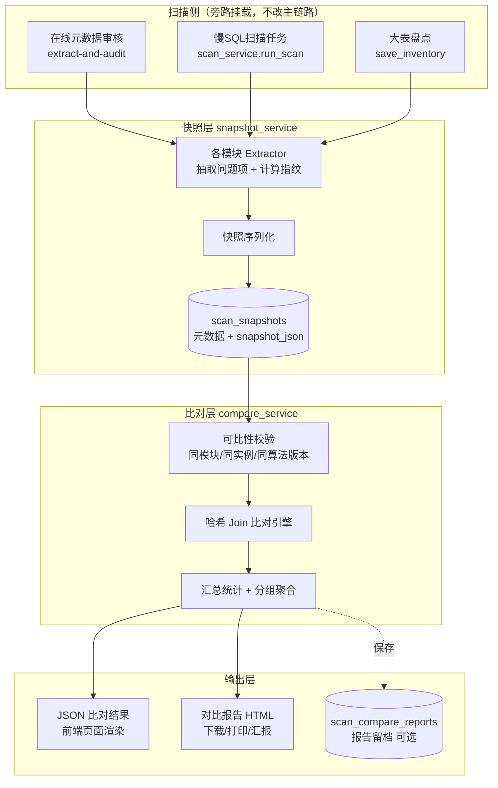

# TDSQL-SQLCheck 扫描结果纵向对比能力 — 需求分析与概要设计

| 项 | 内容 |
|---|---|
| 文档名称 | 扫描结果纵向对比能力 需求分析与概要设计 |
| 目标版本 | V1.3.0.0 |
| 基线版本 | V1.2.0.7 |
| 涉及模块 | SQL审核-在线元数据审核、慢SQL治理-扫描任务、实例与体检-大表治理 |
| 文档状态 | 待评审 |
| 编制 | 智能体 A |

---

## 1. 需求来源与业务目标

### 1.1 需求原文（业务方口述）

> 对"在线元数据审核""慢SQL扫描任务""大表治理"三部分，要能实现**同一个数据库实例扫描结果的比对**。
> 比方说 1 号扫描一个实例发现的问题反馈给开发，15 号再扫，30 号再扫，要能比对 1 号↔15 号、1 号↔30 号、15 号↔30 号。
> 要能对扫描结果**产出对比报告**，报告要能看出：**之前有多少问题、现在多少问题、改了多少、还留有多少、有没有新增的问题**。

### 1.2 业务价值

当前平台解决的是"**发现问题**"，本需求解决的是"**证明问题被解决了**"。二者的差别是治理闭环的最后一环：

- **对开发/测试**：拿到的不再是一份"又发现 200 个问题"的清单，而是"上次 200 个，你改掉了 150 个，还剩 50 个，另外你新写的表又引入了 12 个"。整改有据可依。
- **对 DBA**：量化治理成效，识别"改了又犯"的团队与"屡教不改"的对象。
- **对管理层**：整改率是可汇报、可考核的 KPI，可按月出治理简报。

### 1.3 目标概述

| 编号 | 目标 | 优先级 |
|---|---|---|
| G1 | 三个模块的每次扫描结果可固化留存，形成可追溯的历史序列 | P0 |
| G2 | 扫描历史可按**数据库实例**（及库名、时间范围）筛选检索 | P0 |
| G3 | 任选同一实例的**两次**扫描结果进行比对，产出结构化差异 | P0 |
| G4 | 比对结果可产出**对比报告**（页面查看 + HTML 导出，可打印/可发送） | P0 |
| G5 | 报告回答五问：之前多少、现在多少、修复多少、遗留多少、新增多少 | P0 |
| G6 | 前端限制只能选两个，超选给出明确提示 | P0 |
| G7 | 存量历史数据可回填，上线后即可比对，无需等待两轮新扫描 | P1 |
| G8 | 三模块共用一套比对内核与交互，避免三套实现 | P1 |

---

## 2. 现状调研与差距分析

### 2.1 三模块现状矩阵

对 V1.2.0.7 代码逐一核查结果如下（这是方案设计的事实基础）：

| 维度 | 在线元数据审核 (F1) | 慢SQL扫描任务 | 大表治理 |
|---|---|---|---|
| 结果落库表 | `audit_history` (+`audit_results`) | `scan_tasks` + `slow_queries` | `bigtable_inventory` |
| **有无"一次扫描"批次概念** | ✅ 有，`audit_history.id` 一行一次 | ✅ 有，`scan_tasks.id`，慢SQL 经 `slow_queries.scan_task_id` 关联 | ❌ **无**，仅有 `inspection_date`（天粒度） |
| **是否记录实例信息** | ❌ **未记录**。表有 `connection_id` 字段但 F1 写入时未赋值；且**无 `db_name` 字段** | ✅ 有 `connection_id`/`connection_name`/`db_name` | ✅ 有 `connection_id` |
| 列表接口能否按实例筛选 | ❌ `GET /audit/extracted-reports` 仅 limit/offset | ❌ `get_scan_tasks(limit, offset)` 无筛选 | ⚠️ 按实例查，但**不按日期区分批次** |
| 已有 HTML 报告 | ✅ `GET /audit/report/{id}/html`（实时渲染，不落盘） | ✅ `GET /slow-queries/scan-tasks/{id}/html` | ❌ 无 |
| 问题项天然标识 | 违规项含 `rule_id`，但对象名需从 SQL 文本解析 | ✅ `slow_queries.fingerprint`（SQL 指纹，天然稳定） | 表名 `schema_name.table_name`（天然稳定） |
| 同日重复扫描行为 | 追加新记录 | 追加新任务 | ⚠️ `REPLACE INTO` **覆盖当日**记录 |

### 2.2 已识别缺陷（本次需求触发暴露，建议一并修复）

| 编号 | 缺陷 | 影响 | 处理 |
|---|---|---|---|
| D1 | F1 审核结果未落 `connection_id`/`db_name` | **无法按实例筛选，需求 G2 直接不可实现** | 必须修复（P0） |
| D2 | `BigTableService.get_inventory()` 查询未带 `inspection_date` 过滤 | 多次盘点后返回**跨日期混合数据**，同一张表出现多行，页面清单虚高 | 建议一并修复（P0） |
| D3 | 大表盘点 `REPLACE INTO` 以"天"为粒度 | 同一天二次盘点覆盖前次，当天无法保留两个批次 | 快照旁路留存（见 4.4） |
| D4 | 慢SQL扫描任务列表未回显实例名 | 多实例场景下无法辨认任务归属 | 一并修复（P1） |

### 2.3 已有可复用资产

平台内已存在**高度相似的成熟先例**，本设计应与其保持一致，降低学习成本：

- `daily_inspect_service.compare_two_days(connection_id, date1, date2)` — 日常巡检两日对比
- `GET /api/v1/daily-inspect/compare`（JSON）+ `GET /api/v1/daily-inspect/compare/html`（HTML 大屏）
- 前端"日常巡检与对比报告"页：选实例 → 选日期 → 比对 → 导出 HTML

> **结论**：新功能采用**相同的接口形态（JSON + HTML 双出口）与相同的交互范式**，用户零学习成本，代码风格统一。
> 差别在于：巡检对比的是**指标数值涨跌**，本需求对比的是**问题集合的增删**，比对内核不同，需另建。

---

## 3. 关键技术问题分析

本节是方案成立与否的核心，逐条说明为什么方案要这么设计。

### 3.1 【核心难点】问题项必须具备跨扫描的稳定身份

要回答"改了多少、还剩多少、新增多少"，前提是**能判定两次扫描里的两条记录是不是同一个问题**。这需要为每个问题项计算一个稳定的**指纹（fingerprint）**。

**不能用什么：**

| 候选标识 | 为什么不行 |
|---|---|
| 报告中的序号 `#1 #2 #3` | 当前 F1 的 HTML 报告正是用序号标识。开发新增一张表，其后所有序号整体错位，1 号的 `#5` 与 15 号的 `#5` 根本不是同一对象 → 比对结果全错 |
| `line_number` 行号 | 元数据是每次重新拉取拼接的 .sql，行号随对象增删整体漂移，完全不可靠 |
| 数据库自增主键 `id` | 每次扫描都是新记录，天然不同 |

**必须用什么：业务身份**

| 模块 | 指纹构成 |
|---|---|
| 在线元数据审核 | `schema.对象名` + `对象类型` + `rule_id` (+ 列名/序号，用于同对象同规则多次命中) |
| 慢SQL扫描任务 | `db_name` + `fingerprint`（平台已有的 SQL 归一化指纹，天然稳定） |
| 大表治理 | `schema.table` + `问题类型`（超阈值/未分区/无分片键/分区水位） |

> 指纹算法需**版本化**（`fingerprint_algo=v1`）并随快照一起存储。未来算法升级后，旧快照仍能被正确识别，避免跨算法版本误比对。

### 3.2 【方案评估】关于"直接比对两份 HTML 报告"

需求提出方的思路是：把每次扫描结果存成 HTML 报告，比对时只比两份 HTML，不查数据库，会更快。

**这个思路的内核是完全正确的**：比对时不应该回查业务库、也不应该重跑复杂聚合查询，而应该比对"两次扫描当时固化下来的产物"。**本方案完整保留这一内核。**

但把**载体定为 HTML** 存在三个硬问题，建议调整：

| 问题 | 说明 |
|---|---|
| **① HTML 里没有稳定身份** | 如 3.1 所述，当前 HTML 报告以 `#序号` 标识问题项，无对象名字段。要比对必须先反向解析 HTML 猜出对象名——把已经丢失的信息再猜回来，不可靠 |
| **② 解析 HTML 反而更慢** | HTML 报告含完整 CSS、DDL 全文、样式标签，单份数百 KB 至数 MB；需 DOM 解析 + 正则抽取。而一份精简结构化快照仅数十 KB，`json.loads` 直接可用，**快 1～2 个数量级** |
| **③ 与渲染耦合，改版即失效** | HTML 是给人看的渲染产物。一旦调整样式/结构（例如刚完成的深蓝主题改版），解析逻辑随即失效，历史报告全部不可比 |

**建议方案：把载体从 HTML 换成 JSON 快照，保留"比对固化产物"的内核。**

采用"**一次扫描、三份产物**"模型：

| 产物 | 面向 | 用途 |
|---|---|---|
| **快照 JSON** | 机器 | 比对的**唯一数据源**，精简、字段稳定、含指纹 |
| **单次扫描 HTML 报告** | 人 | 由快照渲染，随时可看可下载（现有能力保留） |
| **对比报告 HTML** | 人/领导 | 比对结果的最终交付物 |

这样做同时满足：
- ✅ 比对不碰业务库、不做复杂 join —— 只按主键取两份快照（O(1)）+ 内存哈希比对（O(n)）
- ✅ 比 HTML 解析更快
- ✅ HTML 报告由快照渲染，**报告与比对结果永远一致**，不会出现"报告显示 200 个、比对说 180 个"的错位

> **关于"存数据库会不会慢"**：慢的从来不是"数据库"，而是"每次比对都重新跑聚合/关联查询"。快照固化后，取数是 `SELECT ... WHERE id=?` 单行主键命中，与读文件在同一量级。
> 因此快照主体**存 DB 单行 LONGTEXT**（而非散落文件），可直接复用平台已有的备份、权限、数据保留清理机制，避免文件散落、迁移丢失、权限旁路等运维问题。如后续确有需要，可通过配置切换为文件存储（见详细设计 §9）。

### 3.3 【业务语义】慢SQL的"消失"不等于"已修复"

这是关系到报告可信度的关键细节。

元数据审核和大表治理是**全量扫描**：对象还在就一定会被扫到，消失即代表被修复。
但慢SQL扫描是**时间窗口内的采样**：某条慢SQL这次没出现，可能是：

1. 真被优化了（加索引、改写SQL）✅
2. 这个时间窗口内业务恰好没跑到它（月末跑批、季度报表）⚠️
3. 两次扫描时间窗口长度不同（上次扫 24 小时、这次扫 1 小时）⚠️

若一律标为"已修复"，报告会**系统性高估整改成效**，领导拿去汇报会失真。

**设计对策：**
- 慢SQL模块的分类文案使用"**已消失（未复现）**"而非"已修复"
- 快照记录 `time_window_start/end`，比对时若两次窗口长度差异 > 2 倍，报告顶部显著提示"**两次扫描时间窗口不一致，整改率仅供参考**"
- 报告中对"已消失"项标注末次出现时间，便于人工甄别

### 3.4 大表治理缺少"批次"概念

大表盘点当前只有 `inspection_date`（天粒度）且同日 `REPLACE` 覆盖，没有"第几次盘点"的概念，无法满足"任选两次比对"。

**设计对策（低侵入）**：不改动 `bigtable_inventory` 现有结构与写入逻辑，在盘点完成后**旁路**追加写一条快照记录。快照天然带 `id` 与精确时间戳，批次能力由快照体系提供，对既有功能零影响。

### 3.5 比对方向不能依赖用户选择顺序

用户勾选两条记录时不区分先后。若把先勾的当基准，用户勾反了会导致"修复"与"新增"完全颠倒。

**设计对策**：后端一律按 `scan_finished_at` 自动排序，**时间早的为基准（base）、晚的为目标（target）**，与用户勾选顺序无关。

---

## 4. 总体设计

### 4.1 设计原则

| 原则 | 说明 |
|---|---|
| P1 统一抽象 | 三个模块业务不同但对比语义完全一致 → 抽象为统一的"扫描快照 + 问题项 + 比对引擎"，**做一个平台能力而非三个功能** |
| P2 旁路增强 | 快照体系为新增旁路，不改三模块现有表结构与核心写入链路（仅补 D1 必要字段），故障不影响主流程 |
| P3 与既有范式一致 | 接口形态、交互范式对齐已有的"日常巡检对比" |
| P4 可降级 | 快照缺失/损坏时可从源表重建；快照生成失败不得阻断扫描主流程 |
| P5 性能无损 | 快照生成为扫描末尾的一次内存序列化 + 单行写入，相对扫描本身耗时可忽略 |

### 4.2 核心抽象模型

```
                    ┌──────────────────────────┐
                    │      ScanSnapshot        │  一次扫描的不可变固化结果
                    │  module / connection_id  │
                    │  db_name / 时间 / 统计    │
                    │  issues[]  ← 问题项数组   │
                    └────────────┬─────────────┘
                                 │
                    ┌────────────▼─────────────┐
                    │       IssueItem          │  单个问题项
                    │  key   ← 稳定指纹（核心） │
                    │  object / rule / severity│
                    │  attrs ← 可变属性(用于变化检测)│
                    └──────────────────────────┘

     base 快照 ──┐
                 ├──►  CompareEngine  ──►  CompareResult
     target 快照 ┘      (哈希 join)         FIXED / NEW / REMAIN / CHANGED + 汇总
```

### 4.3 比对结果分类定义（直接对应领导五问）

| 分类 | 定义 | 对应领导的问题 |
|---|---|---|
| `REMAIN` 遗留未整改 | 基准有 ∧ 目标有 | "还留有多少" |
| `FIXED` 已修复 | 基准有 ∧ 目标无 | "改了多少" |
| `NEW` 新增 | 基准无 ∧ 目标有 | "有没有新增的问题" |
| `CHANGED` 变化 | 两边都有，但关键属性变化（严重级别升降、慢SQL耗时突增、大表等级跃迁） | 深化洞察 |
| 汇总 | `base_total` / `target_total` / 整改率 = FIXED ÷ base_total | "之前多少、现在多少" |

> `CHANGED` 是 `REMAIN` 的子集（仍存在但属性变了），报告中单列展示，汇总计数不重复计入。

### 4.4 系统架构



### 4.5 数据流（以元数据审核为例）

```
1 号  扫描 → 审核引擎产出 results → [旁路] 抽取问题项 → 指纹计算 → 快照#101 入库
15 号 扫描 → ......                                              → 快照#118 入库
30 号 扫描 → ......                                              → 快照#135 入库

用户：实例=核心交易库 → 列表返回 #101 #118 #135 → 勾选 #101 与 #118（限2）
     → POST /compare {snapshot_ids:[101,118]}
     → 后端按时间排序 base=#101 target=#118
     → 取两行 snapshot_json → 内存哈希比对
     → 返回 {summary, fixed[], new[], remain[], changed[]}
     → 页面渲染 KPI + 四类明细 → 点击"导出对比报告"→ HTML
```

### 4.6 模块划分与职责

| 层 | 新增/改造 | 文件 | 职责 |
|---|---|---|---|
| 数据层 | 新增 | `backend/schema/v2/020_scan_compare_tables.sql` | 快照表、对比报告表 DDL |
| 服务层 | 新增 | `backend/services/scan_snapshot_service.py` | 快照生成/查询/回填/重建 |
| 服务层 | 新增 | `backend/services/scan_compare_service.py` | 比对引擎 + 汇总 + HTML 报告渲染 |
| 服务层 | 新增 | `backend/services/snapshot_extractors/` | 三模块问题项抽取器 + 指纹算法 |
| 接口层 | 新增 | `backend/api/scan_compare.py` | 统一对比 API |
| 接口层 | 改造 | `sql_audit.py` / `slow_query.py` / `bigtable.py` | 补实例字段、加筛选参数、挂载快照生成 |
| 服务层 | 改造 | `audit_service.py` / `scan_service.py` / `bigtable_service.py` | 落实例信息、旁路调用快照生成 |
| 前端 | 改造 | `frontend/index.html` / `app.js` | 三模块加筛选条+限选2+对比入口，新增对比结果视图 |
| 权限 | 改造 | `auth_service.py` | 新增 `scan-compare` 菜单键与路径映射 |
| 保留策略 | 改造 | `retention_service.py` | `CLEANABLE_TABLES` 增加两张新表 |

---

## 5. 数据模型概览

新增两张表（完整 DDL 见详细设计 §5）：

**`scan_snapshots`** — 扫描快照主表

| 关键字段 | 说明 |
|---|---|
| `id` | 快照ID，比对的操作对象 |
| `module` | `schema_audit` / `slow_scan` / `bigtable` |
| `biz_ref_id` | 源记录ID（audit_history.id / scan_tasks.id / 盘点批次），与 module 联合唯一，防重复生成 |
| `connection_id` / `connection_name` / `db_name` | **实例信息，支撑 G2 筛选** |
| `scan_started_at` / `scan_finished_at` | 排序与比对方向判定依据 |
| `time_window_start` / `time_window_end` | 慢SQL可比性校验 |
| `issue_total` / `error_count` / `warning_count` / `object_total` | 列表页免解析 JSON 即可展示 |
| `fingerprint_algo` | 指纹算法版本，跨版本比对保护 |
| `snapshot_json` | LONGTEXT，快照主体（问题项数组） |

**`scan_compare_reports`** — 对比报告留档（可选保存）

存 base/target 快照ID、汇总 JSON、报告标题、生成人、时间，支持"历史对比报告"列表与二次查看。

---

## 6. 接口概览

统一前缀 `/api/v1/scan-compare`（详细规格见《接口说明书》）：

| 方法 | 路径 | 说明 |
|---|---|---|
| GET | `/snapshots` | 快照列表，支持 module/实例/库名/时间范围筛选 + 分页（**G2**） |
| GET | `/snapshots/{id}` | 快照摘要详情 |
| POST | `/compare` | 两快照比对，返回结构化差异（**G3/G5**） |
| GET | `/compare/html` | 对比报告 HTML（**G4**） |
| POST | `/snapshots/rebuild` | 存量历史回填快照（**G7**） |
| GET | `/reports` / POST `/reports` | 对比报告留档列表 / 保存 |

**改造的既有接口（保持向后兼容，仅新增可选参数与返回字段）：**

| 接口 | 改造点 |
|---|---|
| `POST /api/v1/audit/extract-and-audit` | 落 `connection_id`/`db_name`（修复 D1） |
| `GET /api/v1/audit/extracted-reports` | 增加 `connection_id`/`db_name`/时间范围筛选 |
| `GET /api/v1/slow-queries/scan-tasks` | 增加实例/时间筛选，返回补 `connection_name` |
| `GET /api/v1/bigtable/inventory/{connection_id}` | 增加 `inspection_date` 参数（修复 D2） |

---

## 7. 前端交互概览

### 7.1 交互流程

```
模块页 →【扫描历史】区域
   ├─ 筛选条：实例下拉 + 库名 + 时间范围 + 查询/重置
   ├─ 列表（多选框）：扫描时间 | 实例 | 库 | 对象数 | 问题数(ERROR/WARNING) | 操作
   │     └─ 勾选 2 条后，顶部"开始对比"按钮点亮
   │     └─ 勾选第 3 条 → ⚠️ 提示"最多只能选择两次扫描结果进行对比"并自动取消该次勾选
   └─【对比结果】
         ├─ 头部：实例名 + 基准时间 → 目标时间（自动按时间排序，标注哪个是基准）
         ├─ KPI 行：之前问题数 / 现在问题数 / 已修复 / 新增 / 遗留 / 整改率
         ├─ Tab 明细：已修复 | 新增 | 遗留未整改 | 严重级别变化
         └─ 操作：导出对比报告 HTML / 保存报告留档
```

### 7.2 限选两个的实现要点（G6）

**双重保障**：
- 前端：`@selection-change` 中若选中数 > 2，`ElMessage.warning` 提示并 `toggleRowSelection` 取消最新一条
- 后端：`snapshot_ids` 长度 ≠ 2 直接返回 `400`，防止绕过前端直接调接口

### 7.3 复用策略

三个模块的扫描历史列表与对比结果视图**结构完全一致**，仅 `module` 参数与列定义不同。按现有代码风格（CDN 全局 Vue + in-DOM 模板），采用**共用状态对象 + 共用方法 + 按 module 参数化**的方式实现，不引入新的组件体系，降低改造风险。

---

## 8. 非功能设计

| 维度 | 设计 |
|---|---|
| **性能** | 快照生成：扫描末尾一次内存序列化 + 单行 INSERT，相对扫描耗时可忽略；比对：2 次主键查询 + O(n) 哈希比对，千级问题项预期 < 200ms；快照 JSON 仅存比对必需字段（不含 DDL 全文/执行计划等大字段），单份预计 10～100KB |
| **存储** | 按每实例每月 2 次扫描、单份 50KB 估算，20 个实例年增约 24MB，可忽略；纳入数据保留策略自动清理 |
| **安全/权限** | 新增 `scan-compare` 菜单权限键；接口层按 `module` **二次校验**调用者是否具备该模块自身权限（防止仅有 scan-compare 权限者越权查看所有模块数据）；快照不含明文口令，慢SQL文本沿用既有脱敏策略 |
| **数据保留** | `scan_snapshots`、`scan_compare_reports` 加入 `CLEANABLE_TABLES`，默认保留 365 天（对比需要长周期，长于慢SQL默认策略） |
| **兼容性** | 所有既有接口仅新增可选参数与返回字段，老前端不受影响；快照体系为旁路，未生成快照时三模块功能与现状完全一致 |
| **容错** | 快照生成包裹独立 try/except，失败仅告警落日志，**绝不阻断扫描主流程**；快照损坏可通过 rebuild 接口从源表重建 |

---

## 9. 关键设计决策与取舍

| 决策点 | 选定方案 | 备选 | 取舍理由 |
|---|---|---|---|
| 比对载体 | **结构化 JSON 快照** | 直接比对 HTML 报告 | HTML 无稳定身份、解析慢、随改版失效（§3.2） |
| 快照存储 | **DB 单行 LONGTEXT** | 独立文件 | 主键取数与读文件同量级；复用备份/权限/清理机制；避免文件散落与迁移丢失 |
| 三模块实现 | **统一抽象 + 三个抽取器** | 各模块独立实现 | 一套比对内核与前端交互，工作量与维护成本显著降低 |
| 大表批次 | **快照旁路提供批次** | 改造 `bigtable_inventory` 加批次表 | 零侵入既有表与写入逻辑，风险最低 |
| 比对方向 | **按时间自动定基准** | 用户勾选顺序 | 避免用户勾反导致修复/新增颠倒（§3.5） |
| 慢SQL消失语义 | **标注"已消失(未复现)"** | 统一称"已修复" | 避免系统性高估整改成效（§3.3） |

---

## 10. 实施计划

| 阶段 | 内容 | 预估 |
|---|---|---|
| S1 | 数据层：DDL + 迁移脚本 + 保留策略接入 | 0.5 人日 |
| S2 | 快照层：service + 三个抽取器 + 指纹算法 | 2 人日 |
| S3 | 缺陷修复 D1/D2/D4 + 三模块挂载快照生成 | 1.5 人日 |
| S4 | 比对引擎 + 汇总统计 | 1.5 人日 |
| S5 | 对比报告 HTML 渲染 | 1 人日 |
| S6 | API 层 + 权限接入 | 1 人日 |
| S7 | 前端：三模块筛选/限选/对比视图 | 2.5 人日 |
| S8 | 存量回填 + 联调 + 自测 | 1.5 人日 |
| S9 | 文档与部署手册 | 0.5 人日 |
| | **合计** | **约 12 人日** |

**建议交付顺序**：S1→S2→S3 后即可先行验证快照正确性；S4～S6 打通后端闭环；S7 前端；S8 回填让领导上线即可见效果。

---

## 11. 风险与对策

| 风险 | 影响 | 对策 |
|---|---|---|
| R1 指纹设计不当导致误判"全是新增" | 报告不可信，需求失败 | 指纹只用业务身份，严禁行号/序号；S3 后用同一实例连续两次扫描做验证（预期差异应接近 0） |
| R2 慢SQL"未复现"被误读为已修复 | 高估成效，汇报失真 | 文案区分 + 时间窗口一致性提示（§3.3） |
| R3 大表同日二次盘点覆盖 | 当日两批次无法比对 | 快照旁路留存，不依赖 inventory 表 |
| R4 存量数据缺实例信息无法回填 | 老数据无法参与筛选比对 | 回填时标记 `connection_id=''`，前端归入"未知实例"分组并提示；新数据不受影响 |
| R5 快照 JSON 过大拖慢比对 | 性能劣化 | 快照仅存比对必需字段；单份超阈值（如 5MB）截断并在快照中标记 `truncated=true`，报告提示 |

---

## 12. 验收标准

| 编号 | 验收项 | 判定 |
|---|---|---|
| V1 | 三模块每次扫描后自动生成快照，`scan_snapshots` 有对应记录 | 必过 |
| V2 | 三模块扫描历史可按实例筛选，结果准确 | 必过 |
| V3 | 选中 2 条可比对；选第 3 条时给出提示且自动取消 | 必过 |
| V4 | 后端对 `snapshot_ids` 数量 ≠ 2 返回 400 | 必过 |
| V5 | 对比结果的 已修复/新增/遗留 数量与人工核对一致 | 必过 |
| V6 | 同一实例**连续两次无变更**扫描比对，结果应为 0 修复 0 新增（指纹稳定性验证） | 必过 |
| V7 | 对比报告 HTML 可下载、可打印，含五问全部数据 | 必过 |
| V8 | 跨实例/跨模块比对被正确拒绝并给出明确提示 | 必过 |
| V9 | 快照生成失败不影响扫描主流程 | 必过 |
| V10 | 存量数据回填后可立即比对 | 应过 |

---

## 13. 需求覆盖对照

| 需求点 | 覆盖章节 | 状态 |
|---|---|---|
| 三模块扫描结果比对 | §4.2 统一抽象、§4.6 模块划分 | ✅ |
| 同实例任选两次（1↔15、1↔30、15↔30） | §4.5 数据流、§6 `/compare` | ✅ |
| 产出对比报告 | §4.3、§6 `/compare/html` | ✅ |
| 之前多少/现在多少/改了多少/剩多少/新增 | §4.3 分类定义 | ✅ |
| 每次结果按报告形式保留 | §3.2 三产物模型（快照为源，HTML 可随时渲染/下载） | ✅ 载体建议调整 |
| 比对不查业务库、要快 | §3.2、§8 性能 | ✅ 内核保留 |
| 按实例筛选 | §2.2 D1 修复、§6 筛选参数、§7.1 | ✅ |
| 限制只能选两个并提示 | §7.2 前后端双重校验 | ✅ |

---

**关联文档**
- 《扫描结果纵向对比能力 详细设计说明书》 — 照图施工级实现细节
- 《扫描结果纵向对比能力 接口说明书》 — 接口契约与调用示例
