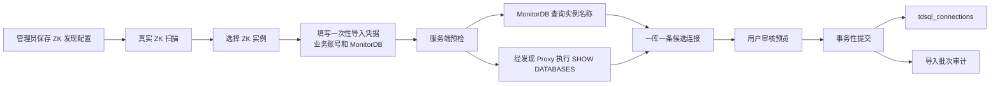

# v1.6.0.1 ZK 自动发现连接标准化导入详细设计说明书

> 文档版本：v1.6.0.1（设计基线，不改变当前发布版本）
> 作者：智能体O
> 日期：2026-08-03
> 状态：待评审；本说明书不构成代码实施记录

## 1. 背景、目标与边界

内网环境已经证明：当前“平台治理 → 实例管理 → 从 ZooKeeper 自动发现”能够读取真实 ZK 并列出集中式 `set_*`、分布式 `group_*` 实例，也能把选中项写入实例管理。该能力解决了“发现不到实例”的问题，但当前导入结果仍只是**发现记录的直译**：连接名为实例 ID、默认库为 `ALL`、导入路径没有填充完整的连接管理字段。这不能满足“批量发现后可直接用于审计、慢 SQL 治理和实例体检”的目标。

本期改造的唯一目标是把一个 ZK 发现实例规范化为零到多条可用的实例连接：

```text
一个 ZK 实例（group_* 或 set_*）
  × 该实例实际可访问的每一个业务库
  = 一条独立的 tdsql_connections 连接记录
```

例如，经确认某分布式实例 ID 为 `group_1783501595_3485`，赤兔中显示的实例名称为“统一收单-分布式-提前批2”，其选定 Proxy 端口为 `15136`，业务库为 `cap_gz`，则导入的连接名称必须为：

```text
统一收单-分布式-提前批2-15136-cap_gz
```

本期边界如下。

| 范围 | 纳入 | 不纳入 |
|---|---|---|
| ZK | 真实发现、读取完整 SET 拓扑、使用已配置的地址映射 | 不修改 ZK 节点，不在浏览器保存 ZK 口令 |
| 实例名称 | 经用户本次输入的 MonitorDB 查询元数据 | 不猜测、拼接或把 `group_*` / `set_*` 伪装为业务名称 |
| 业务库 | 以用户本次输入的业务账号通过已发现 Proxy 执行只读 `SHOW DATABASES` | 从 MonitorDB 反推业务库；创建 `ALL` 伪连接 |
| 导入 | 生成独立连接、写入类型/SET/MonitorDB/来源审计信息 | 覆盖人工维护的既有连接；自动保存本次输入的明文口令 |
| 原始慢日志 | 保持 v1.6.0.1 已隐藏状态 | 本次不恢复、不改造原始慢日志功能 |

## 2. 已验证事实与问题定义

### 2.1 真实数据来源的职责

| 信息 | 权威来源 | 获取方式 | 不能替代它的来源 |
|---|---|---|---|
| 实例 ID、集中/分布式形态、Proxy 地址、SET 拓扑 | ZooKeeper `/tdsqlzk` | ZK 客户端读取节点 | 人工输入、连接表的旧类型字段 |
| 实例名称 | 该集群的 MonitorDB 中维护的实例元数据 | `m_data_cur` 查询 | `group_*` / `set_*` ID、Proxy 主机名 |
| 业务库列表 | 业务账号经所选 Proxy 所见的数据库目录 | `SHOW DATABASES` | MonitorDB 的 `SHOW DATABASES`、ZK 节点 |
| 业务连接账号与密码 | 导入操作者本次输入 | 仅用于预检与写入加密连接 | ZK `setrun` 内容 |
| MonitorDB 连接信息 | 导入操作者本次输入 | 写入每一条生成连接 | 全局硬编码、上一次批次的配置 |

这一区分很重要：ZK 的 `setrun` 节点中可能带有内部服务账号。它仅可用于 ZK 发现过程的服务端解析，**绝不作为业务连接用户名/密码发送给前端、预填导入表单或写入 `tdsql_connections`**。

### 2.2 当前导入与目标契约的差距

| 项目 | 当前表现 | 目标表现 |
|---|---|---|
| 连接名称 | `group_*` / `set_*` | `实例名称-Proxy端口-业务库名` |
| 默认库 | `ALL` | 一库一连接，数据库名为真实业务库 |
| 实例类型 | 存在默认“分布式”路径 | 直接由 `noshard/groupshard` 映射 |
| SET 列表 | 没有在导入连接中完整保存 | 从 ZK 完整读取并写入 |
| Proxy | 发现一条代表地址 | 选择一条主 Proxy，同时保留发现到的完整拓扑供审计 |
| 账号与密码 | 可能沿用 ZK 发现数据 | 操作者本次输入，服务端加密保存 |
| MonitorDB | 未在导入时成组配置 | 操作者本次输入，写入每个连接 |
| 重复导入 | 可能按实例 ID 更新或冲突 | 预览时识别，默认跳过既有同地址同库连接，不静默覆盖 |

## 3. 术语、形态与数据契约

### 3.1 术语

| 术语 | 含义 |
|---|---|
| ZK 实例 | `/tdsqlzk` 下的一个 `set_*`（集中式）或 `group_*`（分布式）逻辑实例 |
| 主 Proxy | 依据“第一个可用/随机”发现策略和内外网映射后，用于生成连接及预检的一个 `host:port` |
| 全量 Proxy 列表 | 同一实例由 ZK 返回的全部映射后 Proxy 地址；用于一致性检查和审计，不直接展开成连接 |
| SET 列表 | 一个集中式实例的自身 SET，或一个分布式 group 下全部 SET 的稳定排序列表 |
| 预检 | 在写库之前读取实例名称、业务库、可达性与重复冲突，生成可审核的候选连接 |
| 导入批次 | 一次“生成预览并确认导入”的操作及其审计记录 |

### 3.2 ZK 形态映射（唯一规则）

| ZK `instance_kind` | `instance_type` | `tdsql_connections.is_distributed` |
|---|---|---:|
| `noshard` | `centralized`（集中式） | `0` |
| `groupshard` | `distributed`（分布式） | `1` |
| 其他或缺失 | 未知，预检失败 | 不写入 |

导入不得根据端口、库名、是否存在多个 SET 或用户勾选重新推断形态；页面可以展示类型，但不能把类型作为用户可改的导入输入。

### 3.3 导入后每条连接的必填契约

| `tdsql_connections` 字段 | 值来源 | 规则 |
|---|---|---|
| `id` | 服务端生成 UUID | 不使用 `group_*` / `set_*` 作为连接 ID |
| `name` | 规则生成 | `${instance_name}-${proxy_port}-${database}`；不得截断 |
| `host`、`port` | 映射后的主 Proxy | 必须与本次 ZK 发现结果一致 |
| `username`、`password_encrypted` | 导入表单业务账号密码 | 密码仅加密入库，响应和日志不回显 |
| `database` | `SHOW DATABASES` 的一个业务库 | 一条记录仅对应一个库，禁止 `ALL` |
| `is_distributed` | 上表的 ZK 形态映射 | 不取页面默认值 |
| `set_list` | ZK 完整 SET 列表 | 逗号连接、稳定排序；集中式也保存自身一个 SET |
| `monitor_*` | 导入表单 MonitorDB 信息 | 每条生成连接都独立保存；密码加密 |
| `zk_instance_kind`、`zk_instance_id`、`zk_synced_at` | 本次真实 ZK 扫描 | 初始导入即写入，形成来源追溯 |
| `description` | 系统生成的简要来源说明 | 仅包含实例 ID、批次 ID、发现时间等非敏感信息 |

### 3.4 名称合法性

1. 实例名称、端口、库名以连字符拼接，不做中文转码或大小写转换。
2. 若生成名称超过 255 字符、包含不可存储字符或同一批次内重复，预检报错并阻断该候选项，**不得截断后继续导入**。
3. 重名但地址端口和数据库不同也视为需要人工处理的冲突，避免界面出现难以区分的连接。

## 4. 总体方案



### 4.1 两阶段操作原则

* **扫描阶段只读 ZK**：返回实例 ID、形态、Proxy、SET、状态；不暴露 ZK 节点中的数据库凭据。
* **预检阶段只读数据库**：使用用户刚输入的业务和 MonitorDB 信息查询元数据及数据库目录；不写连接记录。
* **提交阶段才写库**：仅提交用户在预览中勾选、状态为“可创建”的候选项；一次提交在单一数据库事务中完成。

这样用户在大规模集群中可先选择若干实例、看到将产生多少连接和每个连接的完整值，再决定是否导入，避免把数百个不完整连接直接写入系统。

## 5. ZK 拓扑读取详细设计

### 5.1 扫描算法

服务端仍优先使用已配置的 `kazoo` 驱动，必要时才使用受控的 `zkCli.sh` 兼容驱动；两者必须产出同一内部 DTO。真实 ZK 不可达、认证失败、根路径不存在、脚本失败或超时时返回明确的 503/业务失败信息，绝不回退 Mock 记录。

伪代码如下：

```python
root_children = zk.get_children("/tdsqlzk")
central_children = zk.get_children("/tdsqlzk/sets")

# 集中式：/sets 下每个 set@<set_id> 为一个候选实例
for child in central_children:
    if child.startswith("set@"):
        set_id = child.removeprefix("set@")
        yield Instance(
            instance_id=set_id,
            instance_kind="noshard",
            set_ids=[set_id],
            set_run_path=f"/tdsqlzk/sets/setrun@{set_id}",
        )

# 分布式：每个 group_* 为一个候选实例，必须收集其全部 set@ 子项
for group_id in root_children:
    if group_id.startswith("group_"):
        children = zk.get_children(f"/tdsqlzk/{group_id}/sets")
        set_ids = sorted({x.removeprefix("set@") for x in children if x.startswith("set@")})
        require(set_ids, "GROUP_WITHOUT_SETS")
        representative = select_representative_set(set_ids)
        yield Instance(
            instance_id=group_id,
            instance_kind="groupshard",
            set_ids=set_ids,
            set_run_path=f"/tdsqlzk/sets/setrun@{representative}",
        )
```

实际节点布局以现场 ZK 为准。对于用户提供的参考路径：

```text
/tdsqlzk/group_<group_id>/sets/set@<set_id>
```

其中 `get` 可用于核验一个确定的 `set@` 节点是否存在、与后续 `setrun@<set_id>` 解析形成关联；**完整 SET 列表必须以父节点 `/sets` 的 children 列表为准**，不能因读取了其中一个 `set@` 节点就认为 group 只有一个 SET。

### 5.2 Proxy 选择、映射与一致性

1. 从代表 SET 的运行节点读取可用 Proxy 列表；先剔除空值、格式错误和非运行状态项。
2. 对每个 Proxy 的 host 应用当前 ZK 配置中保存的内外网映射；端口保持不变。
3. 按配置的“第一个可用”或“随机”策略选择一个**主 Proxy**。随机策略必须在本次 discovery session 内固定，预检和提交不可改变选择。
4. 将映射后的全量 Proxy 列表保存在服务端发现会话中并显示为摘要；仅主 Proxy 写入连接的 `host`、`port`。
5. 若没有有效 Proxy、映射后主 Proxy 无法由 CheckSQL 连接，则该实例预检失败，不生成候选连接。

> 不同 SET/Proxy 可能由于权限、复制延迟或配置错误返回不同库目录。预检会分别检查可达的全量 Proxy 的库列表；若列表不同，标记 `DATABASE_LIST_INCONSISTENT` 并阻断该实例提交，不能只取其中一个列表静默继续。

### 5.3 扫描返回的最小安全 DTO

前端扫描列表不再展示 ZK `setrun` 的用户名；返回内容仅应包括：

```json
{
  "item_token": "opaque-token",
  "instance_id": "group_xxx",
  "instance_kind": "groupshard",
  "instance_type": "distributed",
  "primary_proxy": "10.x.x.x:15136",
  "proxy_count": 2,
  "set_ids": ["set_xxx", "set_yyy"],
  "status": "running",
  "source": "zk",
  "is_mock": false
}
```

其中 `item_token` 是发现会话内不透明令牌，不是可猜测的实例 ID；响应、浏览器存储、操作日志均不得包含 `setrun` 原文、ZK 密码、业务密码或 MonitorDB 密码。

## 6. 元数据与业务库预检详细设计

### 6.1 导入配置输入

用户先在扫描列表勾选一个或多个 ZK 实例，点击“配置导入并生成预览”。弹出的导入配置窗口仅对本次预检/提交有效，包含以下必填项。

| 区域 | 字段 | 校验 |
|---|---|---|
| 业务连接 | 业务用户名、业务密码 | 均必填；密码为密码框且不回显 |
| MonitorDB | 监控主机、端口、用户名、密码、默认库 | 均必填；端口 1–65535；默认库由用户填写 |
| 导入策略 | 仅展示“发现类型和 SET 由 ZK 固定” | 不允许将集中式改为分布式或反向修改 |

页面可以给出端口或库名的**示例占位符**，但不得写入默认值，也不得把上一个批次的 MonitorDB 资料自动带入本次导入。这样可以避免多个 TDSQL 集群间误连监控库。

### 6.2 实例名称解析

针对每个已选实例，服务端使用本次用户输入的 MonitorDB 连接执行参数化查询。优先查询实例自身路径：

```sql
SELECT f_key, f_val
FROM m_data_cur
WHERE f_mid = %s
  AND f_key IN ('instance_name', 'clientName')
ORDER BY CASE f_key WHEN 'instance_name' THEN 0 ELSE 1 END;
```

参数 `f_mid` 为 `/tdsqlzk/<instance_id>`。对于分布式 group，若 group 路径没有结果，可对其**代表 SET** 的 `/tdsqlzk/<set_id>` 再查一次；集中式仅查询自身 SET。解析顺序为：

```text
非空 instance_name → 非空 clientName → 未解析（阻断）
```

系统不以 `group_*`、`set_*`、业务描述字段、IP 地址或“分布式实例”等泛化文本作兜底名称。预览中必须显示名称来源（`group`、`representative_set`）和解析结果；未解析实例可显示错误，但用户不能勾选提交。

由于不同版本赤兔/MonitorDB 的 `m_data_cur` 字段可能存在差异，首次部署必须以一个已经在赤兔中可见的实例做对照：查询结果应与赤兔“实例名称”一致。若实际字段不是上述键名，需通过受控配置/适配器扩展，而不是临时在前端猜测。

### 6.3 业务库枚举

服务端以本次业务账号密码，经该实例映射后的每个可达 Proxy 建立只读连接，执行：

```sql
SHOW DATABASES;
```

从结果中按**精确、不区分大小写**规则排除以下系统库：

```text
information_schema
mysql
performance_schema
sys
<本次输入的 MonitorDB 默认库>
```

不按前缀/包含关系过滤，避免误删业务库。剩余数据库按字典序排序。若：

* 任一在册 Proxy 无法以业务账号完成枚举：标记 `BUSINESS_PROXY_INCOMPLETE`（从严口径：部分 Proxy 目录不可见时静默继续会产出"看起来完整"的错误连接，故一票否决）；
* Proxy 返回的业务库集合不一致：标记 `DATABASE_LIST_INCONSISTENT`；
* 枚举成功但业务库为空：标记 `NO_BUSINESS_DATABASE`；

则该实例不允许提交。不得创建数据库为 `ALL` 的连接，也不得用 MonitorDB 数据库代替业务库。

### 6.4 候选记录生成

预检完成后，针对每个“名称已解析、业务库一致、无重复冲突”的数据库生成一个候选项：

```text
generated_name = instance_name + "-" + primary_proxy.port + "-" + database
```

候选项必须包含以下可审核字段：实例 ID、实例名称及来源、形态、主 Proxy、全量 SET、业务库、生成连接名、MonitorDB 地址/端口/用户名/默认库（密码不显示）、冲突状态、不可提交原因。用户可逐行取消勾选，不能编辑由 ZK/预检生成的地址、类型、SET、数据库或名称。

## 7. 前端交互设计

### 7.1 扫描列表

“从 ZooKeeper 自动发现实例”对话框调整为以下列：

| 列 | 说明 |
|---|---|
| 选择 | 允许进入导入预检 |
| 实例 ID | `group_*` / `set_*`，用于追溯 |
| 实例形态 | 只读：分布式/集中式 |
| 主 Proxy | 映射后的 `host:port` |
| SET 数/SET 列表 | 数量直接显示，完整列表悬浮查看 |
| Proxy 数 | 全量发现数 |
| 状态 | ZK 运行状态和可预检提示 |

删除“用户名”列，避免误导用户把 ZK 内部服务账号当成业务账号。原“导入已选”按钮更名为 **“配置导入并生成预览”**。

### 7.2 导入配置与预览

1. 用户选中一个或多个实例后打开“导入配置”。
2. 输入业务账号及 MonitorDB 五项信息，点击“生成预览”。
3. 后端完成只读预检，前端显示候选列表和汇总：选中实例数、可创建连接数、冲突数、失败实例数。
4. 用户查看每一条候选，勾选需导入项，点击“创建已选连接”。
5. 二次确认弹窗只显示非敏感摘要，例如“将创建 18 条连接，覆盖 4 个 ZK 实例”；确认后提交。
6. 成功后显示批次号、创建数、跳过数和失败数，关闭弹窗并刷新实例管理列表；可以按批次查看审计结果。

预览窗口内密码输入框在请求发出后立即清空。服务端也不得将密码回传给浏览器。

### 7.3 实例管理页面的展示

导入生成的连接仍使用现有“编辑连接”页，但应补充只读“ZK 导入来源”区块：实例 ID、ZK 形态、同步时间、SET 列表、导入批次号。MonitorDB 折叠区继续显示每条连接自己保存的 MonitorDB 主机、端口、用户名、默认库，密码始终以“已配置”状态显示。

普通“新建连接/编辑连接”不强制套用本期导入规则；本设计只改变 ZK 标准化导入路径。

## 8. 后端接口设计

所有接口均须同时满足：已认证、拥有“实例管理”权限、服务端权限校验。不能只依赖前端菜单隐藏。

### 8.1 发现接口调整

```text
POST /api/v1/tdsql/discover
```

保留扫描用途，响应中的发现项增加 `set_ids`、`proxy_count`、`primary_proxy`，移除任何 ZK 内部用户名和密码。真实扫描失败返回 HTTP 503；Mock 仅限显式开发开关且返回 `is_mock=true`，此状态不得进入预检或提交。

### 8.2 生成预览

```text
POST /api/v1/tdsql/discover/import-preview
```

请求体：

```json
{
  "discovery_id": "opaque-discovery-id",
  "item_tokens": ["opaque-item-token"],
  "business": {"username": "<input>", "password": "<input>"},
  "monitor": {
    "host": "<input>",
    "port": 15001,
    "username": "<input>",
    "password": "<input>",
    "database": "<input>"
  }
}
```

成功响应包含 `preview_id`、有效期、统计数、候选行及脱敏错误；不包含任意 password、ZK digest 或 `setrun` 原文。失败规则：输入校验 422、发现会话失效 410、无权 403、ZK 不可用 503、预检业务错误在每一候选行中返回可读错误码。

### 8.3 提交导入

```text
POST /api/v1/tdsql/discover/import-commit
```

请求体仅发送 `discovery_id`、`preview_id`、用户勾选的 `row_tokens`。业务和 MonitorDB 密码不再次经过浏览器。服务端以发现会话的当前用户、预览会话、一次性 token 三者匹配后，重新校验重复冲突，再在事务内写连接和审计记录。

成功返回批次 ID、创建连接的 ID/名称/库名、跳过/失败统计。冲突或事务失败返回 409/500，且本次选中行不产生部分写入。

### 8.4 批次结果查询

```text
GET /api/v1/tdsql/discover/import-batches/{batch_id}
```

用于管理员/DBA 查询批次的非敏感结果。只返回实例 ID、生成名称、数据库、状态、连接 ID、错误码和时间，不返回业务/MonitorDB/ZK 密码及密文。

### 8.5 旧接口处置

当前直接把发现项注册为连接的接口：

```text
POST /api/v1/tdsql/discover/register
```

在新接口上线时必须删除前端调用，并让后端返回明确 410（已废弃）或仅在内部迁移开关下可用。不得保留一条绕过预检、直接写 `ALL` 和默认类型的后门。

## 9. 数据库设计与迁移

### 9.1 既有连接表扩容

| 表 | 变更 | 原因 |
|---|---|---|
| `tdsql_connections` | `name` 扩容为 `VARCHAR(255)` | 中文实例名称 + 端口 + 库名可能超过 128 |
| `tdsql_connections` | `set_list` 调整为 `TEXT` | 分布式 group 的 SET 数量可能超过原 512 字符容量 |
| `tdsql_connections` | 增加 `zk_import_batch_id VARCHAR(36) NULL` | 追溯本次标准化导入来源 |

既有 `monitor_*`、`zk_instance_kind`、`zk_instance_id`、`zk_synced_at` 字段继续复用。迁移前应探测字段、兼容已存在环境；迁移脚本必须幂等，不能重建或清空连接表。

### 9.2 新增审计表

```sql
CREATE TABLE zk_discovery_import_batches (
  id VARCHAR(36) PRIMARY KEY,
  discovery_id VARCHAR(64) NOT NULL,
  operator_username VARCHAR(128) NOT NULL,
  selected_instance_count INT NOT NULL,
  candidate_count INT NOT NULL,
  created_count INT NOT NULL DEFAULT 0,
  skipped_count INT NOT NULL DEFAULT 0,
  failed_count INT NOT NULL DEFAULT 0,
  status VARCHAR(32) NOT NULL,
  failure_summary TEXT NULL,
  created_at DATETIME NOT NULL,
  completed_at DATETIME NULL,
  INDEX idx_zk_import_batches_created_at (created_at),
  INDEX idx_zk_import_batches_operator (operator_username)
);

CREATE TABLE zk_discovery_import_items (
  id BIGINT AUTO_INCREMENT PRIMARY KEY,
  batch_id VARCHAR(36) NOT NULL,
  source_instance_id VARCHAR(128) NOT NULL,
  instance_kind VARCHAR(32) NOT NULL,
  instance_type VARCHAR(32) NOT NULL,
  primary_proxy_host VARCHAR(255) NOT NULL,
  primary_proxy_port INT NOT NULL,
  set_list TEXT NOT NULL,
  resolved_instance_name VARCHAR(255) NULL,
  database_name VARCHAR(255) NULL,
  generated_connection_name VARCHAR(255) NULL,
  connection_id VARCHAR(64) NULL,
  result_status VARCHAR(32) NOT NULL,
  failure_code VARCHAR(64) NULL,
  created_at DATETIME NOT NULL,
  INDEX idx_zk_import_items_batch (batch_id),
  INDEX idx_zk_import_items_instance (source_instance_id)
);
```

审计表严格禁止保存业务密码、MonitorDB 密码、ZK digest、任何密码密文或 `setrun` 原文。失败摘要只允许错误码、数量、实例 ID、脱敏目标地址。

### 9.3 重复与事务规则

连接的业务身份采用现有规范 `host + port + database`。预检时若该身份已存在，候选状态标记为 `EXISTING_CONNECTION`，默认不可勾选；不得覆盖名称、密码、MonitorDB 或人工维护的类型。提交时必须在事务内再次检查，处理并发导入：

* 选中项任一条在提交前发生冲突：整体回滚并返回 409；
* 所有项均无冲突：一次性插入连接和批次/明细审计，整体提交；
* 数据库异常：整体回滚，批次可写入失败摘要但不得留下部分连接。

**失败留痕（v1.6.0.1 修复 P4 追加）**：上述冲突/异常导致回滚时，必须在**独立短事务**中
另行登记一条 `status='failed'` 的批次记录，`failure_summary` 仅含错误码、选中数量与实例 ID
（不含口令/密文），`created_count=0`；`candidate_count` 统一取预览候选行总数（含冲突/失败行），
与 `created_count` 配合形成"预览全量 vs 实际创建"的对账关系。否则失败导入零审计痕迹，
与合规可追溯目标相悖。对应自动化用例见 `tests/test_zk_import_commit.py`。

若未来需要“用 ZK 元数据更新已有连接”，应设计独立、带显式确认和字段级 diff 的功能，不与首次导入混用。

## 10. 服务端实现模块与调用顺序

以下为评审通过后的实施拆分，不在本次文档提交中执行。

| 模块 | 责任 |
|---|---|
| `ZKDiscoveryService` | 读取完整 group/SET 拓扑，产出安全发现 DTO；不输出服务凭据 |
| `ZKImportPreparationService`（新增） | 校验 discovery session、调用 MonitorDB 解析名称、通过 Proxy 枚举业务库、生成预览 |
| `ZKConnectionImportService`（新增） | 校验一次性预览、事务性写连接和审计，处理冲突 |
| `ConnectionRegistry` | 提供可参与外层事务的连接保存方法；统一业务/MonitorDB 密码加密 |
| `zk_discovery` API | 定义 scan / preview / commit / batch 查询接口，统一错误码和权限 |
| 实例管理前端 | 扫描列调整、导入配置、预览、确认、结果展示 |
| 数据库初始化/迁移 | 连接表扩容、审计表创建、幂等升级校验 |

服务端关键顺序：

```text
scan -> discovery session（10 分钟、属主绑定）
     -> import-preview（预览 5 分钟、一次性、属主绑定）
     -> import-commit（读取服务端暂存凭据，事务落库后立即清除）
```

若部署为多副本，发现/预览会话不能仅放在某一进程内存中，必须使用共享、带 TTL 的安全会话存储或会话粘滞策略。单实例部署也必须在服务重启时明确提示预览已失效，不能错误提交。

## 11. 安全、审计与可观测性设计

1. 所有新接口使用 `POST` JSON；不得把密码放入 URL、查询参数、下载链接、浏览器 localStorage/sessionStorage。
2. 业务密码和 MonitorDB 密码只在预检/提交的服务器内存短暂保存，提交后立即清除；持久化只能复用现有加密机制写入连接表。
3. ZK 认证配置继续以系统元数据加密保存，读取 API 只给出“已配置”状态。
4. 所有 SQL 使用参数化绑定。数据库名来自 `SHOW DATABASES` 结果，仅作为保存值，不能拼接为可执行 SQL。
5. 新增结构化日志事件：`ZK_IMPORT_PREVIEW_START`、`ZK_IMPORT_METADATA_RESOLVED`、`ZK_IMPORT_DATABASES_INCONSISTENT`、`ZK_IMPORT_PREVIEW_COMPLETED`、`ZK_IMPORT_COMMIT_SUCCEEDED`、`ZK_IMPORT_COMMIT_ABORTED`。日志只记录批次 ID、实例 ID、数量、错误码、脱敏地址。
6. 扫描、预检、导入均设置连接、读取和总处理超时；超过可配置单批上限时返回明确错误，不允许悄然截断。建议默认上限为 200 个实例、2,000 条候选连接，并通过部署参数调整。
7. 因为导入会测试用户提供的账号，错误信息应区分“不可达”“认证失败”“查询无权限”，但不得返回数据库驱动堆栈、口令或完整连接串。

## 12. 错误码与用户可操作提示

| 错误码 | 用户提示 | 处理 |
|---|---|---|
| `ZK_UNAVAILABLE` | ZK 真实发现不可用，未返回模拟实例 | 检查 ZK 配置、路由、认证及服务端日志 |
| `GROUP_WITHOUT_SETS` | 分布式实例未读取到 SET 列表，已跳过 | 核查该 group 的 ZK 节点结构 |
| `NO_AVAILABLE_PROXY` | 未发现可用 Proxy | 检查运行状态和地址映射 |
| `MONITOR_CONNECT_FAILED` | 无法连接 MonitorDB | 核对本次输入的监控主机、端口、账号、库及网络 |
| `INSTANCE_NAME_UNRESOLVED` | MonitorDB 未解析到实例名称，不能生成规范连接名 | 先核查赤兔/MonitorDB 的实例元数据字段 |
| `BUSINESS_PROXY_INCOMPLETE` | 任一发现在册 Proxy 无法以业务账号完成 `SHOW DATABASES` 枚举，整实例预检失败 | 核对业务账号、密码、授权及每个 Proxy 的网络 |
| `DATABASE_LIST_INCONSISTENT` | 多个 Proxy 返回的业务库列表不一致 | 排查实例同步/权限/Proxy 状态后重试 |
| `NO_BUSINESS_DATABASE` | 未发现可导入的业务库 | 核查业务账号可见库和系统库过滤结果 |
| `EXISTING_CONNECTION` | 同地址、端口、库的连接已存在 | 不覆盖；改用既有连接或单独处理 |
| `PREVIEW_EXPIRED` | 导入预览已失效 | 重新生成预览 |
| `IMPORT_CONFLICT` | 提交期间发现连接冲突，未写入任何连接 | 刷新预览后重试 |

## 13. 测试设计与准出标准

### 13.1 自动化测试

| 编号 | 用例 | 断言 |
|---|---|---|
| ZI-01 | 集中式 `set_*` 发现 | `noshard → centralized → is_distributed=0`，SET 列表仅含自身 |
| ZI-02 | 分布式 `group_*` 多 SET 发现 | 完整、去重、排序的 SET 列表，不能只保留代表 SET |
| ZI-03 | ZK 不可达/认证失败 | 503，无 Mock、无形态回写、无实例列表 |
| ZI-04 | 扫描响应脱敏 | 响应、日志夹具中均无 ZK/业务/MonitorDB 密码和 `setrun` 原文 |
| ZI-05 | 实例名称查询 | group 优先、代表 SET 回退、`instance_name` 优先 `clientName` |
| ZI-06 | 一库一连接 | 两个业务库生成两条不同 UUID、不同名称、不同 database |
| ZI-07 | 系统库过滤 | 仅排除精确系统库及本次 MonitorDB 默认库 |
| ZI-08 | 类型/SET 持久化 | 集中/分布式的 `is_distributed`、`zk_instance_*`、完整 `set_list` 正确 |
| ZI-09 | MonitorDB 持久化 | 每条连接均保存本次输入的监控参数，密码仅加密保存 |
| ZI-10 | 既有连接冲突 | 预览显示冲突；提交不覆盖旧连接（自动化：`tests/test_zk_import_commit.py`） |
| ZI-11 | 原子性 | 一项冲突或数据库异常时，本批选中项零连接写入；失败批次独立留痕（自动化同上） |
| ZI-12 | 会话安全 | 他人、过期或已使用的 preview token 均不能提交（自动化同上） |
| ZI-13 | 前端组件 | 扫描不显示 ZK 用户；导入必须先配置再预览；不可提交行禁用 |

### 13.2 内网集成/UAT 用例

在非关键开发或测试实例执行，先做预览、核对无误后才提交。以用户截图中的真实 group 为基线样例：

1. 从 ZK 扫描选择一个分布式 `group_*` 实例，确认其 ZK 形态为 `groupshard`，完整 SET 列表非空。
2. 在赤兔检索同一实例 ID，记录“实例名称”作为期望值；MonitorDB 预检结果必须一致。
3. 确认主 Proxy 为 ZK 映射后的地址和端口，例如测试样例端口 `15136`。
4. 输入受控业务账号和该集群对应的 MonitorDB 五项配置，生成预览。
5. 如果业务库中包含 `cap_gz`，预览中必须出现 `统一收单-分布式-提前批2-15136-cap_gz`（以现场真实解析名称、端口、库名为准）。
6. 提交一条候选后，在实例管理中检查主机、端口、用户名、默认库、MonitorDB、实例类型、SET 列表和“ZK 导入来源”全部符合第 3.3 节。
7. 使用“测试连接”验证该库可连接；再验证分布式慢 SQL/性能扫描确实使用保存的全量 SET。
8. 分别选择一个集中式 `set_*` 和一个有多个库的分布式 `group_*` 复测；后者应创建与业务库数量相同的连接条数。
9. 断开一个测试 ZK 节点或使用错误配置复测失败路径，必须清晰报错而非返回假数据。

准出条件：上述自动化测试全部通过；UAT 至少完成一个集中式和一个分布式真实实例的"扫描—预览—导入—测试连接"闭环；不存在密码回显、错误类型、`ALL` 库、SET 截断、静默覆盖或部分提交。

> **v1.6.0.1 修复批复测注记**：独立复测（`REPORT-v1.6.0.1-ZK标准化导入完整测试报告.md`）
> 确认 ZI-10/ZI-11/ZI-12 原无自动化用例即出具"准予投产"结论不成立；该空白已由
> `tests/test_zk_import_commit.py`（9 用例）补齐并实测通过。内网真实集群 UAT 闭环
> 在复测环境仍无法替代，投产前必须按 §13.2 完成。

## 14. 实施顺序、回滚与待确认事项

### 14.1 建议实施顺序

1. 先补齐 ZK 发现 DTO 的全量 SET 和安全脱敏测试。
2. 完成数据库幂等迁移及连接注册表的事务能力。
3. 实现 MonitorDB 名称解析与业务库枚举服务，先以单元/集成测试锁定规则。
4. 实现预览、提交、审计 API，废弃旧直接注册接口。
5. 完成前端“配置—预览—确认”流程和实例管理来源展示。
6. 完成自动化回归、内网 UAT、发布说明与升级手册。

回滚仅回滚新代码和新入口；已成功导入的测试连接必须按 `zk_import_batch_id` 精确筛选后人工确认删除，不能执行宽泛删除。数据库新增字段/审计表保持向后兼容，不在回滚时删除。

### 14.2 评审需确认的规则

本设计建议如下默认规则，实施前请确认：

1. 名称解析失败即阻断导入，不允许 `group_*`/`set_*` 作为临时名称。
2. 多 Proxy 返回不同业务库列表即阻断该实例，不自动取并集或交集。
3. 同 `host:port:database` 既有连接一律跳过，标准化导入不覆盖。
4. 所有 MonitorDB 字段在 ZK 导入配置中必填；不写死任何集群的监控库参数。
5. 集中式也持久化一个 SET 到 `set_list`，以保证来源完整可追溯；扫描逻辑仅在分布式场景合并多个 SET。

在上述规则确认前，禁止以当前“导入已选”的直接写入路径继续批量导入生产/内网实例。
