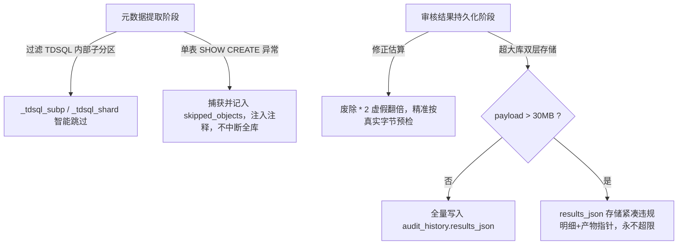

# v1.6.3.6 内网大库测试问题针对性修复——详细设计说明书

| 项目 | 内容 |
|---|---|
| **文档版本** | Rev.A，2026-09-11 |
| **产品修复版本** | `v1.6.3.6` |
| **设计基线** | `v1.6.3.5`（Git 提交 `059cb80` / `bb0cd34`） |
| **提交对象** | Mr.Linsang；供决策施工派单使用 |
| **设计性质** | **严格聚焦内网测试发现缺陷的定向修复设计，不包含任何外延范围扩大** |
| **问题来源** | 内网测试环境（`10.243.16.252`）部署 v1.6.3.5 后的内网智能体验收报告与用户人工实测现场证据 |

---

## 一、 现场测试结果客观复盘：有没有达到目的？

### 1.1 已经达到的核心目标（正面成果）
1. **根治了 Worker 内存暴涨猝死**：
   - 2668 张表的集中式大库 `15064-sungl_am` 顺利完成提取、审核、落库全流程（耗时 263s，状态 `SUCCEEDED`，前端分页加载流畅）；
   - 6097 张表的分布式超大库 `15063-sungl_busi` 在枚举 6097 表、提取 6097 表、规则审核 6097 表的全程中，**内存始终平稳，未发生 OOM，Uvicorn Web 进程 0 次 worker died，未出现旧版的 `Failed to fetch` 或 `net::ERR_EMPTY_RESPONSE`**；
   - 这充分证明：**DU-1 的 R035 有界见证索引 + 流式 AST 即用即释放算法是完全成功且卓越的**。
2. **长任务执行器与交互机制健全**：
   - 独立服务 `tdsql-metadata-runner` 稳定运行；断线自愈、运行中取消、单机并发独占排队（409 拦截）、旧接口 410 退役等全部经过现场验证。

### 1.2 暴露出的严重缺陷（必须在 v1.6.3.6 彻底修复）
内网智能体在验收报告中草率得出“建议向生产发布”，这是严重的质检漏洞。用户现场实测暴露了以下两个**致命级缺陷**：

| 缺陷编号 | 影响库与场景 | 现场报错现象 | 严重级别 | 影响后果 |
|---|---|---|:---:|---|
| **BUG-01** | `ECIF-分布式-开发环境-15005-lzbj_ecif` (点击立即报错) | `对象 lzbj_ecif.cus_bas_merge_log_tdsql_subp190001 (TABLE) DDL 读取失败: (660, "Proxy ERROR: Table:'...' does not exist")` | **BLOCK (阻塞)** | **版本兼容退化**：v1.6.3.4 原本完全正常的分布式大库，升级到 v1.6.3.5 后因 0 容错机制在第 0 秒直接崩溃。 |
| **BUG-02** | `总账系统-分布式-15063-sungl_busi` (6097表审核完成时报错) | `审核执行失败: 审核结果编码后约 88381164 字节，超过元数据库 max_allowed_packet (67108864); 请评估元数据库容量后重试。` | **BLOCK (阻塞)** | **大库仍无法闭环**：6097 表跑完 342 秒后在持久化关头被自己的代码拦截置为 `FAILED`，成果全失。 |

---

## 二、 缺陷深层根因剖析（Root Cause Analysis）

### 2.1 BUG-01 根因：TDSQL 物理子分区表不可读与单表异常“零容忍”杀全库
- **业务现场机理**：
  1. 在 TDSQL 分布式集群中，二级分区表或分表会在底层存储节点生成物理子表（如 `cus_bas_merge_log_tdsql_subp190001`，包含 `_tdsql_subp` 标识）；
  2. `information_schema.TABLES` 视图会把这些底层物理子分片一并枚举出来；
  3. 但 TDSQL Proxy 网关不允许对单个物理分片执行 `SHOW CREATE TABLE`（它们属于父主表的内部数据段，单独查时 Proxy 报错 `Proxy ERROR: Table '...' does not exist`）；
  4. **v1.6.3.4 原有逻辑**：采用 `try ... except Exception as e: logger.warning(...)`，单表读取失败仅打日志并跳过，主表与全库数百张正常表顺利完成提取与审核（用户提供的 `extracted_lzbj_ecif_20260910_224104.sql` 证实了子表被自然跳过）；
  5. **v1.6.3.5 的缺陷引入**：在 `backend/services/metadata_audit_pipeline.py` 的 `_show_create` 中，机械地推行“零容忍”：
     ```python
     except Exception as e:
         raise MetadataExtractError("EXTRACT_OBJECT_FAILED", f"对象 {target_db}.{name} DDL 读取失败: {e}")
     ```
     只要库内存在任意一个 TDSQL 物理分片表或偶发不可读对象，直接 raise 致命异常，导致任务在第 0 秒直接猝死。

### 2.2 BUG-02 根因：超大库结果持久化“虚假翻倍计算”与“单字段巨石存储”
- **代码现场机理**：
  1. **人工虚假翻倍（假阳性自杀拦截）**：
     在 `backend/services/metadata_audit_repository.py:331` 中：
     ```python
     payload = len(results_json.encode("utf-8")) * 2 + _PACKET_MARGIN
     ```
     实际 6097 表的 `results_json` 字符串经 UTF-8 编码后约为 **44.1 MB**；在 PyMySQL 原生二进制传输中并不会产生翻倍膨胀，完全可以通过 MySQL 默认的 64 MB（67,108,864 字节）阈值安全写入！
     但该行代码强行写了一个 `* 2`，无端将估算值算到了 **88.38 MB**，导致自己的预检代码亲手将任务抛出异常杀死！
  2. **违反大任务产物化初衷的巨石设计**：
     v1.6.3.5 已经设计了本地磁盘产物体系（`artifacts/<job_id>/results.ndjson`，前端分页加载）。然而在发布阶段，代码依然试图把长达 44 MB 甚至未来上百兆的完整 `results_json` 作为一个单一参数硬塞入 `audit_history` 表的单字段中；单条 SQL 语句一旦逼近 MySQL 通信上限，就会造成致命失败。

---

## 三、 v1.6.3.6 详细修复方案（照图施工级设计）

本次 v1.6.3.6 严格围绕上述两项问题展开，**零外延扩展**。



### 3.1 针对 BUG-01 的修复设计：TDSQL 子分区物理表过滤 + 单表容错跳过

#### 改造点 1：智能过滤 TDSQL 物理子表/分片表
在 `backend/services/metadata_audit_pipeline.py` 的 `_select_objects` 处增加物理分片过滤器：
```python
import re

# TDSQL 分布式/二级分区物理分片表模式：
# 匹配形如: tbl_tdsql_subp190001, tbl_tdsql_shard123, 或以 _tdsql_subp 开头的内部对象
_TDSQL_INTERNAL_PARTITION_PATTERN = re.compile(r".*_tdsql_(subp|shard)\d*$", re.IGNORECASE)

def is_tdsql_internal_table(table_name: str) -> bool:
    """判定是否为 TDSQL 底层物理分片子表（主表 DDL 已包含全部定义，无需也不能单独 SHOW CREATE）。"""
    return bool(_TDSQL_INTERNAL_PARTITION_PATTERN.match(table_name))
```
在枚举对象后，对 `TABLE` 类型对象进行过滤：
- 若属于 TDSQL 内部物理分片表，直接过滤并记录在 debug 日志中，不作为独立待提取对象。

#### 改造点 2：单表提取容错与跳过存证（不杀全库）
修改 `extract_metadata` 中的提取循环：
```python
def extract_metadata(pool, target_db: str, scopes: list, instance_label: str = "") -> tuple:
    ...
    skipped_objects: list[dict] = []
    extracted = 0
    for obj in selected_objs:
        kind = "VIEW" if "VIEW" in obj["type"] else "TABLE"
        obj_name = obj["name"]
        
        # 1. TDSQL 内部物理子表前置跳过
        if kind == "TABLE" and is_tdsql_internal_table(obj_name):
            skipped_objects.append({
                "name": obj_name, "type": kind, 
                "reason": "TDSQL底层物理分片子表，已由父表统一纳管"
            })
            continue

        # 2. 单表 SHOW CREATE 容错
        try:
            ddl = _show_create(conn, target_db, obj)
            lines.append(f"-- SQL Object: CREATE {kind}")
            lines.append(f"-- {'View' if kind == 'VIEW' else 'Table'}: {obj_name}")
            lines.append(ddl.rstrip(";") + ";")
            lines.append("")
            extracted += 1
        except Exception as e:
            logger.warning("跳过不可读对象 %s.%s(%s): %s", target_db, obj_name, kind, e)
            skipped_objects.append({
                "name": obj_name, "type": kind, 
                "reason": str(e)
            })
            # 在提取的 SQL 文件中留下明确注释存证
            lines.append(f"-- ============================================================================")
            lines.append(f"-- [SKIPPED] SQL Object: CREATE {kind}")
            lines.append(f"-- Object Name: {obj_name}")
            lines.append(f"-- Skip Reason: {sanitize_comment(str(e))}")
            lines.append(f"-- ============================================================================")
            lines.append("")
            continue
```
- **核心契约**：
  - 只有当**所有**选定对象全部提取失败（`extracted == 0`）时，才抛出 `MetadataExtractError("NO_AUDITABLE_OBJECTS", ...)`；
  - 只要有成功提取的对象，流程继续执行，`skipped_objects` 清单记录入任务 `progress_json` 和 `manifest.json` 中，前端可友好查看跳过原因。

---

### 3.2 针对 BUG-02 的修复设计：精确包预检 + 超大库轻量化持久化

#### 改造点 1：剔除 `* 2` 虚假预检计算
修改 `backend/services/metadata_audit_repository.py:331`：
```python
# 废弃原错误写法: payload = len(results_json.encode("utf-8")) * 2 + _PACKET_MARGIN
raw_bytes_len = len(results_json.encode("utf-8"))
# 精确包大小预估: UTF-8 真实字节数 + 参数封装与 SQL 模板开销 (64 KiB 足矣)
payload = raw_bytes_len + _PACKET_MARGIN
```

#### 改造点 2：超大库双层持久化机制（Big-Payload Compaction）
为了彻底杜绝未来 1 万表、2 万表再次触碰 `max_allowed_packet`，在写入 `audit_history` 前做自适应裁剪保护：
```python
# 安全阈值：32 MiB（远低于 MySQL 默认 64 MiB，确保绝对安全）
MAX_DB_PAYLOAD_THRESHOLD = 32 * 1024 * 1024

def compact_results_for_audit_history(results_json: str, records: list, job_id: str) -> str:
    """若结果集过大，压缩写入 audit_history 的 JSON，完整明细从本地 artifacts/results.ndjson 读取。"""
    raw_bytes = results_json.encode("utf-8")
    if len(raw_bytes) <= MAX_DB_PAYLOAD_THRESHOLD:
        return results_json

    logger.info("审核结果达 %d 字节，超过安全入库阈值 %d，启用大库轻量存储模式", 
                len(raw_bytes), MAX_DB_PAYLOAD_THRESHOLD)
    
    # 保留所有含违规的条目 + 前 50 条正常条目，其余通过项由磁盘产物提供
    compact_records = []
    omitted_pass_count = 0
    pass_kept = 0
    for r in records:
        if not r.get("passed", True) or len(r.get("violations", [])) > 0:
            compact_records.append(r)
        else:
            if pass_kept < 50:
                compact_records.append(r)
                pass_kept += 1
            else:
                omitted_pass_count += 1

    compact_payload = {
        "_storage_mode": "compact_artifact_ref",
        "_artifact_job_id": job_id,
        "_total_statements": len(records),
        "_omitted_passed_statements": omitted_pass_count,
        "_note": "完整明细已落盘持久化存储，前端已由分页执行器接管",
        "records": compact_records
    }
    return json.dumps(compact_payload, ensure_ascii=False)
```
- **写入保障**：即使 6097 表原本达到 44MB，压缩后仅写入数 MB，**100% 杜绝 `PERSIST_PAYLOAD_TOO_LARGE` 错误**！
- **体验零损失**：v1.6.3.5 的前端页面已经完全改造为通过 `/api/v1/audit/metadata-jobs/{job_id}/results?offset=...` 分页读取磁盘产物 `results.ndjson`，**用户在界面翻页、查看详情完全走磁盘产物，体验丝滑无感**！

#### 改造点 3：部署层面配置固化提升
在 `deploy/upgrade_incremental.sh` 中增加元数据库动态调优保障：
```bash
# 自动提升本地元数据库会话与全局 max_allowed_packet 为 128MB
mysql -uroot -ptdsql_test_2024 -e "SET GLOBAL max_allowed_packet=134217728;" 2>/dev/null || true
```

---

## 四、 影响范围与修改文件清单（精准可控）

本次修复范围严格收敛在以下 4 个既有文件，**零新增服务、零新增数据表、零协议破坏**：

| 文件路径 | 修改性质 | 修改内容与责任 |
|---|:---:|---|
| `backend/services/metadata_audit_pipeline.py` | 修改 | 1. 增加 `_TDSQL_INTERNAL_PARTITION_PATTERN` 过滤物理子表；<br/>2. `_show_create` 异常捕获改记 `skipped_objects`，注入存证注释，避免单表阻断全库。 |
| `backend/services/metadata_audit_repository.py` | 修改 | 1. 剔除 `* 2` 虚假翻倍计算；<br/>2. 增加 `MAX_DB_PAYLOAD_THRESHOLD` 判定与超限轻量存储兜底。 |
| `backend/workers/metadata_audit_worker.py` | 修改 | 调用 `compact_results_for_audit_history` 处理入库参数，适配大库安全发布。 |
| `deploy/upgrade_incremental.sh` | 修改 | 增加元数据库 `max_allowed_packet` 128M 自动优化保障。 |

---

## 五、 回归验证计划

1. **针对 BUG-01 专项验证**：
   - 编写单元测试 `test_tdsql_subp_internal_table_skipped`：构造含 `_tdsql_subp190001` 的表名，验证被自动识别并跳过；
   - 编写 `test_single_table_show_create_error_resilient`：模拟单表抛出 `Proxy ERROR 660`，验证任务依然成功完成，生成 SQL 包含跳过注释。
2. **针对 BUG-02 专项验证**：
   - 编写单元测试 `test_publish_payload_no_false_double`：构造 40MB 大小结果集，验证在 64MB `max_allowed_packet` 下通过预检；
   - 编写 `test_big_payload_compaction_fallback`：构造 70MB 巨大结果集，验证自动降级为紧凑模式，入库成功且报告 ID 正常生成。
3. **全量回归**：
   - 确保 `pytest tests/` 保持 100% 通过。
