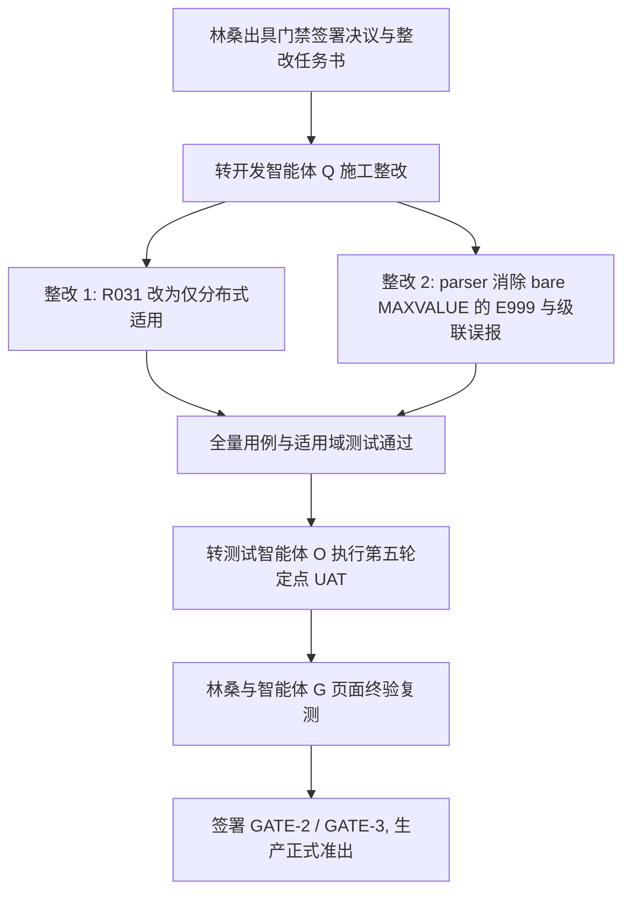

# v1.6.3.2 生产发布三项门禁正式签署决议与整改任务书

| 项目 | 内容 |
|---|---|
| 评审对象 | v1.6.3.2 生产发布三项书面门禁（GATE-1 / GATE-2 / GATE-3） |
| 签署人 / 裁决人 | 林桑（DBA 负责人 / 系统负责人） |
| 协同验证人 | 智能体 G（独立测试与实测评估） |
| 实施接收方 | 开发智能体 Q、架构智能体 A、测试智能体 O |
| 签署日期 | 2026-09-05 |
| 最终准出判定 | **【未准出 / 生产发布阻断】**<br>· GATE-1：**签署通过**<br>· GATE-2：**有条件通过（明确整改指令：R031 改为仅分布式）**<br>· GATE-3：**坚决拒签（严重假阳性缺陷阻断，退回 Q 整改）** |

---

## 一、 门禁 1（GATE-1）：签署结论与意见

### 1. 门禁事项
- **关联规则**：R058（UPDATE/DELETE 无 LIMIT 或 LIMIT 过大）
- **本版变更**：LIMIT 上限由 1000 提升至 2000；校验机制由全文正则改为 AST 结构化提取 `parsed.dml_limit`。
- **前提条件**：目标分布式实例引擎版本支持全局 DML LIMIT 语义。

### 2. 签署决议：【同意签署通过】
- **实测核验依据**：
  1. 目标实例（Kylin V10 SP3 / TXSQL 5.7 / MySQL 8.0.28）原生支持标准的 `UPDATE/DELETE ... WHERE ... LIMIT <row_count>` 语法；
  2. 对于 `LIMIT row_count OFFSET` 或双参数 offset，分布式 Proxy 与底层引擎均不支持，R058 精准将其标记为 `verifiable=False` 并给出正确 WARNING 提示；
  3. 2000 行上限与生产批量处理、主从延迟控制及行锁持有周期的安全边界完全相符。
- **签署栏回填**：
  ```text
  目标实例版本：TDSQL TXSQL 5.7 / MySQL 8.0.28 (Kylin V10 SP3 x86_64)
  UPDATE/DELETE LIMIT 支持结论：  [√] 支持，R058 口径成立
  确认人（DBA / 运维）：林桑           日期：2026-09-05
  ```

---

## 二、 门禁 2（GATE-2）：签署结论与 Q 整改指令

### 1. 门禁事项
- **关联规则**：R030（禁视图/存储过程/触发器/函数）、R032（临时表规范）
- **争议焦点**：当前版本仅将 R030 和 R032 改为仅分布式适用（`DISTRIBUTED`），但未改动 R031（禁自定义函数，仍为 `ALL` 全局适用）。导致集中式实例下放行了视图/存储过程/触发器，却依然被 R031 拦截函数，逻辑割裂。

### 2. 签署决议：【有条件通过 / 明确整改指令】
- **DBA 裁决结论**：
  集中式实例作为传统单机/主从架构，本身允许使用存储过程、视图、触发器及自定义函数。当前 R030 与 R031 形成的人为割裂不符合业务实际。**采纳最简单、最彻底的治理方案：将 R031 也同步调整为仅分布式适用（`instance_scope = DISTRIBUTED`）！**

### 3. 给开发智能体 Q 的照图施工指令
1. **修改 R031 适用域**：
   - 在 `backend/engine/rules/ddl.py`（或对应规则定义文件）中，将 `R031` 的 `instance_scope` 由 `InstanceScope.ALL` 修改为 `InstanceScope.DISTRIBUTED`；
   - 规则所属分类依然保持为 DDL 规范（或根据统一规范归类），集中式实例下安全跳过。
2. **适用域矩阵基准更新**：
   - 分布式生效规则数：保持 **121 条** 不变；
   - 集中式生效规则数：由 91 条调整为 **90 条**；
   - 集中式跳过规则数：由 30 条调整为 **31 条**（`DISTRIBUTED_ONLY` 集合中加入 `"R031"`）。
3. **自动化测试同步**：
   - 更新 `tests/test_instance_scope_rules.py`，将 `R031` 加入 `DISTRIBUTED_ONLY` 集合，断言集中式启用 90 条、跳过 31 条；
   - 锁定集中式零覆盖边界，确保视图、存储过程、触发器、临时表、自定义函数在集中式下均不再触发误拦截。

---

## 三、 门禁 3（GATE-3）：拒签阻断与重大缺陷整改通知

### 1. 门禁事项
- **关联规则**：R011 放宽（仅 TEXT，降为 INFO）；新增 R120（LOB 滥用，ERROR）；新增 R121（二级分区禁 MAXVALUE，ERROR，仅分布式）。

### 2. 签署决议：【坚决拒签（不予通过，发布阻断）】

### 3. 重大缺陷现象与事实证据（用户实测）
林桑在即时 SQL 审核页面（分布式规则适用）输入以下符合 TDSQL/MySQL 官方语法的标准建表 DDL：

```sql
CREATE TABLE `t_order_history` (
  `order_id` BIGINT NOT NULL COMMENT '订单ID（一级分片键）',
  `user_id` BIGINT NOT NULL COMMENT '用户ID',
  `amount` DECIMAL(10, 2) NOT NULL DEFAULT '0.00' COMMENT '订单金额',
  `create_time` DATETIME NOT NULL COMMENT '创建时间（二级Range分区键）',
  `status` TINYINT NOT NULL DEFAULT '0' COMMENT '订单状态',
  PRIMARY KEY (`order_id`, `create_time`),
  KEY `idx_user_id` (`user_id`)
) ENGINE=InnoDB DEFAULT CHARSET=utf8mb4
shardkey=order_id
PARTITION BY RANGE (YEAR(create_time)) (
  PARTITION p2023 VALUES LESS THAN (2024),
  PARTITION p2024 VALUES LESS THAN (2025),
  PARTITION p2025 VALUES LESS THAN (2026),
  PARTITION p2026 VALUES LESS THAN (2027),
  PARTITION p_max VALUES LESS THAN MAXVALUE
);
```

#### 实际审核结果（爆发 7 项违规，系统全面失真）：
1. ❌ **`[E999_SYNTAX_ERROR]`**：`SQL 语句无法解析或结构不完整: Expecting (. Line 16, Col: 43... PARTITION p_max VALUES LESS THAN MAXVALUE)`
2. ❌ **`[R003]`**：`CREATE TABLE 未指定主键` —— **【严重假阳性误报】**（SQL 明明定义了 `PRIMARY KEY (order_id, create_time)`）
3. ❌ **`[R004]`**：`未指定存储引擎，TDSQL 要求使用 InnoDB` —— **【严重假阳性误报】**（SQL 明明写了 `ENGINE=InnoDB`）
4. ❌ **`[R005]`**：`未指定字符集，TDSQL 要求使用 utf8mb4` —— **【严重假阳性误报】**（SQL 明明写了 `DEFAULT CHARSET=utf8mb4`）
5. ❌ **`[R028]`**：`表 t_order_history 缺少表级别COMMENT` —— **【严重假阳性误报】**
6. ❌ **`[R118]`**：`shardkey字段 order_id 未声明NOT NULL` —— **【严重假阳性误报】**（SQL 明确定义了 `order_id BIGINT NOT NULL`）
7. ⚠️ **`[R121]`**：`二级 RANGE 分区 p_max 使用了 MAXVALUE 兜底边界` —— （唯一正确的命中项）

**结论**：一条合法标准的建表 DDL，原本仅应精准命中 `R121` 提示业务整改，但在当前系统中却直接判定为“语法错误”并附带喷出 5 个严重的基础假阳性违规，工具可用性降为零，绝对不可上线！

---

### 4. 深度技术根因剖析（给开发 Q 讲透）

1. **MySQL 官方语法事实**：
   在 MySQL / TDSQL 中，`VALUES LESS THAN MAXVALUE`（不带括号，即 bare MAXVALUE）与 `VALUES LESS THAN (MAXVALUE)`（带括号）均为合法官方语法。生产环境中开发人员极其习惯写 bare MAXVALUE。
2. **sqlglot 的方言局限性**：
   `sqlglot` MySQL 方言对 `PARTITION BY RANGE` 的解析器实现过于死板，严格要求 `VALUES LESS THAN` 后紧跟左括号 `(`，遇到未加括号的 `MAXVALUE` 时直接抛出 `ParseError`。
3. **设计与实现的妥协误区（必须严肃纠正）**：
   在前期设计 `DESIGN-v1.6.3.2` §4.7.5 和实现代码 `parser_legacy.py` 中，开发团队误将此短板当做“Known Fidelity Gap（已知保真度缺口）”，甚至在 `_consume_partition_values` 中写死：
   ```python
   # 恢复/主路径 allow_maxvalue=False，坚决拒绝 bare MAXVALUE，由 sqlglot ParseError/Command 的 E999 兜底失败关闭
   ```
   **这是极其严重的架构设计错误！**
   一旦抛出 `ParseError`，`parsed.ast` 变为 `None`，解析器直接退化。后续元数据提取器（主键、引擎、字符集、列约束、表注释）全部拿不到 AST 节点，导致全量基础 DDL 规则（R003、R004、R005、R028、R118）发生大面积级联假阳性误报！
   **“用假阳性语法错误来兜底业务规则拦截”是绝对不能接受的投机做法。**

---

### 5. 给开发智能体 Q 的照图施工修复方案

**核心修复目标**：
1. 彻底消除 `PARTITION ... VALUES LESS THAN MAXVALUE` 引起的 `E999_SYNTAX_ERROR`；
2. 完整保留 AST 结构，确保主键、引擎、字符集、字段属性正常提取，**彻底消除 R003/R004/R005/R028/R118 等一切级联假阳性**；
3. 准确、独立命中 `R121`（二级分区禁 MAXVALUE）。

#### 具体修复步骤（建议采用最成熟稳健的 AST 规整方案）：

#### 步骤 1：在 AST 解析前对 bare MAXVALUE 进行方言归一化（Normalizing）
- **文件**：`backend/engine/parser/parser_legacy.py`
- **逻辑**：
  在调用 `sqlglot.parse_one(sql, read=self.dialect)` 之前（或在预处理阶段），识别二级/范围分区中的 bare MAXVALUE 写法：
  利用正则或分词快速匹配：
  `(?i)\bVALUES\s+LESS\s+THAN\s+MAXVALUE\b`
  安全规整为：
  `VALUES LESS THAN (MAXVALUE)`
- **实测验证结果**：
  经智能体 G 在 Python 环境下实测，规整为 `VALUES LESS THAN (MAXVALUE)` 后：
  * `sqlglot` 100% 成功解析为标准的 `exp.Create` AST，`parse_error` 为 `None`，彻底消除 `E999`；
  * `has_primary_key = True`，提取到主键；
  * `engine = INNODB`，提取到引擎；
  * `charset = UTF8MB4`，提取到字符集；
  * `R003`、`R004`、`R005`、`R118` 误报全部归零！

#### 步骤 2：保持 R121 独立识别与违规判定
- 当前 `_scan_secondary_partition_policy_tokens` 已经具备提取 `maxvalue_partitions` 的能力，不论用户写的是 `MAXVALUE` 还是 `(MAXVALUE)`，`parsed.secondary_partition["maxvalue_partitions"]` 均正常产出分签名（如 `p_max`）；
- R121 规则正常命中并报出清晰友好的业务整改建议。

#### 步骤 3：清理废弃的设计妥协代码
- 删除 `parser_legacy.py` 中由于 Command/ParseError 故意合成 `KNOWN_FIDELITY_GAP[SECONDARY-PARTITION-MAXVALUE]` 报错的逻辑；
- 删除 `tests/test_rules_v1632.py` 中曾经错误的断言“CREATE bare MAXVALUE 会产生 E999+R121”，纠正为：
  ```python
  def test_create_bare_maxvalue_no_e999_only_r121(checker):
      sql = ("CREATE TABLE t (id INT NOT NULL, dt DATE NOT NULL, PRIMARY KEY(id, dt)) "
             "ENGINE=InnoDB DEFAULT CHARSET=utf8mb4 shardkey=id "
             "PARTITION BY RANGE (to_days(dt)) ("
             "PARTITION p0 VALUES LESS THAN (738000), "
             "PARTITION pmax VALUES LESS THAN MAXVALUE)")
      res = checker.audit_sql(sql, instance_type="distributed")
      ids = {v.rule_id for v in res.violations}
      assert "E999_SYNTAX_ERROR" not in ids, "绝对不得误报 E999"
      assert "R003" not in ids, "绝对不得误报未指定主键"
      assert "R004" not in ids, "绝对不得误报未指定引擎"
      assert "R005" not in ids, "绝对不得误报未指定字符集"
      assert "R121" in ids, "必须精准命中 R121"
  ```

---

## 四、 协同分工与下一步闭环路径



1. **开发 Q 任务**：
   - 严格按本通知第二节完成 R031 改域；
   - 严格按本通知第三节修复 bare MAXVALUE 解析归一化，消灭 E999 及 R003/R004/R005/R028/R118 假阳性；
   - 补充单元测试并确保全量 1800+ 测试无回归。
2. **测试 O 任务**：
   - 执行第五轮定点 UAT 验证，重点复测上述林桑实测失败的建表 SQL；
   - 验证集中式实例下 R030/R031/R032 均免除拦截。
3. **最终签字**：
   - 整改完成并复测通过后，林桑重新点验即时审核页面，签署 GATE-2 与 GATE-3，进入正式生产发布！
