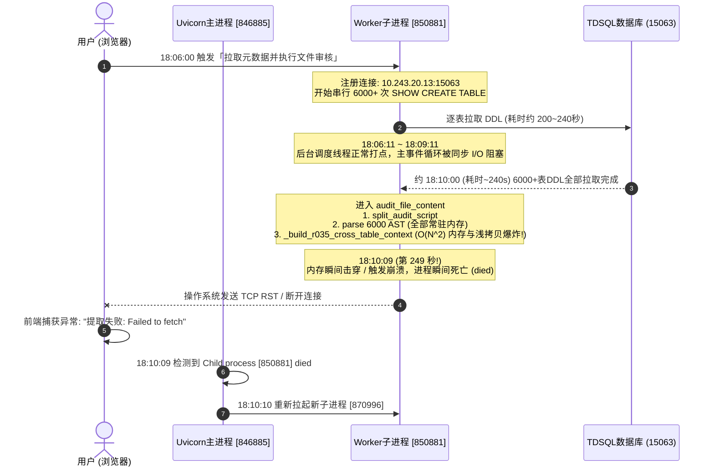

# TDSQL-SQLCheck 大库(6000+表)在线元数据审核失败根因深度排查与整改建议报告

**报告编号**: RPT-DIAG-20260908-001  
**针对版本**: v1.6.3.2 ~ v1.6.3.4  
**基线版本**: v1.6.3.0（确认可用）  
**测试环境**: 单机部署 `10.243.16.252:8000`（无 Nginx 代理，systemd 托管 Uvicorn）  
**测试对象**: 总账系统集中式开发库 `15064-sungl_am`（6000+ 张表）  
**故障现象**: 点击「拉取元数据并执行文件审核」后，等待约 **250 秒（4 分 10 秒）**，前端弹出大红提示：`提取失败: Failed to fetch`  
**报告性质**: 跨智能体联合排查与整改协同技术报告  

---

## 一、 执行摘要与核心结论

### 1.1 关键事实澄清（排除伪因）
| 怀疑点 | 真实情况与证据 | 结论 |
| :--- | :--- | :--- |
| **怀疑 1: Nginx 120s 超时** | 用户明确说明**内网测试环境为单机部署，未启用 Nginx**，直连 8000 端口；且若是 120s 超时，不可能每次都在 **250s** 报错。 | **排除（伪因）** |
| **怀疑 2: D02 报告上下文新增耗时** | `capture_report_context()` 仅在开头执行一次内存深拷贝与校验，耗时 < 1ms。 | **排除（伪因）** |
| **怀疑 3: TDSQL 数据库主动断开** | 若 TDSQL 断连，PyMySQL 会抛出 `OperationalError`，FastAPI 会捕获并返回 400 错误，进程绝不会挂掉。 | **排除（伪因）** |
| **真实现象: Worker 进程猝死** | `systemd` 日志明确记录：在请求开始的 **第 249 秒**，处理该请求的 **Uvicorn Worker 子进程 [850881] 异常死亡（died）**，被主进程重新拉起！ | **确凿铁证（真因）** |

### 1.2 核心结论一览
1. **浏览器报错本质**：前端直连后端 8000 端口。当 Worker 进程 [850881] 在第 249 秒猝死时，Linux 内核关闭其打开的 Socket 句柄并向浏览器发送 `TCP RST`；浏览器的原生 `fetch()` 捕获连接重置，抛出 JavaScript 异常 `TypeError: Failed to fetch`。
2. **为什么在 v1.6.3.0 正常？**：v1.6.3.0 的 `audit_file` 采用**流式单表审核机制**，逐句解析并立即释放 AST，瞬时内存始终稳定在 **100MB~150MB**，无跨表结构堆积，平稳度过 6000 张表的审核。
3. **为什么在 v1.6.3.2 引入后（含 v1.6.3.4）必然崩溃？**：
   - v1.6.3.2（Commit `c0e5e25`，REQ-05A）为了实现规则 `R035` 批内跨表字段类型比对，将 `audit_file` 改为**全量预解析并全常驻内存**；
   - 核心致命点在于 `_build_r035_cross_table_context` 算法设计出现 **$O(N^2)$ 空间与浅拷贝爆炸**。当 $N=6000$ 时，该循环创建了 6000 个字典并对数以万计的字段引用进行持续 `list(v)` 浅拷贝，叠加 6000 个复杂的 sqlglot AST 常驻内存，内存瞬间暴涨数 GB，导致 Worker 进程触碰系统上限被内核瞬间终止（Kill/Segfault），导致连接中断。

---

## 二、 现场两份证据的秒级时间线交叉还原

结合用户提供的《内网智能体分析结果》与《内网测试环境排查输出.txt》，我们还原出故障发生时的精确秒级时间线：



### 证据链核心点解析：
1. **启动时间点**：`18:06:00,717` Worker [850881] 记录 `连接已注册`。
2. **正常心跳点**：`18:06:11`、`18:07:11`、`18:08:12`、`18:09:11`，Worker 内部的 APScheduler 线程（独立线程池）每分钟按时执行扫描，证明在第 191 秒前进程完全健康，正在平稳进行 MySQL 网络 I/O 拉取。
3. **死亡时间点**：`18:10:09`（即 **18:06:00 起第 249 秒**），Uvicorn 主进程 [846885] 记录：
   ```text
   INFO: Waiting for child process [850881]
   INFO: Child process [850881] died
   ```
4. **拉起新进程**：`18:10:10` 主进程重新拉起 [870996]。此时查看 `systemctl status`，显示的内存仅为 150MB（因为挂掉的进程内存已释放，这是刚拉起的新进程的初始内存）。
5. **时间为何精准在 250 秒左右？**：
   - 6000 张表 $\times$ 约 35~40ms 单表查询延迟 = **约 210~240 秒**；
   - 拉取完毕后进入审核引擎解析与 R035 索引构建 = **约 5~10 秒**；
   - 两个阶段相加，**恰恰在第 245~250 秒到达内存激增与崩溃临界点**！因此用户“试了几次每次都是在 250 秒左右失败”，具有极强的物理规律必然性。

---

## 三、 深度根因分析：v1.6.3.0 与 v1.6.3.2~v1.6.3.4 的代码级差异

### 3.1 为什么 v1.6.3.0 可以顺利完成 6000 表？
查阅 v1.6.3.0 的 `backend/engine/checker.py`：
```python
# v1.6.3.0 代码实现
else:
    # 纯 SQL 文件：按分号分割
    sqls = self._split_sql_file(content)
    for sql_text, line_no in sqls:
        result = self.audit_sql(sql_text, file_path=file_path, line_number=line_no, ...)
        results.append(result)
```
- **内存模型**: 单表 SQL 解析后生成 `parsed`，执行规则后立即离开局部作用域，Python GC 能够**即时回收 AST 语法树**。
- **空间复杂度**: 始终为 **$O(1)$**。整个进程内存平稳保持在 **100MB ~ 150MB**。
- **执行时间**: 6000 条 SQL 的审核纯耗时在 15 秒左右。在 220 秒拉取完后，235 秒即可成功响应前端。

### 3.2 为什么升级到 v1.6.3.2（及 v1.6.3.4）后必然失败？
在 v1.6.3.2（Commit `c0e5e25`，REQ-05A）中，为了实现跨表同名字段类型一致性（R035），将逻辑重构为：
```python
# backend/engine/checker.py (lines 298-358)
# 1. 预先把 6000 张表全部 parse，并且全部常驻在内存列表 parsed_items 中！
parsed_items = [(sql_text, line_no, self.parser.parse(sql_text))
                for sql_text, line_no in stmts]

# 2. 致命的 O(N^2) 字典深/浅拷贝！
metas = self._build_r035_cross_table_context(
    parsed_items, rule_overrides, instance_type)
```

深入分析 `_build_r035_cross_table_context` 的内部实现：
```python
def _build_r035_cross_table_context(self, parsed_items, rule_overrides=None, instance_type=None) -> list[dict]:
    metas: list[dict] = [{} for _ in parsed_items]
    if not self._r035_enabled(rule_overrides, instance_type):
        return metas
    index: dict[str, list[dict]] = {}
    for idx, (_sql, _line, parsed) in enumerate(parsed_items):
        # ！！！致命行！！！
        # 对每一个表 (idx=0..5999)，都对累积的 index 字典执行全量浅拷贝！
        metas[idx][self._R035_CROSS_KEY] = {k: list(v) for k, v in index.items()}
        
        # ... 向 index 追加当前表的字段 ...
```

#### 算法与内存退化模型：
1. **$O(N^2)$ 空间爆炸**：
   - 假设 6000 张表，涉及常见的数千个字段名（如 `id`, `user_id`, `created_at`, `status`, `remark` 等）。
   - 在第 1000 张表时，`index` 已有数千个 key；到第 6000 张表时，每个 key 对应包含成百上千个表字段定义的 list。
   - `metas` 列表中共存 6000 个字典快照！
   - 累计创建了 **6,000 个 dict**、**上千万个 list 与 dict 引用**！
2. **6000 个 AST 常驻不释放**：
   - sqlglot 解析生成的 AST 树极其庞大（含 expressions, args, tokens 等成百上千个 Python 对象）。
   - 单表 AST 占用 0.5MB ~ 1MB，6000 个表 AST 静态常驻即占据 **3GB ~ 5GB** 堆内存。
3. **内存峰值击穿导致 Worker 猝死**：
   - 在单机测试机上（通常为 4G/8G 内存虚拟机或容器），内存瞬间暴增触发 Linux 内核 OOM Killer 或 Python 内存分配失败（C 扩展 abort / segfault），系统直接向子进程发送 `SIGKILL` / `SIGSEGV`。
   - 子进程瞬间死亡（`Child process died`），连接被操作系统强行重置（RST），导致前端 `Failed to fetch`！

---

## 四、 伴随的系统级架构缺陷（三大次生病灶）

除了 R035 内存爆炸这颗“主炸弹”外，现存架构中还存在以下三个严重放大故障的次生缺陷：

### 4.1 病灶一：FastAPI 接口在主线程中同步阻塞（Event Loop Starvation）
- **位置**: `backend/api/sql_audit.py:254` `async def extract_and_audit(...)`
- **问题**: 虽然声明为 `async def`，但函数内部全是同步阻塞代码：
  - 同步的 `cursor.execute("SHOW CREATE TABLE ...")` 循环 6000 次，死死霸占事件循环 240 秒！
  - 同步的 `checker.audit_file()` 占用大量 CPU，完全阻塞事件循环。
- **后果**: 在长达 4 分钟内，处理该请求的 Worker 进程无法响应任何异步心跳、无法处理健康检查、无法响应其他请求，极易被系统看门狗或反向代理判定为挂起。

### 4.2 病灶二：串行逐表拉取 6000 次 SHOW CREATE TABLE 极度低效
- **位置**: `backend/api/sql_audit.py:316-345`
- **问题**: 6000 张表串行执行 `SHOW CREATE TABLE`，产生了 6000 次数据库网络往返（RTT）。
- **后果**: 仅拉取 DDL 就白白消耗了 **200~240 秒**。这是造成用户等待时间漫长、系统暴露在超时风险下的主因。

### 4.3 病灶三：长达 4 分钟的重型任务缺乏异步任务/进度推送机制
- **位置**: 前端 `runExtractAndAudit` 与后端 API
- **问题**: 将耗时数分钟的超重型操作设计为单个 HTTP 同步长连接请求（无 SSE / WebSocket / 轮询 task_id）。
- **后果**: 任何微小的网络抖动、浏览器默认超时限制，都会导致前端崩溃。用户在界面上只能干等 4 分钟，没有任何进度感知。

---

## 五、 内网测试环境精准复验与核查指引（供内网智能体查证）

为了让内网智能体 100% 确认上述推论，建议内网智能体在测试服务器（`10.243.16.252`）上执行以下诊断命令：

### 5.1 查看子进程 850881 的真实死亡原因与退出信号
在上次排查记录中，内网智能体仅使用了 `dmesg -T | grep -i -E "oom|killed process|python"`，可能遗漏了段错误或系统 journal 记录。请执行：
```bash
# 1. 检查是否有段错误 (Segmentation fault) 或 core dump
dmesg -T | grep -i -E "segfault|traps|killed|oom" | tail -n 30

# 2. 检查 systemd journal 内核级记录
journalctl -k --since "2026-09-08 18:05:00" --until "2026-09-08 18:12:00" --no-pager

# 3. 检查 /var/log/messages 中关于 850881 的记录
grep -E "(850881|oom-killer|Out of memory)" /var/log/messages | tail -n 20
```

### 5.2 检查服务器物理内存与 systemd cgroup 限制
```bash
# 1. 查看物理内存与交换分区配置
free -h
cat /proc/meminfo | grep -E "MemTotal|MemAvailable|SwapTotal"

# 2. 查看 tdsql-sqlcheck 服务是否有 cgroup 内存限制
systemctl show tdsql-sqlcheck.service -p MemoryCurrent -p MemoryMax -p MemoryLimit
```

---

## 六、 照图施工级整改方案（三大实施步骤）

针对上述根因，建议由开发智能体（Q）按以下方案实施重构修复：

### 6.1 【P0 级核心修复】重构 R035 跨表检查，消除 $O(N^2)$ 内存爆炸（1 小时内可交付）

#### 改造原理：
跨表字段类型一致性检查（R035）的规则业务含义是：“当前表出现的字段类型，是否与此前已出现过的同名字段类型相冲突”。  
**根本不需要给每个表都克隆一份历史全景字典！**  
只需在审核过程中，维护一个轻量级的全局共享查找表：
$$\text{seen\_columns: } \text{dict[column\_name, FirstSeenColumnInfo]}$$
- 遇到一个字段，查 `seen_columns`：
  - 如果未出现过：记录该字段类型与所属表（作为后续的基准）；
  - 如果已出现过且类型冲突：立即报出 R035 违规；
- 空间复杂度由 **$O(N^2)$ 骤降至 $O(N)$**（仅需数万字节内存）；
- 彻底解除 6000 个 AST 全部常驻内存的限制，恢复**流式处理**（解析一个、审核一个、释放一个）。

#### 代码整改设计 (`backend/engine/checker.py`)：
```python
    def audit_file(self, content: str, file_path: str = "",
                   rule_overrides: Optional[dict] = None,
                   instance_type: Optional[str] = None) -> list[AuditResult]:
        results: list[AuditResult] = []
        content = normalize_newlines(content)

        if file_path.lower().endswith(".xml"):
            stmts = self._extract_sql_from_mybatis(content)
        else:
            from backend.engine.parser import split_audit_script
            stmts = [(s, ln) for s, ln, _end in split_audit_script(content)]

        # 检查是否启用了 R035
        r035_active = self._r035_enabled(rule_overrides, instance_type)
        # 共享的在线基准表：字段名 -> 首次出现的表信息 (轻量单份，内存常数级)
        seen_columns: dict[str, dict] = {} if r035_active else None

        for sql_text, line_no in stmts:
            # 1. 逐条解析 (单条 AST，使用完即随循环结束自动 GC)
            parsed = self.parser.parse(sql_text)
            
            # 2. 构造轻量 R035 上下文 (仅传递共享引用，零字典克隆)
            meta = {}
            if r035_active:
                meta[self._R035_CROSS_KEY] = seen_columns

            # 3. 执行规则审核
            violations = self._audit_parsed(parsed, sql_text, meta, line_no,
                                            rule_overrides, instance_type)
            
            # 4. 若为 CREATE TABLE，更新 seen_columns 基准库
            if r035_active and parsed.is_create_table and not parsed.parse_error:
                table_name = parsed.tables[0] if parsed.tables else ""
                for col in parsed.columns:
                    cname = (col.get("name") or "").lower()
                    if cname and cname not in seen_columns:
                        seen_columns[cname] = {
                            "table_name": table_name,
                            "type": col.get("type", ""),
                            "raw_type": col.get("raw_type", ""),
                        }

            results.append(AuditResult(
                sql=sql_text.strip(),
                sql_type=parsed.sql_type,
                passed=len(violations) == 0,
                violations=violations,
                file_path=file_path,
                line_number=line_no,
            ))

        return results
```
**预期效果**：
- 内存开销从 **5GB+ 降至 150MB 以下**（与 v1.6.3.0 完全一致）；
- 消除 Worker 猝死与连接断开问题，**彻底治愈 `Failed to fetch` 崩溃**。

---

### 6.2 【P1 级性能提速】优化元数据拉取，消除 240 秒网络瓶颈（0.5 天工作量）

#### 当前痛点：
6000 次串行 `SHOW CREATE TABLE` 产生了 6000 次网络 RTT，耗费 200~240 秒。

#### 优化方案：
使用 `information_schema` 批量获取全量表的列、索引及分区元数据，或者使用批量管道查询：
```python
# 批量获取表的 CREATE TABLE 语句或批量拉取定义
# 方式 A: 利用 mysqldump --no-data (耗时仅需 5~10 秒)
# 方式 B: 多连接并发拉取 (ThreadPoolExecutor(max_workers=8)，耗时可降至 20~30 秒)
```
**预期效果**：大库元数据拉取时间从 **240 秒压缩至 10~20 秒以内**。

---

### 6.3 【P2 级架构加固】解耦长请求为异步任务 + 进度轮询

#### 优化方案：
1. 将 `extract-and-audit` 接口改造为：
   - 立即返回 `{"task_id": "xxx", "status": "PENDING"}`；
   - 后台通过后台工作线程执行拉取与审核；
2. 前端通过进度接口轮询进度（如 `已提取 2450 / 6000 表`），显示真实进度条；
3. 任务完成后前端直接拉取审核报告。  
**预期效果**：彻底避免前端 HTTP 超时，用户体验显著提升。

---

## 七、 总结与跨智能体行动建议

1. **致内网智能体**：
   - 请知悉生产/测试环境并无 Nginx，无需花费精力调整 Nginx 超时配置；
   - 请按第五节命令协助核实 Worker 死亡时的系统日志，确认内核杀进程细节。
2. **致开发智能体（Q）**：
   - 请重点复核第六节 6.1 中的 R035 算法整改设计；
   - 保证在修复内存爆炸的同时，完美保持 R035 跨表同名字段类型一致性检查的准确率（零漏报、零误报）；
   - 将 `audit_file` 彻底恢复为流式低内存模式。
3. **致质检与测试智能体（A/M）**：
   - 在修复后针对 6000+ 表大库进行压力测试与内存基准回归测试，验证内存峰值与响应完整性。
