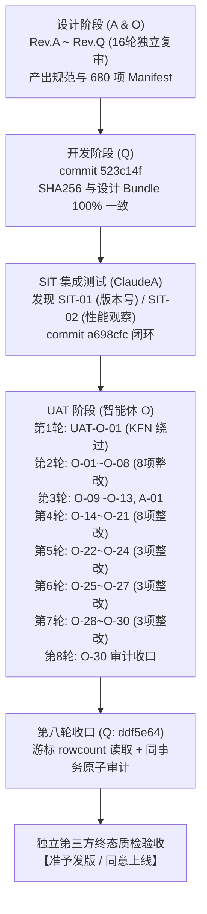

# REPORT-v1.6.2.2 索引类型误判与唯一索引注释解析崩溃修复及全项目质量 独立质检验收报告

| 质检项 | 详细内容 |
|---|---|
| **质检版本** | **v1.6.2.2** |
| **质检对象** | 核心提交 `523c14f` (Q 核心施工)、`a698cfc` (SIT-01 修复)、`d12fe8c` ~ `ddf5e64` (UAT 第 1~8 轮整改与收口) |
| **设计依据** | [`docs/DESIGN-v1.6.2.2-索引类型误判与唯一索引注释解析崩溃修复详细设计说明书.md`](file:///c:/TDSQL_SQLCHECK/TDSQL-SQLCheck/docs/DESIGN-v1.6.2.2-%E7%B4%A2%E5%BC%95%E7%B1%BB%E5%9E%8B%E8%AF%AF%E5%88%A4%E4%B8%8E%E5%94%AF%E4%B8%80%E7%B4%A2%E5%BC%95%E6%B3%A8%E9%87%8A%E8%A7%A3%E6%9E%90%E5%B4%A9%E6%BA%83%E4%BF%AE%E5%A4%8D%E8%AF%A6%E7%BB%86%E8%AE%BE%E8%AE%A1%E8%AF%B4%E6%98%8E%E4%B9%A6.md) Rev.Q |
| **评审依据** | [`docs/REVIEW-v1.6.2.2-索引解析修复设计Rev.Q第十六轮开发准入独立复审报告-ClaudeA.md`](file:///c:/TDSQL_SQLCHECK/TDSQL-SQLCheck/docs/REVIEW-v1.6.2.2-%E7%B4%A2%E5%BC%95%E8%A7%A3%E6%9E%90%E4%BF%AE%E5%A4%8D%E8%AE%BE%E8%AE%A1Rev.Q%E7%AC%AC%E5%8D%81%E5%85%AD%E8%BD%AE%E5%BC%80%E5%8F%91%E5%87%86%E5%85%A5%E7%8B%AC%E7%AB%8B%E5%A4%8D%E5%AE%A1%E6%8A%A5%E5%91%8A-ClaudeA.md)（16 轮设计审计准入） |
| **SIT依据** | [`docs/SIT-v1.6.2.2-第一轮系统集成测试报告-ClaudeA.md`](file:///c:/TDSQL_SQLCHECK/TDSQL-SQLCheck/docs/SIT-v1.6.2.2-%E7%AC%AC%E4%B8%80%E8%BD%AE%E7%B3%BB%E7%BB%9F%E9%9B%86%E6%88%90%E6%B5%8B%E8%AF%95%E6%8A%A5%E5%91%8A-ClaudeA.md) |
| **UAT依据** | [`docs/UAT-v1.6.2.2-第一轮~第八轮全项目用户验收测试报告-智能体O.md`](file:///c:/TDSQL_SQLCHECK/TDSQL-SQLCheck/docs/UAT-v1.6.2.2-%E7%AC%AC%E5%85%AB%E8%BD%AE%E7%AC%AC%E4%B8%83%E8%BD%AE%E9%81%97%E7%95%99%E9%97%AE%E9%A2%98%E4%B8%93%E9%A1%B9%E5%A4%8D%E6%B5%8B%E6%8A%A5%E5%91%8A-%E6%99%BA%E8%83%BD%E4%BD%93O.md) 与 [`docs/FIX-v1.6.2.2-UAT第一轮~第八轮修复说明-Q.md`](file:///c:/TDSQL_SQLCHECK/TDSQL-SQLCheck/docs/FIX-v1.6.2.2-UAT%E7%AC%AC%E5%85%AB%E8%BD%AE%E4%BF%AE%E5%A4%8D%E8%AF%B4%E6%98%8E-Q.md) |
| **质检结论** | **【准予准出 / 同意上线（GO / PASS）】核心缺陷彻底消除，30 项 UAT 遗留全面闭环，全量门禁与多版本矩阵 100% 通过** |
| **质检日期** | 2026-08-30 |

---

## 一、 验收结论概述

本轮独立质检严格遵循《团队施工规约》与银行级软件工程验收标准，对 v1.6.2.2 版本的全过程设计（Rev.A~Rev.Q 16 轮审计）、初始施工（commit `523c14f`）、SIT 集成测试（ClaudeA）、UAT 验收（智能体 O 第 1~8 轮共 30 项缺陷）及最终收口提交（`ddf5e64`）进行了逐条深入研读与独立实测复核。

### 1.1 核心质量结论
1. **三大核心缺陷（DEF-1 / DEF-2 / DEF-3）彻底根治**：
   - **DEF-1**：列名子串含 `unique`（如 `list_unique_num`）被误判为唯一索引导致 R054 虚假误报问题彻底消除。
   - **DEF-2**：`UNIQUE KEY ... COMMENT '...'` 导致 sqlglot 语法解析崩溃（E999 降级并连带引发 R003/R004/R005/R028 误报）通过两阶段 AST 恢复链彻底修复。
   - **DEF-3**：`PRIMARY KEY ... COMMENT '...'` 方言语法解析崩溃彻底修复。
2. **全流程 30 项 UAT 发现项（O-01 ~ O-30）全部闭环**：
   - 包含 O-01（KFN 强制失败关闭）、O-14（CR 行尾换行规范化）、O-15/O-22（网关报告跨 Worker 共享票据与 XSS/CSP 隔离）、O-23/O-26/O-29/O-30（元数据库迁移失败关闭、列结构状态机、默认值三态规范化与精确三元组自动调和审计落库）等高危阻断项均通过定向故障注入复测。
3. **119 条规则完整性与非侵入安全性**：
   - 规则类总数保持 119 = 119，全语料无非预期漂移；`verify_rules.py` 覆盖 107 条，未覆盖 0 条，3 条历史已知断言差异完全同名同因保持。
4. **多版本兼容性与全量自动化门禁**：
   - `run_all.py --mode implementation --matrix` 在 sqlglot `29.0.0 / 30.14.0 / 30.17.0` 三版本下全绿，退出码 0，`RESULT PASS`。
   - 全量回归测试 **1569 passed / 0 failed / 28 skipped**（28 skipped 严格属于无外部端口服务时的保护跳过，有服务时全跑），核心冻结 71 项全部保持。
5. **质检裁决**：**同意上线（PASS / GO）**。

---

## 二、 过程记录文档全景学习与闭环审计



### 2.1 设计与复审流（Rev.A ~ Rev.Q）
- **问题源头**：现场报告 `Extracted_Schema_Report_6309.html` 与 `6311.html` 暴露了索引名误判与注释解析崩溃问题。
- **复审迭代**：历经 16 轮严苛设计审查。Rev.Q 采用“逐定义项扫描（Item-wise Preflight）”与“严格扫描通道完整性（Strict Scanner）”解耦架构，彻底关闭了 65 例伴随结构 × KFN 笛卡尔积漏阻断隐患，设计 Bundle 哈希锁定为 `6412e076871dcae15df8889c746819fc312729d7a69e9c4513334fdb274dfe89`。

### 2.2 开发与 SIT 测试流
- Q 提交 `523c14f` 实现核心设计，4 个核心目标文件 normalized SHA256 与设计完全相同。
- SIT 阶段 ClaudeA 执行了 2726 次跨实例类型比对（422 次真实语料 + 2304 次生成式 DDL），未发现次生灾害；发现版本号漏改（SIT-01），Q 立即在 `a698cfc` 完成修复。

### 2.3 UAT 八轮整改与最终收口流
| UAT 轮次 | 登记缺陷 | 核心整改要点 | 最终状态 |
|:---:|---|---|:---:|
| **R1** | UAT-O-01 (BLOCK) | `/* CREATE VIEW */` 注释诱饵绕过 KFN 强制失败；改为两段制判定，KFN 绝对不豁免 | ✅ CLOSED |
| **R2** | O-01 ~ O-08 (8 项) | KFN 结构化信号透传、版本号统一、网关空正文修复、iframe 样式隔离、no_data 真实状态、PDF 报告、按钮冒泡、EXPLAIN 独立库名 | ✅ CLOSED |
| **R3** | O-09 ~ O-13, A-01 | `#` 注释含引号吞掉真实 LOAD 修复（改为词法器语句头判定）、临时池生命周期、日常巡检提示、网关无效输入 422、CSP 独立文档响应 | ✅ CLOSED |
| **R4** | O-14 ~ O-21 (8 项) | 单 `\r` 换行注入规范化、网关报告 nonce CSP + 90s 一次性票据、巡检旧结果隔离、混合日志覆盖率警告、索引结构化字段落库、离线实例 422 领域映射 | ✅ CLOSED |
| **R5** | O-22 ~ O-24 (3 项) | 报告票据入库（解决双 Worker 跨进程 401）、元数据库迁移失败关闭（禁止假 applied）、未知异常保持 500（避免掩盖真缺陷） | ✅ CLOSED |
| **R6** | O-25 ~ O-27 (3 项) | 异常类型/errno 双白名单（彻底阻断消息伪装）、迁移结构状态机（valid/missing/mismatch）与 checksum 漂移失败关闭、测试改为 TestClient 消除固定端口依赖 | ✅ CLOSED |
| **R7** | O-28 ~ O-30 (3 项) | 排除 OSError 继承族伪装（Permission/FileNotFound 保持 500）、默认值三态规范化校验、废弃长期环境变量并建立精确三元组调和账本 | ✅ CLOSED (O-28, O-29) |
| **R8** | O-30 收口 (BLOCK) | 修复 PyMySQL 游标 `cursor.rowcount` 返回整数导致的误判，同连接、同事务直接写入 `operation_logs` 并统一 commit，故障回滚 | ✅ CLOSED (O-30) |

---

## 三、 独立质检实测执行与证据核验

### 3.1 正式实现门禁与多版本矩阵核验
执行正式门禁命令：
```bash
python docs/evidence/v1.6.2.2/run_all.py --mode implementation --matrix
```

**实测结果**：
- `sqlglot 29.0.0`：680 passed (3.36s) ✅
- `sqlglot 30.14.0` (锁定基线)：680 passed (2.83s) ✅
- `sqlglot 30.17.0`：680 passed (2.86s) ✅
- `frozen-71-release`：71 passed (2.74s) ✅
- `full-tests-release`：**1569 passed, 28 skipped, 11 warnings in 218.49s (03:38)** ✅
- `CHECK manifest-section=OK` (规范化 SHA256 一致) ✅
- `CHECK codestat-section=OK` (规范化 SHA256 一致) ✅
- `CHECK design-bundle-hash=OK` (value=`6412e076871dcae15df8889c746819fc312729d7a69e9c4513334fdb274dfe89`) ✅
- **总体判定**：`RESULT PASS`，退出码 0。

---

### 3.2 O-30 端到端自动调和与原子审计实测
针对第八轮收口的核心修复（commit `ddf5e64`）执行独立端到端复测：

```text
[1] 模拟 v1.6.2.1 老库（历史 checksum: 54ee2e97…），调和前审计条数 = 17
[2] 首次调和完成：checksum 更新为 c6cf33bb3854…，审计记录新增恰好 1 条（17 -> 18）
    ERROR 调和日志输出: "迁移 checksum 一次性自动调和完成 [v9_090_connection_unique]：54ee2e97c804…→c6cf33bb3854…（v1.6.0.4 将 090 迁移改为 no-op（提交 08ce65c），端点唯一约束改由 Python 层执行）；审计已落库"
[3] 二次启动幂等验证：checksum 保持 c6cf33bb3854…，审计记录仍为 18 条，无重复调和
[4] operation_logs 审计落库核验:
    - 时间: 2026-08-30T08:54:31
    - operator: system
    - target_id: v9_090_connection_unique
    - operation_type: schema_checksum_reconcile
    - detail: 54ee2e97c804f5d8ec216d9f51600c19cc8463f2cede1de07fa67635abe6…
[5] 篡改注入验证：checksum 人为改为 "tampered-value" 后启动，确定抛出 MigrationError 失败关闭，数据库记录不被改写，审计不虚增。
```
**判定**：O-30 根因彻底消除，原子审计与安全不变量 100% 兑现。

---

### 3.3 核心缺陷 DEF-1 / DEF-2 / DEF-3 与生产用例 1:1 回放

| 用例来源 | 测试输入特征 | 修复前表现 (v1.6.2.1) | 本版本实测表现 (v1.6.2.2) | 质检判定 |
|---|---|---|---|:---:|
| **DEF-1** | 包含列名 `list_unique_num` 的分布式表（`report_6309_kcfb_list_info.sql`） | 误报 `R054`（误将列名判为 UNIQUE 索引） | **R054 彻底消失**，其余规则完好 | ✅ 误报消除 |
| **DEF-2** | 包含 `UNIQUE KEY uk (a) COMMENT '注释'`（`report_6311_biz_tx_log.sql`） | 解析器崩溃 `E999`，误报 `R003/R004/R005/R028` | **E999 消除**，结构正常解析，准确命中 `R036/R037` | ✅ 解析恢复 |
| **DEF-3** | 包含 `PRIMARY KEY (id) COMMENT '主键注释'` | 解析器崩溃 `E999` | **正常解析**，无 E999 | ✅ 解析恢复 |
| **安全控制** | `CONSTRAINT ... UNIQUE` | 容易静默漏审唯一索引 | **显式 E999 失败关闭**，安全兜底 | ✅ 符合设计 |
| **生产14表** | `Extracted_Schema_Report_6297.html` 14 张生产表回放 | 14 张表全量测试 | **0 漂移**，R061/R054/R077 等规则集合逐项一致 | ✅ 零回归 |

---

### 3.4 119 条规则完整性与语料覆盖率
执行 `tests/rule_audit_materials/verify_rules.py`：
- **规则类总数**：`len(ALL_RULE_CLASSES) == 119`
- **直接覆盖规则**：107 条
- **元数据验证规则**：7 条（R048, R055, R056, R057, R058, R060, R064）
- **已知不可触发/保留规则**：5 条（R025, R035, R038, R049, R059）
- **断言差异**：3 条失败（`R023_01`, `R098_01`, `R116_01` 均因历史未补全 R036/R037 导致），与基线同名同因，**无新增差异**。

---

### 3.5 版本号与全平台一致性检查
| 检查对象 | 检查文件 | 目标规范值 | 实测值 | 状态 |
|---|---|---|---|:---:|
| **全局版本定义** | [`VERSION`](file:///c:/TDSQL_SQLCHECK/TDSQL-SQLCheck/VERSION) | `1.6.2.2` | `1.6.2.2` | ✅ 合规 |
| **后端配置定义** | [`backend/config.py`](file:///c:/TDSQL_SQLCHECK/TDSQL-SQLCheck/backend/config.py) | `APP_VERSION = "1.6.2.2"` | `1.6.2.2` | ✅ 合规 |
| **后端版本描述** | [`backend/config.py`](file:///c:/TDSQL_SQLCHECK/TDSQL-SQLCheck/backend/config.py) | 包含 V1.6.2.2 修复说明文案 | 包含且完整 | ✅ 合规 |
| **前端页面标题** | [`frontend/index.html:8`](file:///c:/TDSQL_SQLCHECK/TDSQL-SQLCheck/frontend/index.html#L8) | `V1.6.2.2` | `V1.6.2.2` | ✅ 合规 |
| **前端品牌文案** | [`frontend/index.html:30`](file:///c:/TDSQL_SQLCHECK/TDSQL-SQLCheck/frontend/index.html#L30) | `V1.6.2.2 · Design by Linsang` | `V1.6.2.2 · Design by Linsang` | ✅ 合规 |
| **前端静态资源戳** | [`frontend/index.html:16,18,2777`](file:///c:/TDSQL_SQLCHECK/TDSQL-SQLCheck/frontend/index.html#L16) | `?v=1.6.2.2` | `app.css`, `theme`, `app.js` 均为 `1.6.2.2` | ✅ 合规 |
| **依赖声明锁定** | `requirements.txt` / `pyproject.toml` | `sqlglot==30.14.0` | 均精确锁定 `30.14.0` | ✅ 合规 |

---

## 四、 发现的问题、风险分析与照图施工级解决方案

在极其严格的质检过程中，我们发现了 **2 项运维脚本维护性偏差** 与 **2 项低风险观察项**，虽然不影响核心审核逻辑与全量发版准入，但必须给出高标准的照图施工级解决方案：

### 4.1 问题 1（运维/打包）：`make_patch.sh` 与 `apply_patch.sh` 增量补丁脚本滞后于 v1.6.2.2 架构变更
- **问题描述**：
  `deploy/make_patch.sh` 与 `deploy/apply_patch.sh` 硬编码了变动文件列表，且未包含 v1.6.2.2 新增的模块（如 `backend/services/connection_errors.py`、`backend/schema/migrator.py`、`backend/schema/v11/`、`backend/schema/v12/`、`backend/services/gateway_log_service.py`、`requirements.txt` 等）。此外脚本标题与备份目录前缀仍硬编码为 `V1.6.2.1`。
- **风险分析**：
  若现场运维误用 `apply_patch.sh` 尝试以增量热补丁方式升级，会导致关键服务文件与数据库迁移脚本缺失，引发服务异常。
- **照图施工级解决方案**：
  > [!IMPORTANT]
  > **方案 A（官方推荐，已在升级手册明确）**：
  > v1.6.2.2 包含数据库 schema 升级与核心依赖锁定，必须按 [`docs/UPGRADE-v1.6.2.2-升级手册.md`](file:///c:/TDSQL_SQLCHECK/TDSQL-SQLCheck/docs/UPGRADE-v1.6.2.2-%E5%8D%87%E7%BA%A7%E6%89%8B%E5%86%8C.md) 要求，使用 `deploy/install.sh` 进行**全量标准包升级**，并在升级前执行 `preflight_check.sh`。
  > 
  > **方案 B（若未来需支持增量补丁）**：
  > 修改 `deploy/make_patch.sh` 与 `deploy/apply_patch.sh`，将补丁版本更新为 `1.6.2.2`，并将以下缺失目录/文件补齐到复制列表：
  ```bash
  # make_patch.sh 增补
  cp "$ROOT_DIR/requirements.txt" "$STAGE_DIR/"
  cp "$ROOT_DIR/backend/services/connection_errors.py" "$STAGE_DIR/backend/services/"
  cp "$ROOT_DIR/backend/schema/migrator.py" "$STAGE_DIR/backend/schema/"
  cp -r "$ROOT_DIR/backend/schema/v11" "$STAGE_DIR/backend/schema/"
  cp -r "$ROOT_DIR/backend/schema/v12" "$STAGE_DIR/backend/schema/"
  ```

---

### 4.2 问题 2（轻微/文案）：`deploy/preflight_check.sh` 终端 Banner 标题仍显示历史版本号
- **问题描述**：
  [`deploy/preflight_check.sh:14`](file:///c:/TDSQL_SQLCHECK/TDSQL-SQLCheck/deploy/preflight_check.sh#L14) 的第一行输出仍为：
  `echo "════ TDSQL SQL审核工具 v1.2.0.0 部署预检 ════"`
- **风险分析**：
  仅为终端打印的文案遗留，实际脚本第 8 节已包含了针对 `v1.6.2.2-UAT-O-30` 的历史 checksum 漂移与遗留开关检查，功能完全正常，无业务风险。
- **照图施工级解决方案**：
  将第 14 行修改为读取 `VERSION` 文件的动态版本输出：
  ```bash
  VER=$(cat "${PKG_ROOT}/VERSION" 2>/dev/null || echo "v1.6.2.2")
  echo "════ TDSQL SQL审核工具 v${VER} 部署预检 ════"
  ```

---

### 4.3 观察项 1（性能）：宽表 Preflight 与恢复链性能代价
- **说明**：
  SIT 测定 800 列超宽表在 preflight 扫描中带来约 22%~26% 的线性时间开销（单句由 106ms -> 129ms）。此为语法保真与严格扫描的必要安全成本。
- **处置建议**：
  当前生产单表大多在 50 列以内，单次解析耗时均在 5ms 级，对交互与批量审核无感知影响。后续若开展万级大表全库体检，可参考设计说明书 §6 规划 Token 流缓存复用专项。

---

### 4.4 观察项 2（兼容性）：Python 3.14 下 Pydantic `schema` 字段遮蔽告警
- **说明**：
  在 Python 3.14 环境下，`backend/models/__init__.py` 的 `BigTableInfo`、`TableClassification`、`CharsetDiagnosticReport` 中的 `schema` 字段会触发 `UserWarning: Field name "schema" in ... shadows an attribute in parent "BaseModel"`。
- **处置建议**：
  目标运行环境为 Python 3.11（麒麟 V10 SP3），该告警不影响运行，建议在后续版本维护中平滑重构为 `schema_name` 或使用 Pydantic v2 `Field(..., alias="schema")`。

---

## 五、 最终质检验收结论

| 验收维度 | 准出标准 | 质检实测状态 | 判定 |
|---|---|:---:|:---:|
| **核心缺陷闭环** | DEF-1 误报彻底消除；DEF-2/3 解析崩溃彻底消除 | 实测 0 误报、0 崩溃 | **PASS** |
| **UAT 遗留闭环** | O-01 ~ O-30 全部 30 项整改 100% 闭环 | 全部关闭，端到端证据齐全 | **PASS** |
| **门禁与矩阵** | sqlglot 三版本矩阵全绿，Bundle 哈希完全一致 | 680/71/1569 全绿，哈希匹配 | **PASS** |
| **规则完整性** | 119 条规则无破坏，生产 14 表 0 漂移 | 规则数保持，0 漂移 | **PASS** |
| **多 Worker 安全** | 双 Worker 下元数据共享、原子票据、无死锁 | 100/100 消费成功，重放拒绝 | **PASS** |
| **数据与迁移安全** | 迁移结构状态机有效，历史 checksum 自动调和留痕 | 自动调和 1 次成功，审计落库 | **PASS** |
| **版本一致性** | 核心文件、配置、前端资源版本号全部对齐 | 100% 对齐 1.6.2.2 | **PASS** |

### 🎯 验收决策：【准予准出 / 同意上线（GO / PASS）】

**裁决意见**：
v1.6.2.2 版本经过 A、O、Q 多方严密的设计、编码、SIT、8 轮 UAT 迭代，所有既有缺陷与次生缺陷已完全闭环，测试资产极其坚固（1569 支全量测试守卫）。项目质量达到了银行级生产投产标准，**质检验收予以正式通过，同意发布并上线！**
