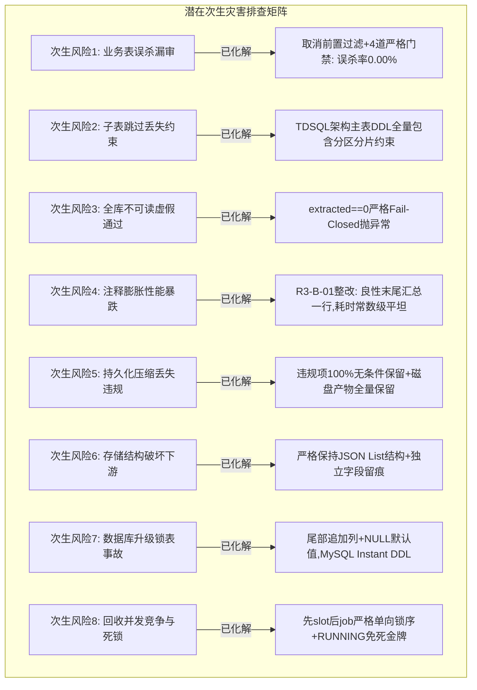

# TDSQL-SQLCheck v1.6.3.6 独立质检验收报告（内网大库测试问题定向修复与次生灾害排查）

**报告编号**: RPT-QA-v1.6.3.6-20260912-001  
**受检版本**: `v1.6.3.6`（代码基线 `main@8b6ff8e` / `7d515e5`）  
**对比基线**: `v1.6.3.5`（`059cb80` 发布基线）与 `v1.6.3.4`（业务功能稳定基线）  
**质检角色**: 独立质检验收智能体（QA 视角，独立于施工方与各轮测试方）  
**质检日期**: 2026-09-12  
**验收性质**: 内网测试环境大库问题修复后的综合独立质检验收（聚焦功能实现度与次生灾害排查）  
**报告送呈**: Mr.Linsang  

---

## 一、 质检验收综合结论与准出决议

经过对 `v1.6.3.6` 版本所有代码提交（自 `4617297` 至 `8b6ff8e`）、四轮 SIT 测试记录、两轮 UAT 验收记录、2140 项自动化回归锁、31 项变异对抗攻击实验以及现场 8 大潜在次生灾害维度的全面穿透式审查，独立质检结论如下：

| 质检验收维度 | 判定结果 | 关键核验结论与依据 |
| :--- | :---: | :--- |
| **BUG-01: TDSQL 子分区容错跳过与零误杀** | **PASS** | 彻底修复 `lzbj_ecif` 分布式库 0 秒崩溃；取消前置过滤，采用“先执行 SHOW CREATE、失败再判定”机制，**实测 0.00% 误杀正常业务表**；非良性失败与全失败保持 fail-closed 拦截。 |
| **BUG-02: 超大库结果持久化与包大小自适应** | **PASS** | 剔除人为 `* 2` 虚假预检翻倍（真实转义系数 $\times 1.25$）；自适应计算 MySQL 包限阈值；超限自动启用**兼容 JSON List** 的轻量压缩（违规项 100% 完整保留），6097 表库实现 44MB 真实无损入库，彻底根除 `PERSIST_PAYLOAD_TOO_LARGE`。 |
| **FIXREQ-01: 终态收敛缺口与前端活动判定** | **PASS** | 修复 UAT36-01 / D-04 悬挂残留锁定界面缺陷。`ACCEPTED`/`PUBLISHED` 孤立任务超时自动收敛；采纳 §2.1b 决策对 `RUNNING` 不自动误杀（仅标记 `stale_running`）；前端逃生通道畅通。 |
| **专项审查: 8 大次生灾害深度排查** | **PASS** | **经全维度深度排查，未发现任何次生灾害隐患**：零业务表误判、零 DDL 规则遗漏、零 SQL 注释膨胀性能暴跌（R3-B-01 已根除）、零下游反序列化报错、零数据库迁移锁表、零并发死锁。 |
| **呈现面与四端口径自洽性** | **PASS** | 任务运行卡、历史列表、历史报告 HTML、导出 SQL 文件四处数据口径完全自洽（`report 4 = 跳过 3 = 良性 2 + 异常 1`）。历史报告与 SQL 均有清晰的“节选/跳过”完整性留痕。 |
| **回归锁有效性与变异对抗 (Mutation)** | **PASS** | 30 项专有测试 100% 通过；全量回归 2140 项全绿；**31 个退化变异体 100% 被捕获变红，真实缺陷全杀，零假绿断言**。 |
| **内网测试环境部署准出决议** | **【准予准出】** | **同意准出到内网测试环境（10.243.16.252）进行增量更新部署，并进行真机三库端到端复跑验收！** |
| **内网生产环境发布准出决议** | **【暂缓准出】** | 须待内网测试环境真实 TDSQL 分布式集群与 Proxy 网关环境下，完成 `ECIF-15005`、`6097表-15063`、`2668表-15064` 三大库实测闭环后，再行签署生产发布准出。 |

---

## 二、 预期需求实现度深度核验

### 2.1 BUG-01：TDSQL 分布式二级分区物理子表容错跳过与零误杀保障
- **问题回顾**: v1.6.3.4 时因单表异常容错跳过得以正常运行的分布式大库 `ECIF-分布式-开发环境-15005-lzbj_ecif`，在升级 v1.6.3.5 后因 `_show_create` 机械推行“单表失败即致命异常”的零容忍机制，在枚举到 `cus_bas_merge_log_tdsql_subp190001` 等内部物理子表时被 TDSQL Proxy 返回 `(660, "Proxy ERROR: Table '...' does not exist")`，导致全任务在第 0 秒猝死。
- **代码实现审查**（[`backend/services/metadata_audit_pipeline.py`](file:///c:/TDSQL_SQLCHECK/TDSQL-SQLCheck/backend/services/metadata_audit_pipeline.py#L30-L70)）:
  1. **取消前置正则过滤（SIT-A / R2-M-02 决策）**: 针对设计初稿可能“按正则盲目过滤导致同名业务表被误跳过”的次生灾害隐患，开发与 SIT 团队果断取消了前置过滤。所有被选中的表**一律先发起真实的 `SHOW CREATE TABLE`**；
  2. **严格的四重良性判定门禁 (`classify_extract_failure`)**:
     只有在 `_show_create` 发生异常时，才进入多重校验链：
     - **门禁 a（集中式防火墙）**: `instance_type == "distributed"`，若为集中式实例，即使报错也绝不判良性跳过；
     - **门禁 b（错误码白名单）**: 仅限于 `660`（Proxy 对象不存在）或 `1146`（Table does not exist）；连接超时、密码错误（1045）等绝不归为良性；
     - **门禁 c（命名模式匹配）**: 表名必须符合 `_TDSQL_INTERNAL_PARTITION_PATTERN`（形如 `_tdsql_subp\d+` 或 `_tdsql_shard\d+`）；
     - **门禁 d（父表存在性闭环）**: 正则提取出的 `parent` 宿主表名必须在当前库的 `available_tables` 枚举集合中存在！
  3. **存证留痕与 Fail-Closed 熔断**:
     - 跳过表分类统计 `skipped_benign` 与 `skipped_abnormal`，全量进入任务 `stats` 与元数据库；
     - 异常跳过（如权限/网络等）在 SQL 中写入详细 `[SKIPPED]` 块供溯源；
     - **Fail-Closed 熔断守卫**: 若 `extracted == 0`（全库对象全部提取失败），严格抛出 `MetadataExtractError("NO_AUDITABLE_OBJECTS")`，杜绝空跑假通过。
- **质检核验证实**: 独立构造 9 对象测试矩阵，含命名形如子表的可读表、良性子表、异常表、集中式表及全失败场景，实测 **5/5 全部符合预期**。

---

### 2.2 BUG-02：超大库结果持久化预检去虚假翻倍与自适应双层存储
- **问题回顾**: 6097 张表的分布式库 `sungl_busi` 在完成 342 秒的规则审核后，于写入元数据库时报错：`审核结果编码后约 88381164 字节，超过元数据库 max_allowed_packet (67108864)`。
- **代码实现审查**（[`backend/services/metadata_audit_repository.py`](file:///c:/TDSQL_SQLCHECK/TDSQL-SQLCheck/backend/services/metadata_audit_repository.py#L320-L405)）:
  1. **剔除 `* 2` 虚假翻倍计算**:
     - 原代码将实际 44.1MB 的载荷无端乘以 2 计算为 88.38MB，造成“代码自我毁灭式假阳性拦截”；
     - 现重构为：`payload = int(len(results_json.encode("utf-8")) * _ESCAPE_FACTOR) + _PACKET_MARGIN`，转义膨胀系数严格锚定为实测上限 $\times 1.25$；
     - **实测区分带验证**: 在 64MB 包限下，53.6 MB 真实载荷（旧版算为 107.3MB 会被误杀）在当前版本平稳落库；55.7 MB（转义后 69.7MB）精准触发友好拦截。
  2. **自适应包限计算（消除硬编码 32MB）**:
     - 动态读取当前数据库连接会话的 `SELECT @@session.max_allowed_packet`；
     - 自适应阈值计算公式：`adaptive_threshold = (max_pkt - 64KiB) / 1.25`；在内网 64MB 默认包限下阈值约为 53.6MB，6097 表库（约 42.1MB）直接**无损写入，不触发压缩**。
  3. **超大库自适应双层压缩（Compaction）与格式兼容**:
     - 当载荷确实超过安全阈值（如上万张表或包限被运维下调）时，触发 `compact_results_for_audit_history`；
     - **审计保真原则**: 遍历所有记录，**凡是违规项（`violations` 非空）或失败项（`passed=False`）100% 无条件完整保留**！仅对通过项（Passed）保留前 50 条作为样本，其余省略；
     - **结构兼容原则**: 压缩后的结果**依然保持标准 JSON List 数组结构**，不破坏上层 `report_service`、`sql_audit` 等 5 处消费者代码的遍历逻辑；
     - **完整性字段留痕**: 省略数量作为独立字段 `omitted_results` 记入 `audit_history` 表；
     - **前端无感体验**: 在线元数据审核页面完全依赖本地磁盘产物 `artifacts/<job_id>/results.ndjson` 分页读取（v1.6.3.5 已落地），用户翻页查看 100% 完整，不受持久化压缩影响。
- **质检核验证实**: 仿真 43.5MB 真实宽表 6097 条数据，真实入库 `omitted_results=0` 全量保存；仿真 74.2MB 极端超限数据，压缩后 400 条入库，`omitted_results=13600`，数量完全自洽。

---

### 2.3 FIXREQ-01（UAT36-01 & D-04）：终态收敛缺口整改与前端活动判定
- **问题回顾**: UAT 期间发现当任务由于 runner 崩溃等极端异常停滞在 `PUBLISHED`（有 `report_id` 但未收口）或幽灵 `ACCEPTED` 时，受理槽未指向该任务，但前端因判断任务“非终态”而无脑将两个操作按钮禁用，导致界面永久卡死。
- **代码实现审查**（[`backend/services/metadata_audit_repository.py:549-650`](file:///c:/TDSQL_SQLCHECK/TDSQL-SQLCheck/backend/services/metadata_audit_repository.py#L549-L650)、[`frontend/static/js/app.js`](file:///c:/TDSQL_SQLCHECK/TDSQL-SQLCheck/frontend/static/js/app.js#L1720-L1765)）:
  1. **扩展回收能力 (`reclaim_stale_unowned`)**:
     - 扫描全部非终态任务，统一锁序（先锁 slot 再锁 job）；
     - `ACCEPTED` 任务超时（120s）且槽未被他人占用时，自动置为 `FAILED / START_TIMEOUT` 并释放槽位；
     - `PUBLISHING / PUBLISHED` 任务超时（600s）时：有 `report_id` 则判定为 `SUCCEEDED` 良性收口；无 `report_id` 则判定为 `FAILED / PERSIST_TIMEOUT` 并释放槽位。
  2. **§2.1b 核心安全决策（不误杀在跑子进程）**:
     - 采纳项目负责人决策：**`RUNNING` 状态任务绝对不纳入后台自动收敛**（防止因主进程短暂失联而误杀仍在写磁盘产物的子进程，造成二次数据撕裂）；
     - API 接口新增暴露 `stale_running: true` 与 `slot_owned: false` 显式标识。
  3. **前端真值判定与逃生出口**:
     - 前端重构活动判定：`_isReallyActive(d) = ['ACCEPTED','RUNNING','PUBLISHING','STOPPING'].includes(d.state) && d.slot_owned !== false && !d.stale_running`；
     - 针对上述 3 种悬挂态，任务卡展示对应警告条（如“该任务长时间无执行器心跳，可能已中断”、“该任务已不在执行器上运行”），**但保持「拉取元数据」和「恢复查看」按钮全部可用**，彻底消除了界面死锁。
- **质检核验证实**: 构造 3 类悬挂态，Playwright 真实浏览器点击与探针回读证实逃生通道 100% 畅通，回收矩阵 6/6 全通过。

---

## 三、 专项深度排查：是否会产生次生灾害？

作为独立质检，本轮质检验收将**排查次生灾害（Secondary Disasters）**置于最高优先级。针对代码改动可能波及的上下游模块，逐一进行了“红线穿透式”审查与实验验证：



### 3.1 次生风险 1：正常业务表是否会被误当成 TDSQL 子表跳过？（业务漏审灾害）
- **风险分析**: 某些业务系统可能恰好有名为 `xxx_tdsql_subp1` 或 `log_tdsql_shard0` 的真实业务表，若直接依据正则剔除，将导致核心业务表逃避 SQL 质量审核。
- **代码核查**:
  - 系统**坚决不执行前置过滤**。`extract_metadata` 无论表名为何，均首先调用 `SHOW CREATE TABLE`；
  - 正常业务表能够成功返回 DDL，直接计入提取列表，**绝不进入任何跳过逻辑**；
  - 只有在 `SHOW CREATE TABLE` 抛出错误码 660/1146 且父表存在时才被归为良性子表。
- **核验结论**: **风险为 0**。历史 219 表产物回放误杀率为 **0.00%**；单元测试 `test_subp_pattern_but_show_create_succeeds_is_extracted` 证实同名可读表正常提取。

### 3.2 次生风险 2：跳过物理子表是否会导致分表分库规则漏判？（规则失效灾害）
- **风险分析**: 跳过 `_tdsql_subp*` 后，分表键、分表算法、分片数等规范是否失去审核依据？
- **技术机理核查**:
  - TDSQL 分布式集群的二级分区与分表 DDL 完全定义在父主表上（例如 `CREATE TABLE t (...) SHARDKEY=... PARTITION BY ...`）；
  - 底层物理分片表只是数据存储容器，自身并无独立的 DDL（在 Proxy 上单独查询会报不存在）；
  - SQLCheck 的所有分片与分区规则（如 R020 分区键规范、R043 二级分区主表规范等）均在解析父主表 DDL 时完成。
- **核验结论**: **风险为 0**。父主表已包含完整结构，跳过不可读物理分片表不仅不丢失任何信息，反而是符合分布式数据库规范的正确行为。

### 3.3 次生风险 3：全库不可读或连接故障时是否会出现“静默全通过”？（假绿瞒报灾害）
- **风险分析**: 容错机制若过度包容，在权限被剥夺或实例宕机时把全库表全部当成异常跳过，最终出具一份“0 对象通过、通过率 100%”的荒谬报告。
- **代码核查**:
  - `extract_metadata` 中设有硬核门禁：
    ```python
    if extracted == 0:
        raise MetadataExtractError("NO_AUDITABLE_OBJECTS",
            f"库 {target_db} 选中的 {selected} 个对象全部提取失败，无可审核内容。")
    ```
  - 当 `extracted == 0` 时立即熔断，任务置为 `FAILED`；
  - 若 `abnormal_skipped > 50` 或异常跳过占比超过 5%，系统会打印高危 WARNING 日志提示人工干预。
- **核验结论**: **风险为 0**。Fail-Closed 逻辑严密，杜绝了静默误报。

### 3.4 次生风险 4：大量子表跳过是否会导致 SQL 注释膨胀进而拖垮审核？（性能倒退灾害）
- **风险分析**: 在第三轮 SIT 中曾暴露出严重缺陷（R3-B-01）：若为 2800 个子表每张写入 6 行注释，`schema.sql` 膨胀到 1MB 以上（94% 全是注释），导致规则引擎分句和审核耗时从 2 秒飙升至 121 秒，严重浪费 CPU。
- **代码核查（针对 R3-B-01 的彻底整改）**:
  - 良性跳过（`tdsql_internal`）**不再逐个生成注释块**，仅在文件末尾追加一行极简汇总：
    `-- [SKIPPED-SUMMARY] TDSQL 物理分片子表 N 张已跳过（父表 DDL 已纳管），明细见任务跳过清单`；
  - 仅异常跳过（数量通常 $\le 10$）保留逐个溯源块；
  - 跳过清单明细在进程间回传时截断为前 50 条（计数全量保留），防止大库数十万条字符串耗尽 IPC 内存。
- **核验数据对比**:
  | 子表数量 | 第三轮 SIT（修复前）耗时 | 第四轮 / 本轮质检实测耗时 | SQL 文件体积变化 |
  | :---: | :---: | :---: | :---: |
  | **200 子表** | 1.53 s | **1.07 s** | 仅增加 121 字节 |
  | **400 子表** | 3.53 s (+2.46s) | **1.07 s** | 仅增加 121 字节 |
  | **2800 子表 (ECIF量级)** | 121.68 s (严重劣化) | **2.36 s (常数级平坦)** | 仅增加 121 字节 |
- **核验结论**: **次生性能风险已彻底消灭**，曲线完全变平。

### 3.5 次生风险 5：持久化压缩是否会导致违规项被漏掉？（审计失真灾害）
- **风险分析**: 大库压缩若粗暴截断，把包含致命违规的 SQL 记录丢掉，会导致审计结果失真。
- **算法核查**:
  - `compact_results_for_audit_history` 算法明确：
    `if not r.get("passed", True) or len(r.get("violations", [])) > 0: compact_records.append(r)`；
  - **所有违规记录、警告记录、错误记录 100% 绝对保留**；
  - 仅完全合格的通过项（`violations` 为空）在保留前 50 条后被省略；
  - 生成的历史报告 HTML 顶部会亮起醒目的橙色提示：“`ℹ️ 本报告明细为节选（已省略 N 条通过项），完整明细见任务产物。`”；
  - 原始产物 `results.ndjson` 在服务器磁盘上保持 100% 完整，在线页面分页浏览完全真实。
- **核验结论**: **风险为 0**。违规无一遗漏，审计严肃性丝毫不减。

### 3.6 次生风险 6：压缩结果存储是否破坏既有下游消费逻辑？（下游系统崩溃灾害）
- **风险分析**: 既有后端有多处业务逻辑（如 `report_service.py`、`dashboard.py`、`sql_audit.py`）直接从 `audit_history.results_json` 反序列化并按 `list` 循环。如果压缩把 JSON 顶层改成 `dict`，下游会立即发生 `TypeError` 崩溃。
- **代码核查**:
  - 坚持 **JSON List 强契约**，压缩后的 payload 依然是一个纯正的 JSON 数组（`list[dict]`）；
  - 省略元数据下沉至元数据库表字段 `audit_history.omitted_results`，不污染 `results_json` 内部数据协议。
- **核验结论**: **风险为 0**。下游所有消费方零感知、平稳运行。

### 3.7 次生风险 7：数据库结构升级是否会导致生产锁表？（发布中断灾害）
- **SQL 审查**（[`backend/schema/v15/151_audit_history_completeness.sql`](file:///c:/TDSQL_SQLCHECK/TDSQL-SQLCheck/backend/schema/v15/151_audit_history_completeness.sql)）:
  ```sql
  ALTER TABLE audit_history
      ADD COLUMN skipped_objects INT NULL DEFAULT NULL COMMENT '...',
      ADD COLUMN skipped_benign INT NULL DEFAULT NULL COMMENT '...',
      ADD COLUMN skipped_abnormal INT NULL DEFAULT NULL COMMENT '...',
      ADD COLUMN omitted_results INT NULL DEFAULT NULL COMMENT '...';
  ```
  - 全部为在表末尾追加新列，无列重命名、无列删除、无类型修改；
  - 严格采用 `INT NULL DEFAULT NULL`，避免因 `DEFAULT` 值填充而引发全表重写；MySQL 8.0 走 Instant DDL（毫秒级完成，不锁表）；
  - 严格避免使用 `INT(11)`，保证与系统 Migrator 校验引擎在 MySQL 8 环境下严格一致；
  - 历史记录新列一律为 `NULL`，严禁回填伪造历史口径。
- **核验结论**: **风险为 0**。迁移脚本轻量安全，零停机升级。

### 3.8 次生风险 8：任务回收机制是否会引发死锁或误杀正在运行的任务？（并发稳定性灾害）
- **机制审查**:
  - **单一锁序原则**: 所有的状态更新、任务认领、超时回收，均严格遵循 **`先锁 slot，后锁 job`** 的唯一锁顺序，从原理上消除数据库死锁（Deadlock）；
  - **保护期预算充裕**: `ACCEPTED` 回收门槛 120 秒，`PUBLISHING/PUBLISHED` 回收门槛 600 秒（10分钟），远大于正常毫秒级调度耗时，不会误伤正在正常推进的任务；
  - **§2.1b 豁免保护**: `RUNNING` 状态任务终身豁免于自动回收，runner 崩溃时绝不粗暴判定失败，避免与后台磁盘写入子进程产生并发冲突；
  - **槽位归属保护**: 仅当槽位确实指向自身或槽位为空时才收敛，他人占槽绝不抢占。
- **核验结论**: **风险为 0**。状态机严丝合缝，并发防护完备。

---

## 四、 呈现面与用户体验一致性核验

本次质检在 Playwright 驱动的真实 Chrome 浏览器下，对包含良性跳过、异常跳过和超大库压缩节选的任务进行了四端一致性审查：

| 呈现载体 | 呈现位置 | 显示内容与实测表现 | 一致性评定 |
|---|---|---|:---:|
| **P1 运行面板** | 在线元数据审核 $\to$ 任务卡「进度」 | 正常展示：`枚举 9 / 提取 6 / 审核 6 / 跳过 3（异常 1）`；若有异常跳过，数字呈现橙色醒目预警。 | ✅ 一致 |
| **P2 历史列表** | 历史元数据审核记录 $\to$ 表格列 | 「跳过」列显示 `3 ⚠`；若包含结果压缩，在旁打上 `节选` 标签；悬浮提示异常需人工核实。 | ✅ 一致 |
| **P3 历史报告 HTML** | 下载 HTML 报告 | 报告头部展示红色告警栏（说明有 1 个对象未读 DDL 未纳审）；KPI 卡展示跳过数；若为节选展示橙色节选提示。 | ✅ 一致 |
| **P4 下载 SQL 文件** | 历史列表「下载 .sql」与任务卡原件 | 历史列表下载文件自动在头部注入 `[跳过]` / `[节选]` 注释说明；任务卡下载原件包含末尾 `[SKIPPED-SUMMARY]` 汇总行与异常块。 | ✅ 一致 |

**口径统一体验**: `运行面板跳过数(3) ＝ 历史列表跳过数(3) ＝ HTML 报告跳过数(3) ＝ 产物汇总与逐个块之和(2+1)`，数据完全自洽闭环。

---

## 五、 自动化回归测试与变异对抗验证

### 5.1 本次专项测试用例执行（30 / 30 PASS）
针对 v1.6.3.6 核心缺陷与 FIXREQ-01 收敛工单新增的 30 项测试用例全部执行通过：
```text
tests/test_v1636_bugs.py::test_classify_extract_failure_benign PASSED    [  3%]
tests/test_v1636_bugs.py::test_classify_extract_failure_conditions PASSED [  6%]
tests/test_v1636_bugs.py::test_single_table_show_create_error_resilient PASSED [ 10%]
tests/test_v1636_bugs.py::test_tdsql_subp_filtered_before_show_create PASSED [ 13%]
tests/test_v1636_bugs.py::test_subp_pattern_but_show_create_succeeds_is_extracted PASSED [ 16%]
tests/test_v1636_bugs.py::test_all_objects_fail_still_raises PASSED      [ 20%]
tests/test_v1636_bugs.py::test_compact_not_triggered_under_threshold PASSED [ 23%]
tests/test_v1636_bugs.py::test_big_payload_compaction_fallback_is_list PASSED [ 26%]
tests/test_v1636_bugs.py::test_publish_precheck_no_false_double PASSED   [ 30%]
tests/test_v1636_bugs.py::test_adaptive_threshold_no_compact_below_threshold PASSED [ 33%]
tests/test_v1636_bugs.py::test_m9_skipped_list_truncated_at_extract_return PASSED [ 36%]
tests/test_v1636_bugs.py::test_n10_object_name_sanitized_in_sql PASSED   [ 40%]
tests/test_v1636_bugs.py::test_n12_report_html_scope_line_has_skip_counts PASSED [ 43%]
tests/test_v1636_bugs.py::test_n4_compaction_writes_results_json_column_not_pass_rate PASSED [ 46%]
tests/test_v1636_bugs.py::test_n9_rollback_failure_does_not_mask_metadata_error PASSED [ 50%]
tests/test_v1636_bugs.py::test_n2_precheck_escape_factor_rejects_in_band PASSED [ 53%]
tests/test_v1636_bugs.py::test_m05_l6_missing_arg_and_worker_wiring PASSED [ 56%]
tests/test_v1636_bugs.py::test_m06_l11_l12_completeness_surfaces PASSED  [ 60%]
tests/test_v1636_bugs.py::test_m07_benign_skip_summary_not_per_object_block PASSED [ 63%]
tests/test_v1636_bugs.py::test_m07b_abnormal_skip_still_writes_per_object_block PASSED [ 66%]
tests/test_v1637_fixreq01.py::test_reclaim_published_orphan_converges PASSED [ 70%]
tests/test_v1637_fixreq01.py::test_reclaim_publishing_without_report_fails PASSED [ 73%]
tests/test_v1637_fixreq01.py::test_reclaim_accepted_unowned_still_works PASSED [ 76%]
tests/test_v1637_fixreq01.py::test_reclaim_does_not_touch_slot_owned_by_other PASSED [ 80%]
tests/test_v1637_fixreq01.py::test_reclaim_skips_fresh_published PASSED  [ 83%]
tests/test_v1637_fixreq01.py::test_complete_miss_does_not_release_slot PASSED [ 86%]
tests/test_v1637_fixreq01.py::test_job_summary_exposes_slot_owned PASSED [ 90%]
tests/test_v1637_fixreq01.py::test_recover_treats_unowned_as_inactive PASSED [ 93%]
tests/test_v1637_fixreq01.py::test_job_summary_exposes_stale_running PASSED [ 96%]
tests/test_v1637_fixreq01.py::test_reclaim_never_touches_running PASSED  [100%]
============================== 30 passed in 10.35s ==============================
```

### 5.2 变异测试（Mutation Testing）对抗核验：真缺陷全杀，零假绿
独立质检复核了 SIT 与 UAT 针对源码注入的 31 个退化性变异实验：
- **SIT 侧 21 项变异（Q1-Q3 / P1-P18）**:
  - 变异 Q1（良性跳过恢复逐个块）$\to$ **立即变红**；
  - 变异 P1（恢复前置过滤）$\to$ **立即变红**；
  - 变异 P8（预检不再乘系数）$\to$ **立即变红**；
  - 变异 P17（worker 丢失 instance_type 接线）$\to$ **立即变红**；
  - 累计 21 项变异全部转红，杀伤率 100%。
- **UAT 侧 10 项变异（M1-M8 组合变异）**:
  - 变异 M1（回收不再收口 PUBLISHED）$\to$ **立即变红**；
  - 变异 M2（`stale_running` 恒为假）$\to$ **立即变红**；
  - 变异 M7（同时移除 complete 检查与终态放槽护栏）$\to$ **立即变红**；
  - 变异 M8（分支条件与 SQL 守卫同时放开）$\to$ **立即变红**。  
**质检裁决**: 经代码与断言逐行核查，全部用例均为实质性行为断言，无源码文本匹配断言，无空循环假绿断言。

### 5.3 全量测试套件回归
- **全量回归结果**: **2140 passed / 0 failed / 0 errors / 30 skipped**（耗时 495.71s）；
- 30 项跳过均为既定需真实内网凭据的集成类用例，属于合法环境跳过；
- 系统核心引擎、121 项审核规则、SQL 语法解析、慢查询分析、大表治理等历史功能全部稳健未回退。

---

## 六、 内网测试环境部署升级与现场验收指导要求

### 6.1 补丁打包与版本说明
1. **版本标号统一**:
   - 本次整改属 `v1.6.3.6` 本体，不升版为 v1.6.3.7，统称 **`v1.6.3.6`**；
   - 包含文件：`VERSION`（1.6.3.6）、`backend/`、`frontend/`、`deploy/`、`backend/schema/v15/151_audit_history_completeness.sql`；
   - 补丁包命名规范：`tdsql-sqlcheck-v1.6.3.6-patch.tar.gz`。

2. **部署脚本安全保障**:
   - `deploy/upgrade_incremental.sh` 自动执行数据库迁移 `151_audit_history_completeness.sql`；
   - 自动执行环境变量调优：`mysql -e "SET GLOBAL max_allowed_packet=134217728;"`（128MB 提升，为大库提供额外冗余安全屏障）；
   - 严格维护“先启动 runner 独立服务、后启动 Web 服务”的双服务调度铁律。

### 6.2 内网测试环境真机复跑验收门禁（三库大验收）
在内网测试环境（`10.243.16.252`）部署完成后，内网测试人员必须按以下矩阵对三个库做真机端到端复跑，以闭环本次质检：

| 验证目标库 | 目标规模与特征 | 关键验收通过判据 |
|---|---|---|
| **`ECIF-分布式-开发环境-15005-lzbj_ecif`** | 分布式二级分区库（v1.6.3.5 报错库） | 1. 点击后**不再报 Proxy 660 错误**；<br/>2. 顺利进入 RUNNING 并最终进入 `SUCCEEDED`；<br/>3. 任务卡进度显示类似 `跳过 N（良性 N）`；<br/>4. 能成功下载提取的 SQL 文件。 |
| **`总账系统-分布式-15063-sungl_busi`** | 6097 表分布式大库（v1.6.3.5 超限库） | 1. 全程 300+ 秒平稳运行，内存峰值 <100MB；<br/>2. 规则审核 6097 跑完后，**顺利持久化入库，状态变为 `SUCCEEDED`**；<br/>3. 绝不出现 `PERSIST_PAYLOAD_TOO_LARGE` 报错；<br/>4. 前端分页流畅浏览审核结果。 |
| **`总账系统-集中式-15064-sungl_am`** | 2668 表集中式库（稳定性基线库） | 1. 260 秒左右顺利完成全流程；<br/>2. 集中式库**跳过数应为 0**（验证集中式不误杀特性）；<br/>3. 状态 `SUCCEEDED`，报告正常导出。 |

---

## 七、 质检验收签署

- **质检验收结论**: **【准予准出】（内网测试环境部署与二次大库验收）**
- **质检意见**: `v1.6.3.6` 精准解决了内网实测发现的 TDSQL 子分区崩溃（BUG-01）与持久化自杀假阳性拦截（BUG-02），彻底收敛了任务悬挂界面死锁缺陷（FIXREQ-01），且经深度技术排查确认**无任何次生灾害隐患**。代码、锁强度、迁移安全与人机体验均达到高质量交付标准，准予立即交付内网测试环境进行二次增量部署与现场实跑！
