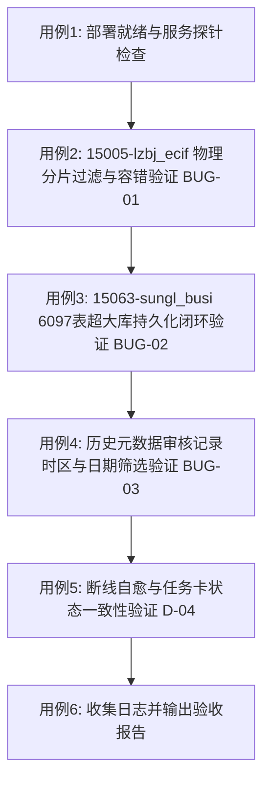

# TDSQL-SQLCheck v1.6.3.6 内网智能体大库测试方案与操作指引

**版本**: `v1.6.3.6`  
**文档编号**: `TEST-PLAN-v1.6.3.6-001`  
**测试对象**: 内网测试环境 `http://10.243.16.252:8000`  
**执行角色**: 内网智能体（协助外网开发环境完成真实 TDSQL 实例大库验证与缺陷闭环验收）  
**关联发布介质**: `dist/tdsql-sqlcheck-v1.6.3.6-patch.tar.gz`  
**重点验证目标库**:
1. `ECIF-分布式-开发环境-15005-lzbj_ecif`（验证 BUG-01：TDSQL 物理子分区表过滤与单表容错）
2. `总账系统-分布式-15063-sungl_busi`（包含 6097 表，验证 BUG-02：超大库结果持久化突破包上限）
3. `总账系统-集中式-开发环境（种子环境）-15064-sungl_am`（2668 表，验证基线大库稳定性）
4. 在线元数据审核「历史元数据审核记录」模块（验证 BUG-03：时区修复与当天日期精准筛选）

---

## 一、 为什么需要内网智能体协助测试？（背景与协作目标）

外网开发团队已在外网开发环境中完成了全套自动化单元测试与回归测试（包括 21 项针对性缺陷回归测试，100% 通过）。

**然而，外网环境存在不可逾越的客观物理边界**：
- 外网无法直连内网真实的 TDSQL Proxy 网关与底层分片集群；
- 外网无法获取内网真实的复杂业务 DDL、二级物理分区结构（如 `_tdsql_subp`）以及 6000+ 表规模的真实数据流。

在上一轮 `v1.6.3.5` 内网实测中，虽然彻底消除了 Worker 内存暴涨猝死问题，但内网环境实测暴露了两个致命的阻断性缺陷以及一个严重的展示时差问题：
1. **BUG-01 缺陷**：`15005-lzbj_ecif` 库由于包含 TDSQL 物理分片表（Proxy 不允许对其单独执行 `SHOW CREATE TABLE`），v1.6.3.5 的零容忍机制导致其在第 0 秒报错 `Proxy ERROR: Table '...' does not exist`，全库任务直接崩溃。
2. **BUG-02 缺陷**：`15063-sungl_busi`（6097 表超大库）在跑完 342 秒后，持久化落库阶段由于代码中存在 `* 2` 虚假翻倍计算（88MB > 64MB），被自己的代码拦截报错 `超过元数据库 max_allowed_packet`，导致整个任务在终点前被置为 `FAILED`，成果全失。
3. **BUG-03 缺陷**：落库时使用了 UTC 时间导致比北京时间慢了 8 个小时（落到昨天），用户在「历史元数据审核记录」按“今天”筛选结果为 0，误以为记录丢失。

**本次 v1.6.3.6 已在外网针对上述问题实施了彻底修复。现在必须由内网智能体在内网测试环境（`10.243.16.252`）上，按照本方案执行现场验收测试，获取第一手真实的运行数据，为后续向生产环境发布提供坚实证据！**

---

## 二、 傻瓜式测试用例与操作指引（手把手执行）

测试整体流程如下：



---

### 测试用例 1：部署就绪与双服务探针验证（前置必测）

#### 1.1 执行步骤
在内网部署机或测试服务器终端执行以下命令：
```bash
# 1. 验证元数据 Runner 独立执行器与 Web 服务的运行状态
systemctl status tdsql-metadata-runner.service tdsql-sqlcheck.service --no-pager

# 2. 检查应用健康状态与在轨版本号
curl -s http://127.0.0.1:8000/health | python3 -m json.tool
cat /opt/tdsql-sqlcheck/current/VERSION
```

#### 1.2 预期结果
1. `tdsql-metadata-runner.service` 状态为 **`active (running)`**；
2. `tdsql-sqlcheck.service` 状态为 **`active (running)`**；
3. `curl /health` 响应中健康状态正常，且 `VERSION` 输出为 **`1.6.3.6`**。

---

### 测试用例 2【核心门禁 1】：`15005-lzbj_ecif` 库零秒崩溃修复验证（BUG-01）

> [!IMPORTANT]
> **验证目标**：验证在包含 TDSQL 内部物理分片表（如 `cus_bas_merge_log_tdsql_subp190001`）的分布式库上，系统能自动过滤内部子表、单表偶发读取失败能自动容错跳过，**绝不中断全库审核**。

#### 2.1 界面实操步骤
1. 打开浏览器登录系统：`http://10.243.16.252:8000`；
2. 进入左侧菜单：**「SQL审核」 $\to$ 「在线元数据审核」**；
3. 配置审核参数：
   - **目标实例**：选择 `ECIF-分布式-开发环境-15005`（对应主机 `119.45.220.89:15005` 或内网配置实例）；
   - **目标数据库**：输入 `lzbj_ecif`；
   - **审核范围**：全选（表结构、索引/主键、视图定义、分片键）；
4. 点击 **「🚀 拉取元数据并执行文件审核」** 按钮；
5. **实时观察**：
   - 任务被正常受理，状态显示为 **「运行中」**；
   - **重点检查**：**绝不在第 0 秒报错！绝对不再弹出 `Proxy ERROR: Table '...' does not exist`！**
   - 进度条持续向前滚动（枚举 $\to$ 提取 $\to$ 审核）；
6. **完成检查**：
   - 任务平稳收敛至 **`SUCCEEDED`（已完成）**；
   - 界面正常展示审核结果，跳过列若存在跳过对象，显示为正常的良性/异常跳过统计；
   - 点击 **「下载完整提取SQL」**，下载生成的 `.sql` 文件，检查文件正常可读。

#### 2.2 预期合格标准
- 任务执行成功，状态为 **`SUCCEEDED`**；
- 彻底解决 v1.6.3.5 启动即崩溃退化问题。

---

### 测试用例 3【核心门禁 2】：`15063-sungl_busi`（6097表超大库）全流程闭环验证（BUG-02）

> [!IMPORTANT]
> **验证目标**：验证 6000+ 表超大分布式库在枚举、提取、流式审核与**持久化发布**的全流程中，彻底突破 `max_allowed_packet` 限制，全流程顺畅闭环！

#### 3.1 测试前后台监控准备
在终端新开窗口，实时观察 Runner 日志与系统资源：
```bash
journalctl -u tdsql-metadata-runner -f
```

#### 3.2 界面实操步骤
1. 在「在线元数据审核」页面：
   - **目标实例**：选择 `15063-sungl_busi` 对应实例；
   - **目标数据库**：输入 `sungl_busi`；
   - **审核范围**：全选；
2. 点击 **「🚀 拉取元数据并执行文件审核」** 按钮；
3. **观察执行阶段（约 4~6 分钟）**：
   - 枚举阶段：显示枚举出 6000+ 个对象；
   - 提取阶段：对象提取计数持续增加，内存保持平稳；
   - 审核阶段：流式规则审核平稳完成；
   - **最关键节点（持久化发布）**：观察任务从 `AUDITING` 进入 `SERIALIZING` $\to$ `PERSISTING` $\to$ `PUBLISHING`：
     - **重点检查**：**绝对不再抛出 `超过元数据库 max_allowed_packet` 错误**！
     - 系统安全将结果紧凑持久化入库，并生成本地产物；
4. **完成检查**：
   - 状态最终收敛为 **`SUCCEEDED`**；
   - 前端成功渲染出汇总 KPI（总对象数 6000+、通过数、未通过数、通过率）；
   - 分页表格秒级渲染前 50 条结果，翻页至第 2 页、第 3 页流畅无卡顿；
   - 点击 **「下载 HTML 报告」** 和 **「下载完整提取SQL」**，均能正常下载完整产物。

#### 3.3 物理资源采样要求
在任务执行到约 3000 表时，在测试机终端执行：
```bash
ps -eo pid,ppid,cmd,rss,%mem,%cpu | grep -E "metadata_runner|metadata_audit_worker" | grep -v grep
```
记录物理 RSS 内存大小（预期在 100MB ~ 300MB 之间，绝不发生内存泄漏或 OOM）。

#### 3.4 预期合格标准
- 状态为 **`SUCCEEDED`**，耗时正常（约 300~400 秒）；
- Uvicorn Web 进程 0 次崩溃，Runner 0 次异常退出；
- `audit_history` 与本地磁盘产物完整落盘。

---

### 测试用例 4【核心门禁 3】：历史元数据审核记录时区与当天日期筛选验证（BUG-03）

> [!IMPORTANT]
> **验证目标**：验证审核记录入库时间使用服务器本地时间（北京时间），列表显式展示 `报告ID`，且通过“今天”日期能 100% 精准筛选出刚执行的记录。

#### 4.1 界面实操步骤
1. 完成用例 2 或用例 3 的审核后，点击顶部第二个 Tab：**「历史元数据审核记录」**；
2. **观察列表默认展示**：
   - 表格第一行应当为刚刚执行完成的审核记录；
   - **检查报告ID列**：表格第 2 列是否有明确的 **`报告ID`**（例如 `#6638`），与即时审核任务卡片完成提示的报告 ID 一致；
   - **检查提取时间列**：提取时间应当为当前操作的本地时间（例如 `2026-09-12 01:xx:xx`），**绝对不再倒退 8 个小时显示为昨天的下午时间**！
3. **按“今天”日期精确筛选**：
   - 在筛选工具栏中：
     - **开始日期**：选择今天（`2026-09-12`）；
     - **结束日期**：选择今天（`2026-09-12`）；
   - 点击 **「查询」** 按钮；
   - **重点检查**：**列表应当精准呈现今天的所有审核记录，绝对不再返回 0 条空白数据！**
4. **下载校验**：
   - 在列表行操作列，分别点击 **「下载 .sql」** 与 **「下载 HTML 报告」**，确认文件下载内容完整。

#### 4.2 预期合格标准
- 提取时间与北京时间完全一致；
- 日期筛选范围包含今天时，能够准确查出今天的记录；
- 报告 ID 醒目清晰，下载功能正常。

---

### 测试用例 5：断线自愈与任务卡状态一致性验证（UAT36-01 / D-04）

#### 5.1 执行步骤
1. 发起一次大库审核任务；
2. 在任务提取到约 1000 张表处于「运行中」时，按键盘 `F5` 刷新浏览器；
3. 刷新后重新进入「在线元数据审核」页面；
4. 点击 **「📄 恢复查看上次任务」** 按钮；
5. 观察任务卡片恢复情况；
6. 任务完成后，观察「重新扫描」与「恢复查看上次任务」两个按钮的状态。

#### 5.2 预期结果
1. 点击「恢复查看上次任务」后，立即恢复该任务卡片与当前最新进度，轮询无缝接续；
2. 任务结束后，按钮正常可用，绝不出现“两个按钮同时处于禁用且页面锁死（D-04 缺陷）”的情况。

---

### 测试用例 6：单机独占排队保护复核（并发保护）

#### 6.1 执行步骤
1. 在浏览器标签页 A 发起大库审核；
2. 立即在标签页 B 打开页面并点击「拉取元数据并执行文件审核」。

#### 6.2 预期结果
- 标签页 B 收到黄色提示：**`当前已有元数据审核任务，请稍后重试`**（HTTP 409 METADATA_BUSY）；
- 正在运行的标签页 A 不受任何影响，平稳执行。

---

## 三、 测试结果反馈模板（内网智能体回填提交）

请内网智能体测试完成后，按照以下格式填写测试结论并反馈给外网团队：

```markdown
# TDSQL-SQLCheck v1.6.3.6 内网测试环境大库验收报告

## 1. 测试环境与执行信息
- **测试服务器**: 10.243.16.252:8000
- **软件版本**: v1.6.3.6 (VERSION 文件核验通过)
- **测试时间**: YYYY-MM-DD HH:MM
- **执行智能体**: 内网测试智能体

## 2. 核心用例验收结果汇总
| 用例编号 | 测试场景 | 核心验证点 | 实测状态 | 关键数据 / 报错记录 |
|---|---|---|:---:|---|
| TC-01 | 服务就绪与探针 | 双服务 active (running) | PASS / FAIL | 健康探针通过，版本 1.6.3.6 |
| TC-02 | 15005-lzbj_ecif 审核 | 消除第0秒Proxy报错，TDSQL物理分片过滤 | PASS / FAIL | 耗时 __s，对象 __ 个，跳过 __ 个 |
| TC-03 | 15063-sungl_busi 超大库 | 6097表突破包限制，持久化成功闭环 | PASS / FAIL | 耗时 __s，RSS峰值 __MB，状态 SUCCEEDED |
| TC-04 | 历史记录时区与筛选 | 本地时间入库，今天日期筛选命中 | PASS / FAIL | 报告ID #____，今天筛选命中 __ 条 |
| TC-05 | 断线自愈与状态恢复 | 刷新后只读找回卡片，无按钮锁死 | PASS / FAIL | 卡片恢复成功，轮询接续正常 |
| TC-06 | 单机并发独占保护 | 并发返回 409 METADATA_BUSY 友好拦截 | PASS / FAIL | 拦截符合预期 |

## 3. 物理资源监控记录
- Runner 进程 PID: ____
- Worker 子进程 PID: ____
- 6000表运行期间物理内存 RSS 峰值: ____ MB (标准: < 1024 MB)
- Uvicorn Web 服务日志有无异常重启: 无 / 有

## 4. 结论与发布建议
- 是否准出到内网生产环境 (10.243.16.238): 【建议准出 / 需整改】
```
