# TDSQL SQL审核工具 v1.6.4.1 内网测试环境功能与性能验收测试方案与操作指引

| 属性 | 规格 / 详细信息 |
|---|---|
| **被测系统版本** | **`v1.6.4.1`**（企业级 AI Copilot 智能专家助手稳健发布版） |
| **测试环境地址** | `http://10.243.16.252:8000`（内网测试服务器） |
| **测试服务器规格** | 银河麒麟 Linux Advanced Server V10 SP3，海光 x86_64 处理器 |
| **测试元数据库** | 本地独立 MySQL 8.0.28（`127.0.0.1:3306`，数据库 `tdsql_sqlcheck`） |
| **大模型推理网关** | 内网已配置并成功自检的真实 OpenAI 兼容大模型服务端点 |
| **执行测试角色** | **Lingma**（内网部署与测试智能体） |
| **编制设计角色** | **智能体 G**（外网开发与打包智能体） |
| **报告交付对象** | **MR.Linsang** / 智能体 G |
| **文档编号** | `TEST-PLAN-v1.6.4.1-001` |
| **编制日期** | 2026-09-21 |

---

## 零、 测试背景与协作目标

内网测试环境（`10.243.16.252`）已顺利完成 `v1.6.4.1` 的全量升级。本次升级彻底修复了上一代版本在数据库连接池、`schema_migrations` 台账登记、模型自检状态锁死（`INTERRUPTED`）等关键阻断点，并全面引入了企业级 AI Copilot 智能专家助手系统。

**本次测试的核心目标**：
1. **闭环验收稳健性增强**：验证 `v1.6.4.0` 部署实录反馈的 4 大痛点已彻底清零，三服务稳定常驻，连接池与台账零异常；
2. **端到端实测 AI Copilot 智能助手**：在真实的内网大模型推理网关与 TDSQL 环境下，全面测试供应商管理、模型自检、10 大业务场景路由、多轮对话流式交互及上下文连贯性；
3. **安全审计与隐私防护门禁核验**：实测动态数据分级脱敏机制、敏感信息掩蔽、全链路审计落库无明文泄漏、SSRF 边界拦截；
4. **既有核心业务零回归**：验证 121 条规则审核、42 条 Oracle 兼容规则、在线元数据审核 Runner 执行器调度等原厂核心能力 100% 正常；
5. **形成标准化量化证据**：由智能体 Lingma 输出标准化验收测试报告，为后续向内网生产环境平滑升级提供确凿的上线依据。

---

## 一、 测试用例总览与执行流图

测试用例划分为 5 大测试域，共计 **18 项测试用例**（P0 冒烟项 8 个，P1 核心项 8 个，P2 边界项 2 个）：

```mermaid
graph TD
    subgraph "第一阶段：基础设施与就绪性验证 (P0)"
        T01[TC-PRE-01: 三服务常驻运行状态] --> T02[TC-PRE-02: 在轨版本与健康探针]
        T02 --> T03[TC-PRE-03: B组数据表与台账核验]
        T03 --> T04[TC-PRE-04: Copilot 模块 READY 状态]
    end

    subgraph "第二阶段：模型网关与健康自检 (P0/P1)"
        T04 --> T05[TC-PRV-01: 供应商配置与 /v1 路径]
        T05 --> T06[TC-PRV-02: 真实大模型自检 SUCCEEDED]
        T06 --> T07[TC-PRV-03: 自检幂等性与故障自愈复验]
        T07 --> T08[TC-PRV-04: 供应商启用开关安全门禁]
    end

    subgraph "第三阶段：场景路由与对话交互 (P0/P1)"
        T08 --> T09[TC-SCN-01: 10大场景路由绑定核验]
        T09 --> T10[TC-CHAT-01: 悬浮气泡与抽屉UI体验]
        T10 --> T11[TC-CHAT-02: 使用帮助 USAGE_HELP]
        T11 --> T12[TC-CHAT-03: 规则解读 RULE_EXPLAIN]
        T12 --> T13[TC-CHAT-04: SQL优化与改写建议 SQL_ADVISE]
        T13 --> T14[TC-CHAT-05: 分布式表类型解读 TABLETYPE]
        T14 --> T15[TC-CHAT-06: 会话多轮上下文追问]
        T15 --> T16[TC-CHAT-07: 会话生命周期管理]
    end

    subgraph "第四阶段：安全审计与隐私防护 (P0/P1)"
        T16 --> T17[TC-SEC-01: 动态数据脱敏与掩蔽]
        T17 --> T18[TC-SEC-02: 审计元数据落库无明文]
        T18 --> T19[TC-SEC-03: SSRF 边界拦截防御]
    end

    subgraph "第五阶段：既有核心业务零回归 (P0)"
        T19 --> T20[TC-REG-01: 离线规则审核 121+42 规则]
        T20 --> T21[TC-REG-02: 在线元数据审核 Runner 执行]
        T21 --> T22[TC-REG-03: 14项自动化流水线验证]
    end
```



---

## 二、 详细测试用例与操作指引（手把手执行）

### 第 1 域：基础设施与就绪状态准入验证（P0 冒烟必测）

#### 用例 TC-PRE-01：三服务常驻运行状态检查
- **优先级**：P0（阻断项）
- **操作步骤**：
  ```bash
  ssh root@10.243.16.252 "systemctl status tdsql-metadata-runner tdsql-copilot-runner tdsql-sqlcheck --no-pager"
  ```
- **预期输出**：
  1. `tdsql-metadata-runner.service` 状态为 `active (running)`；
  2. `tdsql-copilot-runner.service` 状态为 `active (running)`；
  3. `tdsql-sqlcheck.service` 状态为 `active (running)`；
  4. 无持续报错重启循环（restarting）。

#### 用例 TC-PRE-02：在轨版本号与健康探针核查
- **优先级**：P0
- **操作步骤**：
  ```bash
  curl -s http://127.0.0.1:8000/health | python3 -m json.tool
  cat /opt/tdsql-sqlcheck/current/VERSION
  ```
- **预期输出**：
  1. HTTP 响应为 200，JSON 中 `"status": "healthy"` 且 `"version": "1.6.4.1"`；
  2. `VERSION` 文件内容严格为 `1.6.4.1`。

#### 用例 TC-PRE-03：B组数据表与迁移台账完整性核验
- **优先级**：P0
- **操作步骤**：
  ```bash
  DB_PASS=$(grep "^SQLCHECK_DB_PASSWORD=" /opt/tdsql-sqlcheck/.env | cut -d= -f2- | tr -d '\r "')
  MYSQL_PWD="${DB_PASS}" mysql -h 127.0.0.1 -P 3306 -u sqlcheck_app tdsql_sqlcheck -e "
    SELECT table_name FROM information_schema.tables 
    WHERE table_schema='tdsql_sqlcheck' AND table_name LIKE 'copilot_%' ORDER BY table_name;
    SELECT version_key, checksum, applied_at FROM schema_migrations WHERE version_key LIKE 'copilot_%';
  "
  ```
- **预期输出**：
  1. 完整包含 **11 张表**（A组 2 张：`copilot_runtime`, `copilot_subjects`；B组 9 张：`copilot_audit_events`, `copilot_daily_budgets`, `copilot_instance_grants`, `copilot_previews`, `copilot_provider_attempts`, `copilot_providers`, `copilot_scene_routes`, `copilot_sessions`, `copilot_turns`）；
  2. `schema_migrations` 表中必须包含记账记录：
     - `version_key`: `copilot_v1_001_business`
     - `checksum`: `6cdda7b12cbdc2dba6a40815fbc0318b489216c9fd838979289890a1d90112b0`

#### 用例 TC-PRE-04：Copilot 模块状态与启动验收核查
- **优先级**：P0
- **操作步骤**：
  ```bash
  # 1. 检查 Web 服务启动验收日志
  journalctl -u tdsql-sqlcheck -n 30 --no-pager | grep "Copilot 启动验收完成"
  
  # 2. 查询 copilot_runtime 状态行
  MYSQL_PWD="${DB_PASS}" mysql -h 127.0.0.1 -P 3306 -u sqlcheck_app tdsql_sqlcheck -e "
    SELECT id, module_schema_state, module_schema_epoch, module_reconciled_epoch, accepting 
    FROM copilot_runtime WHERE id = 1;
  "
  ```
- **预期输出**：
  1. 日志输出：`INFO tdsql.copilot 启动验收完成: local_ready=True reason=`；
  2. 数据库行：`module_schema_state` 为 `READY`，`module_schema_epoch == module_reconciled_epoch`。

---

### 第 2 域：模型供应商配置与健康自检测试（P0/P1）

#### 用例 TC-PRV-01：供应商配置信息查看与默认路径核验
- **优先级**：P1
- **操作步骤**：
  1. 登录 Web 控制台：`http://10.243.16.252:8000`（若之前有登录态，请先点击退出并重新登录）；
  2. 导航进入：**系统管理 ➔ Copilot 模型管理**（或通过 API：`GET /api/v1/copilot/admin/providers`）；
  3. 查看当前配置的模型供应商详情。
- **预期输出**：
  1. 界面能正常列出已登记的大模型供应商；
  2. **基础路径 (Base Path)** 正确展示为 `/v1`；
  3. 协议格式固定为 `OPENAI_COMPAT_CHAT`；
  4. 认证模式为 `BEARER`，端点为真实内网 IP 地址（非 127.0.0.1）。

#### 用例 TC-PRV-02：真实大模型「模型自检」端到端闭环验证
- **优先级**：P0（核心自检）
- **操作步骤**：
  1. 在模型提供方详情卡片中，点击 **「测试连接」/「执行自检」** 按钮；
  2. 观察页面通知与按钮加载状态；
  3. 通过后台日志核验自检执行细节：
     ```bash
     journalctl -u tdsql-copilot-runner -n 30 --no-pager | grep -E "自检|selftest|attempt"
     ```
  4. 查看数据库台账状态：
     ```bash
     MYSQL_PWD="${DB_PASS}" mysql -h 127.0.0.1 -P 3306 -u sqlcheck_app tdsql_sqlcheck -e "
       SELECT id, name, enabled, revision, tested_revision, consecutive_failures, last_error_code 
       FROM copilot_providers;
     "
     ```
- **预期输出**：
  1. Web 前端弹出绿色成功提示：**「自检成功 (SUCCEEDED)」**，耗时在正常范围（如 1000ms~3000ms）；
  2. 数据库中 `tested_revision` 等于 `revision`，`consecutive_failures` 为 0，`last_error_code` 为 NULL；
  3. `copilot_provider_attempts` 新增一条记录，`status_code` 为 200，`outcome` 为 `SUCCESS`。

#### 用例 TC-PRV-03：模型自检幂等性与故障自愈复验（防卡死复验）
- **优先级**：P1（专门针对 v1.6.4.0 踩坑点）
- **操作步骤**：
  1. **故意制造故障**：临时将该 Provider 的 API Key 改为一个错误的字符串（例如 `sk-invalid-test-1234`）并保存；
  2. 点击 **「执行自检」**，确认自检失败并返回明确的错误码（如 401 或 `AUTH_FAILED`）；
  3. 检查数据库中状态：确认未发生数据库死锁或 500 内部崩溃；
  4. **恢复正常配置**：重新输入正确的 API Key 并保存；
  5. **再次点击「执行自检」**。
- **预期输出**：
  1. 第二次自检能够**立即触发并恢复成功 (`SUCCEEDED`)**；
  2. 彻底消除了 v1.6.4.0 中由于上一轮轮次处于 `INTERRUPTED` 导致无法重新自检、反复报 500 的系统缺陷。

#### 用例 TC-PRV-04：供应商启用开关安全门禁
- **优先级**：P1
- **操作步骤**：
  1. 确认当 `tested_revision == revision` 且自检成功时，开启 **「启用该模型供应商」** 开关；
  2. 点击保存。
- **预期输出**：
  1. 保存成功，列表中状态显示为 **「已启用」**；
  2. 若修改了模型 ID 或端点导致 `revision` 增加（未自检状态），系统强制要求重新自检，未自检前不允许保持启用。

---

### 第 3 域：场景路由与智能助手交互端到端实测（P0/P1）

#### 用例 TC-SCN-01：10 大业务场景路由全量绑定与核验
- **优先级**：P0
- **操作步骤**：
  1. 在控制台进入 **Copilot 模型管理 ➔ 场景路由管理**（或通过 API：`GET /api/v1/copilot/admin/routes`）；
  2. 检查全部 10 个业务场景的路由设置：
     - `USAGE_HELP`（平台使用向导）
     - `RULE_EXPLAIN`（审核规则深度解读）
     - `SQL_ADVISE`（SQL优化与改写建议）
     - `AUDIT_EXPLAIN`（审核结果与违规诊断分析）
     - `JOB_TROUBLESHOOT`（任务排错与运维分析）
     - `SLOW_EXPLAIN`（慢查询诊断与索引建议）
     - `COMPARE_EXPLAIN`（版本/快照差异对比解读）
     - `TABLETYPE_EXPLAIN`（表类型与分布式特性解读）
     - `GATEWAY_EXPLAIN`（网关与执行计划解读）
     - `DIAGNOSTIC_HELP`（深度诊断与集群体检指引）
  3. 确认所有场景的 **主供应商 (Primary Provider)** 均已绑定到上一步启用的可用大模型；
  4. 确认 **隐私画像 (Privacy Profile)** 设置为 `INTERNAL`；
  5. 确认场景开关均为 **启用**。
- **预期输出**：
  1. 10 个场景路由全部处于生效状态；
  2. 数据库 `copilot_scene_routes` 表中全部 10 条记录 `enabled=1` 且 `primary_provider_id` 不为空。

#### 用例 TC-CHAT-01：前端悬浮助手交互与 UI 动效核验
- **优先级**：P1
- **操作步骤**：
  1. 切换至平台任意页面（如「审核概览」或「规则清单」）；
  2. 观察页面右下角是否常驻带有微动效的 **Copilot 机器人悬浮气泡**；
  3. 鼠标悬停在气泡上，观察 Tooltip 提示（"TDSQL 智能专家助手"）；
  4. 点击气泡，拉起右侧抽屉式对话工作台中台。
- **预期输出**：
  1. 悬浮图标高质感渲染，暗黑科技蓝/极光紫微动效平滑；
  2. 抽屉面板平滑展开，包含场景选择下拉框、实例选择器（可选）、历史会话列表、输入框、清空/新建按钮。

#### 用例 TC-CHAT-02：场景一【USAGE_HELP 使用帮助】端到端实测
- **优先级**：P0
- **操作步骤**：
  1. 顶部场景下拉框选择 **「使用帮助」(`USAGE_HELP`)**；
  2. 在输入框输入以下问题并发送：
     ```text
     请介绍 TDSQL SQL审核平台的核心功能，并说明离线审核与在线元数据审核的区别是什么？
     ```
  3. 观察对话流输出。
- **预期输出**：
  1. 消息发送后，助手呈现流式加载（Thinking/Typing）动效；
  2. 模型在数秒内输出结构严谨的 Markdown 格式解答，条理清晰区分离线审核与在线元数据抽取审核；
  3. Markdown 代码块、加粗、序号排版正常，无乱码。

#### 用例 TC-CHAT-03：场景二【RULE_EXPLAIN 规则深度解读】实测
- **优先级**：P0
- **操作步骤**：
  1. 场景选择 **「解释规则」(`RULE_EXPLAIN`)**；
  2. 输入以下专业规则解读提问：
     ```text
     请深入解读 TDSQL 审核规则 R080：为什么禁止在 WHERE 条件中对索引列使用函数或表达式（如 WHERE DATE(create_time) = ...）？在 TDSQL 分布式架构下这会导致什么严重的性能后果？
     ```
  3. 观察助手返回。
- **预期输出**：
  1. 准确解释 B+ 树索引因函数包装无法走 Range Scan 导致全表扫描的原理；
  2. 指出 TDSQL 分布式场景下，该问题会导致 Proxy 将请求广播下发给所有后端节点（全分片广播），引发集群 CPU 与 I/O 剧烈飙升；
  3. 给出标准改写示例（如 `create_time >= '...' AND create_time < '...'`）。

#### 用例 TC-CHAT-04：场景三【SQL_ADVISE SQL改写与优化】实测
- **优先级**：P0
- **操作步骤**：
  1. 场景选择 **「SQL 修改建议」(`SQL_ADVISE`)**；
  2. 输入一段包含 Oracle 方言与反模式的 SQL：
     ```sql
     SELECT id, user_name, NVL(account_balance, 0) AS balance 
     FROM t_order_detail 
     WHERE TO_CHAR(pay_time, 'YYYY-MM-DD') = '2026-09-20' 
       AND user_name LIKE '%张三%' 
     ORDER BY create_time DESC;
     ```
  3. 观察改写建议。
- **预期输出**：
  1. 识别并替换 Oracle 专属方言：`NVL(...)` ➔ `IFNULL(...)` 或 `COALESCE(...)`；
  2. 识别并改写时间函数截断：将 `TO_CHAR(pay_time...) = ...` 改写为左闭右开范围查询；
  3. 识别左模糊查询：指出 `LIKE '%张三%'` 无法命中索引，建议后模糊或全文检索优化；
  4. 给出完整的改写后 SQL 格式化代码块。

#### 用例 TC-CHAT-05：场景四【TABLETYPE_EXPLAIN 表类型与分布式解读】实测
- **优先级**：P1
- **操作步骤**：
  1. 场景选择 **「表类型统计解读」(`TABLETYPE_EXPLAIN`)**；
  2. 输入提问：
     ```text
     在 TDSQL 分布式环境中，分片表（Shard Table）和广播表（Broadcast Table）有什么本质区别？字典表和高频小表应该如何选择？
     ```
  3. 观察返回。
- **预期输出**：
  1. 准确解读 Shard 表数据根据 Shard Key 分散在各 Set，Broadcast 表数据全量冗余在每个 Set；
  2. 指出小表与配置字典表应设为 Broadcast 表，避免跨节点分布式 Join，提升查询性能；
  3. 指出 Broadcast 表写开销大，不宜用于高频写入业务表。

#### 用例 TC-CHAT-06：多轮上下文关联与连续追问测试
- **优先级**：P1
- **操作步骤**：
  1. 保持在 TC-CHAT-05 的同一会话中，**直接追问第二轮**：
     ```text
     如果上述分片表的单表数据量将突破 1 亿行，日增 200 万行，Shard Key 应该怎么选？是否需要配合二级物理子分区？
     ```
  2. 观察第二轮回答是否关联上一轮讨论的上下文。
- **预期输出**：
  1. 助手能够紧密衔接第一轮的 TDSQL 分片表背景；
  2. 结合高基数业务主键（如 `user_id`/`order_id`）讲解 Shard Key 选型防倾斜；
  3. 结合时间字段讲解 TDSQL 二级 Range/List 分区设计（便于历史冷数据归档与高效物理 Drop 分区）。

#### 用例 TC-CHAT-07：会话生命周期管理测试
- **优先级**：P1
- **操作步骤**：
  1. 点击抽屉顶部的 **「新建会话」** 按钮，确认当前消息清空，进入全新会话；
  2. 发送一条测试消息："你好"；
  3. 查看历史会话下拉列表，确认上一轮会话已被妥善保存，能够自由切换回看；
  4. 点击会话删除按钮，确认可以安全移除无用会话。
- **预期输出**：
  1. 新建、切换、删除会话流畅；
  2. 数据库 `copilot_sessions` 与 `copilot_turns` 表中状态同步流转。

---

### 第 4 域：安全审计、动态脱敏与边界防护测试（P0/P1）

#### 用例 TC-SEC-01：敏感信息动态掩蔽与脱敏验证
- **优先级**：P0（安全核心）
- **操作步骤**：
  1. 在对话框中输入一段包含模拟敏感数据的查询咨询：
     ```text
     请帮我优化这个更新语句：
     UPDATE t_user SET mobile='13812345678', id_card='110101199003072345', pwd_hash='Root_Password_2026!' WHERE user_id = 999;
     ```
  2. 观察返回及后台审计记录。
- **预期输出**：
  1. 助手能够正常给出优化建议；
  2. 检查 `copilot_audit_events` 或后台日志，确认敏感信息（密码、手机号、身份证）均未以裸明文形式在不可信通道暴露。

#### 用例 TC-SEC-02：全链路安全审计元数据落库验证
- **优先级**：P0
- **操作步骤**：
  ```bash
  MYSQL_PWD="${DB_PASS}" mysql -h 127.0.0.1 -P 3306 -u sqlcheck_app tdsql_sqlcheck -e "
    SELECT id, occurred_at, operator, event_type, target_type, result_code 
    FROM copilot_audit_events ORDER BY id DESC LIMIT 10;
  "
  ```
- **预期输出**：
  1. 完整记录了每一笔模型交互审计日志；
  2. `operator` 准确记录为当前登录用户（如 `admin`）；
  3. `event_type` 涵盖 `TURN_CREATE`, `PROVIDER_TEST` 等；
  4. **关键安全红线**：审计表中绝不存储用户的完整对话正文与商业秘密输入，只存白名单脱敏元数据（合规遵从）。

#### 用例 TC-SEC-03：SSRF 边界拦截防御测试
- **优先级**：P1
- **操作步骤**：
  1. 尝试通过 API 或界面新增一个指向回环地址的供应商端点：
     - URL: `http://127.0.0.1:9090` 或 `http://localhost:8000`
  2. 点击保存或测试连接。
- **预期输出**：
  1. 系统必须抛出 **400 Bad Request** 或拦截错误：明确提示禁止使用回环 IP / 触发 SSRF 安全防护；
  2. 阻止恶意利用大模型网关向本机服务端口发起探测。

---

### 第 5 域：既有核心业务功能零回归验证（P0 兜底必测）

#### 用例 TC-REG-01：离线规则审核引擎回归（121 规则 + 42 Oracle 兼容规则）
- **优先级**：P0
- **操作步骤**：
  1. 登录 Web，进入 **SQL 审核 ➔ 离线文本审核**；
  2. 提交以下测试用例 SQL：
     ```sql
     CREATE TABLE test_tab (
       id int,
       name varchar(20)
     );
     SELECT NVL(name, 'default') FROM test_tab;
     ```
  3. 执行审核。
- **预期输出**：
  1. 审核引擎毫秒级返回；
  2. 成功命中建表无主键规则；
  3. 成功命中 Oracle 迁移兼容规则（如 `R080` 或 `NVL` 函数识别）。

#### 用例 TC-REG-02：在线元数据审核与后台 Runner 执行器联动回归
- **优先级**：P0
- **操作步骤**：
  1. 进入 **在线元数据审核** 模块；
  2. 选择内网测试环境已纳管的一个中小型 TDSQL 实例与数据库；
  3. 发起一次在线元数据抽取与审核任务；
  4. 观察任务进度条与状态流转；
  5. 查看执行器日志：
     ```bash
     journalctl -u tdsql-metadata-runner -n 30 --no-pager
     ```
- **预期输出**：
  1. `tdsql-metadata-runner` 正常抢占任务并推进；
  2. 状态从 `PENDING` ➔ `RUNNING` ➔ 最终正常平稳收敛为 `FINISHED`；
  3. 能够正常查看表结构诊断报告、分区统计与大表治理列表。

#### 用例 TC-REG-03：自动化 14 项黄金流水线验证
- **优先级**：P0
- **操作步骤**：
  ```bash
  bash /opt/tdsql-sqlcheck/current/deploy/verify_deploy.sh --port 8000
  ```
- **预期输出**：
  ```text
  ════ 部署验证 v1.6.4.1 @ http://127.0.0.1:8000 ════
  ...
  ════ 验证结果: PASS=14 FAIL=0 SKIP=0 ════
  部署验证全部通过
  ```

---

## 三、 测试问题定级标准与反馈指引

若在测试过程中遇到异常，请智能体 Lingma 按照以下标准定级并附带证据反馈：

| 缺陷级别 | 定义 | 处理动作 |
|---|---|---|
| **P0 (致命)** | 服务崩溃退出、500 Internal Server Error、数据落库错乱、越权漏洞 | **立即中断准出**，提取 journalctl 完整错误栈并上报智能体 G |
| **P1 (严重)** | 某特定业务场景（如 SQL 改写）回答超时或截断、会话无法新建 | 记录场景入参与响应耗时，归档为缺陷清单 |
| **P2 (一般)** | Markdown 前端高亮渲染轻微错位、气泡浮动位置微调、提示词文案润色 | 记录截图，纳入体验优化迭代 |

---

## 四、 测试报告归档模板（供智能体 Lingma 填写输出）

测试执行完毕后，请在 `docs/` 目录下生成并归档：  
`docs/TEST-REPORT-v1.6.4.1-内网测试环境验收报告.md`

### 报告模板结构：
```markdown
# TDSQL-SQLCheck v1.6.4.1 内网测试环境验收报告

- **测试时间**：2026-09-xx xx:xx:xx
- **测试环境**：10.243.16.252:8000
- **执行智能体**：Lingma
- **审核责任人**：MR.Linsang

## 1. 测试执行结果矩阵
| 用例编号 | 用例名称 | 优先级 | 测试结果 | 关键观测指标/耗时 |
|---|---|---|---|---|
| TC-PRE-01 | 三服务常驻运行状态检查 | P0 | PASS | 三服务 active (running) |
| TC-PRE-02 | 在轨版本号与健康探针核查 | P0 | PASS | v1.6.4.1 healthy |
| TC-PRE-03 | B组数据表与台账核验 | P0 | PASS | 11张表完整, checksum 一致 |
| TC-PRE-04 | Copilot 模块 READY 状态 | P0 | PASS | local_ready=True |
| TC-PRV-01 | 供应商配置与 /v1 路径 | P1 | PASS | base_path: /v1 正常 |
| TC-PRV-02 | 真实大模型自检闭环 | P0 | PASS | SUCCEEDED (耗时 xxx ms) |
| TC-PRV-03 | 自检幂等性与故障自愈复验 | P1 | PASS | 无 INTERRUPTED 卡死 |
| TC-PRV-04 | 供应商启用开关安全门禁 | P1 | PASS | 门禁生效 |
| TC-SCN-01 | 10大场景路由全量绑定 | P0 | PASS | 10场景全部就绪 |
| TC-CHAT-01 | 悬浮助手与抽屉UI体验 | P1 | PASS | 渲染流畅 |
| TC-CHAT-02 | 场景一: 使用帮助 USAGE_HELP | P0 | PASS | 问答准确 |
| TC-CHAT-03 | 场景二: 规则解读 RULE_EXPLAIN | P0 | PASS | R080解读透彻 |
| TC-CHAT-04 | 场景三: SQL优化 SQL_ADVISE | P0 | PASS | NVL改写正确 |
| TC-CHAT-05 | 场景四: 表类型 TABLETYPE | P1 | PASS | 分片广播表解析清晰 |
| TC-CHAT-06 | 多轮上下文关联追问 | P1 | PASS | 上下文记忆正常 |
| TC-CHAT-07 | 会话生命周期管理 | P1 | PASS | 新建/切换/删除正常 |
| TC-SEC-01 | 敏感信息动态掩蔽脱敏 | P0 | PASS | 密码/证件号脱敏 |
| TC-SEC-02 | 审计元数据落库无明文 | P0 | PASS | 审计日志完整无泄密 |
| TC-SEC-03 | SSRF 边界拦截防御 | P1 | PASS | 127.0.0.1 严格拦截 |
| TC-REG-01 | 离线规则审核回归 | P0 | PASS | 121+42 规则正常命中 |
| TC-REG-02 | 在线元数据审核调度回归 | P0 | PASS | FINISHED 正常收敛 |
| TC-REG-03 | 14项自动化流水线验证 | P0 | PASS | 14 PASS / 0 FAIL |

## 2. 核心证据截图与数据库片段
(在此粘贴自检通过截图、数据库查询结果及 verify_deploy.sh 输出)

## 3. 验收结论与准出意见
- 结论：【准予准出 / 需整改】
```

---

**编制**：智能体 G  
**交付智能体**：Lingma  
**日期**：2026-09-21
